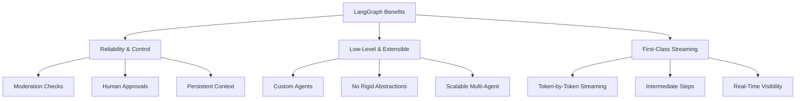
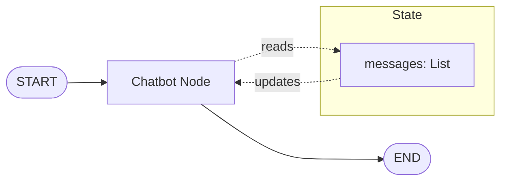
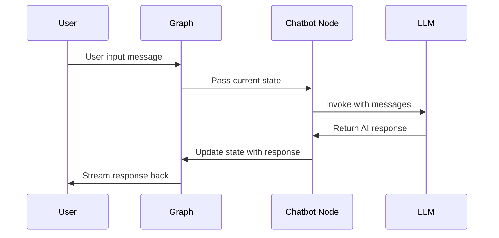

# Topic01: Build a Basic Chatbot with LangGraph

## Overview
This tutorial introduces LangGraph by building your first basic chatbot. You'll learn core LangGraph concepts including StateGraph, nodes, edges, and state management while creating a functional conversational AI agent.

## What is LangGraph?
LangGraph is a framework for building stateful, multi-agent applications with language models. Unlike simple LLM chains, LangGraph provides:

- **State Management**: Persistent conversation context across interactions
- **Graph-Based Architecture**: Nodes and edges define complex workflows
- **Human-in-the-Loop**: Built-in controls for human oversight and intervention
- **Multi-Agent Support**: Coordinate multiple AI agents in sophisticated workflows

## Why Choose LangGraph?

### Key Advantages



## Visual Architecture: Basic Chatbot



## Core LangGraph Concepts

### 1. StateGraph
The foundation of every LangGraph application - defines structure as a state machine.

### 2. State
- **Schema**: Defines what data the graph tracks
- **Reducers**: Functions that handle state updates
- **Messages**: Conversation history with built-in management

### 3. Nodes
- **Purpose**: Units of work (typically Python functions)
- **Input**: Current state
- **Output**: State updates

### 4. Edges
- **Normal Edges**: Direct connections between nodes
- **Conditional Edges**: Dynamic routing based on state

## Implementation

### Step 1: Define State Schema

```python
from typing import Annotated
from typing_extensions import TypedDict
from langgraph.graph import StateGraph, START
from langgraph.graph.message import add_messages

class State(TypedDict):
    # Messages have the type "list". The `add_messages` function
    # in the annotation defines how this state key should be updated
    # (in this case, it appends messages to the list, rather than overwriting them)
    messages: Annotated[list, add_messages]

# Create the graph builder
graph_builder = StateGraph(State)
```

**Key Points:**
- `TypedDict` defines the state schema
- `Annotated[list, add_messages]` uses a reducer function
- `add_messages` appends new messages instead of overwriting

### Step 2: Set Up the Language Model

```python
from langchain.chat_models import init_chat_model
import os

# Choose your preferred model
# OpenAI
os.environ["OPENAI_API_KEY"] = "your-api-key"
llm = init_chat_model("openai:gpt-4")

# Anthropic
os.environ["ANTHROPIC_API_KEY"] = "your-api-key"  
llm = init_chat_model("anthropic:claude-3-5-sonnet-latest")

# Google Gemini
os.environ["GOOGLE_API_KEY"] = "your-api-key"
llm = init_chat_model("google_genai:gemini-2.0-flash")
```

### Step 3: Create Chatbot Node

```python
def chatbot(state: State):
    """
    Main chatbot node that processes messages and generates responses.
    
    Args:
        state: Current graph state containing conversation messages
        
    Returns:
        Dictionary with updated messages list
    """
    # Get the LLM response to all messages in the conversation
    response = llm.invoke(state["messages"])
    
    # Return the response in the expected format
    # The add_messages reducer will append this to existing messages
    return {"messages": [response]}

# Add the node to the graph
graph_builder.add_node("chatbot", chatbot)
```

**Key Points:**
- Node functions take current `State` as input
- Return dictionary with state updates
- `add_messages` automatically appends new messages

### Step 4: Define Graph Flow

```python
# Set the entry point - where the graph starts execution
graph_builder.add_edge(START, "chatbot")

# Compile the graph into an executable form
graph = graph_builder.compile()
```

### Step 5: Visualize the Graph (Optional)

```python
from IPython.display import Image, display

try:
    # Generate and display a visual representation
    display(Image(graph.get_graph().draw_mermaid_png()))
except Exception:
    # Visualization requires additional dependencies
    print("Visualization not available - install graphviz for visual output")
```

### Step 6: Run the Chatbot

```python
def stream_graph_updates(user_input: str):
    """
    Process user input and stream the chatbot's response.
    
    Args:
        user_input: The user's message as a string
    """
    # Create initial state with user message
    initial_state = {
        "messages": [{"role": "user", "content": user_input}]
    }
    
    # Stream graph execution and print responses
    for event in graph.stream(initial_state):
        for value in event.values():
            print("Assistant:", value["messages"][-1].content)

# Interactive chat loop
def run_chatbot():
    """Run an interactive chatbot session."""
    print("LangGraph Chatbot - Type 'quit' to exit")
    
    while True:
        try:
            user_input = input("User: ")
            if user_input.lower() in ["quit", "exit", "q"]:
                print("Goodbye!")
                break
            stream_graph_updates(user_input)
        except KeyboardInterrupt:
            print("\nGoodbye!")
            break
        except Exception as e:
            print(f"Error: {e}")

# Start the chatbot
run_chatbot()
```

## Complete Code Example

```python
from typing import Annotated
from typing_extensions import TypedDict
from langchain.chat_models import init_chat_model
from langgraph.graph import StateGraph, START
from langgraph.graph.message import add_messages
import os

# 1. Define State
class State(TypedDict):
    messages: Annotated[list, add_messages]

# 2. Initialize LLM
os.environ["ANTHROPIC_API_KEY"] = "your-api-key"
llm = init_chat_model("anthropic:claude-3-5-sonnet-latest")

# 3. Create chatbot node
def chatbot(state: State):
    return {"messages": [llm.invoke(state["messages"])]}

# 4. Build and compile graph
graph_builder = StateGraph(State)
graph_builder.add_node("chatbot", chatbot)
graph_builder.add_edge(START, "chatbot")
graph = graph_builder.compile()

# 5. Run chatbot
def stream_graph_updates(user_input: str):
    for event in graph.stream({"messages": [{"role": "user", "content": user_input}]}):
        for value in event.values():
            print("Assistant:", value["messages"][-1].content)

# Interactive session
while True:
    user_input = input("User: ")
    if user_input.lower() in ["quit", "exit", "q"]:
        break
    stream_graph_updates(user_input)
```

## Best Practices

### Do's ✅
- **Always define clear state schemas** with TypedDict
- **Use appropriate reducers** (`add_messages` for conversation history)
- **Handle errors gracefully** in interactive loops
- **Compile graphs before execution**
- **Use meaningful node names** for debugging

### Don'ts ❌
- **Don't overwrite message history** without reducers
- **Don't forget to set entry points** with START
- **Don't skip state type annotations**
- **Don't ignore compilation errors**

## Common Issues & Troubleshooting

### Issue: "Graph has no entry point"
```python
# Solution: Always add an edge from START
graph_builder.add_edge(START, "your_first_node")
```

### Issue: "Messages being overwritten"
```python
# Problem: Missing add_messages reducer
messages: list  # ❌ Overwrites messages

# Solution: Use the reducer
messages: Annotated[list, add_messages]  # ✅ Appends messages
```

### Issue: "Node function errors"
```python
# Problem: Incorrect return format
def bad_node(state):
    return "just a string"  # ❌

# Solution: Return state update dictionary
def good_node(state):
    return {"messages": [response]}  # ✅
```

## Understanding the Execution Flow



## Integration with Other Concepts
- **Topic02**: Adding tools will extend this basic chatbot with external capabilities
- **Topic03**: Memory implementation will enhance conversation context
- **Topic04**: Human-in-the-loop will add oversight mechanisms
- **Topic05**: Custom state will enable more sophisticated behaviors

## Next Steps
1. **Add tools** to give your chatbot access to external information and actions
2. **Implement memory** for long-term conversation context
3. **Add human oversight** for critical decisions
4. **Customize state** for domain-specific requirements
5. **Explore multi-agent patterns** for complex workflows

**🎉 Congratulations!** You've built your first LangGraph chatbot and learned the fundamental concepts that power all LangGraph applications. This foundation will support increasingly sophisticated agent architectures as you progress through the learning path. 