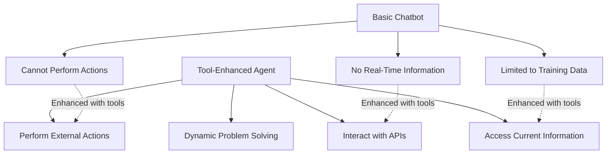
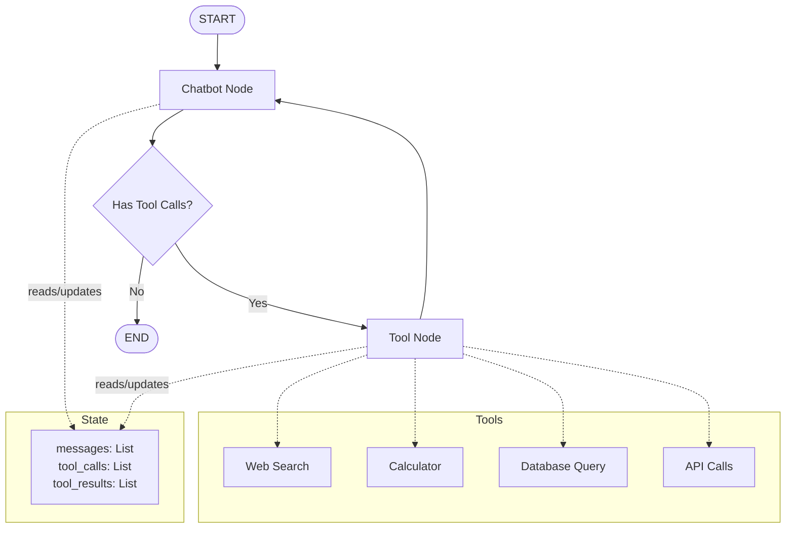
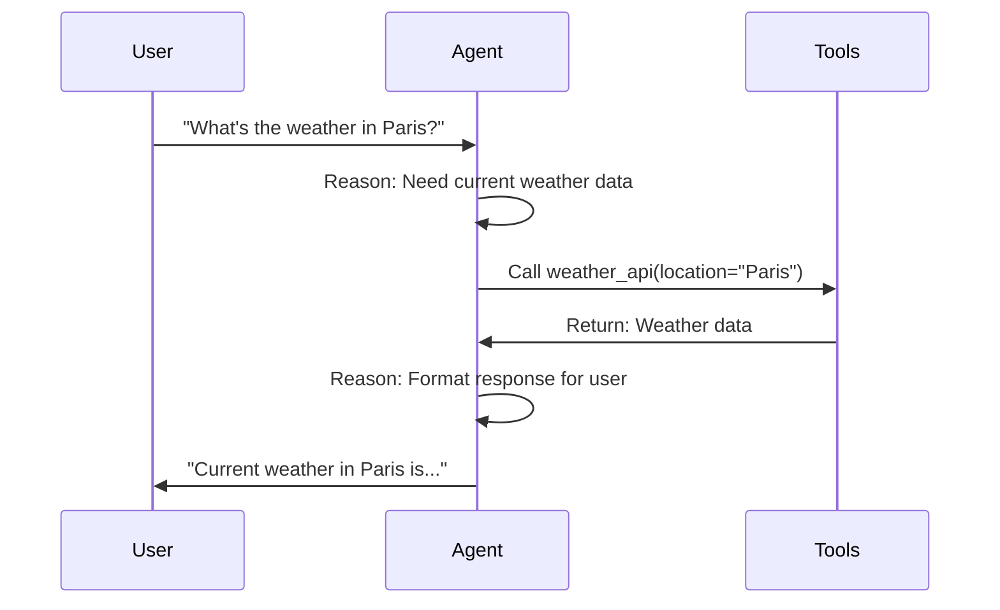
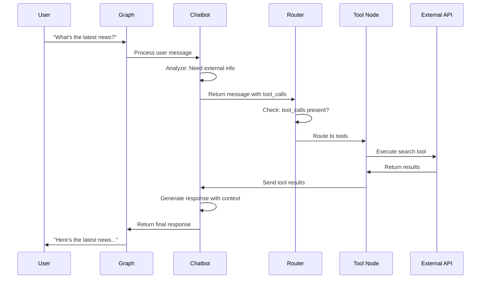

# Topic02: Add Tools to Extend Agent Capabilities

## Overview
This tutorial extends your basic chatbot with external tools, enabling it to access real-time information and perform actions beyond its training data. You'll learn tool calling, conditional routing, and the ReAct (Reasoning + Action) pattern that powers modern AI agents.

## What are Tools in LangGraph?
Tools are functions that AI agents can call to interact with external systems, APIs, databases, or services. They bridge the gap between language model capabilities and real-world functionality.

### Key Concepts:
- **Tool Calling**: Model decides when and which tools to use based on context
- **Tool Schema**: Structured format defining tool inputs and outputs
- **Tool Binding**: Connecting tools to language models
- **Tool Execution**: Running tools and handling their results

## Why Use Tools?

### Breaking Model Limitations



## Visual Architecture: Tool-Enhanced Agent



## The ReAct Pattern (Reasoning + Action)



## Implementation

### Step 1: Install Required Dependencies

```bash
# Install search engine integration
pip install -U langchain-tavily

# Alternative search tools
pip install -U langchain-serpapi
pip install -U langchain-duckduckgo-search
```

### Step 2: Configure Environment and Tools

```python
import os
from langchain_tavily import TavilySearch
from typing import Annotated
from typing_extensions import TypedDict

# Set up your API key
os.environ["TAVILY_API_KEY"] = "your-tavily-api-key"

# Create the search tool
tool = TavilySearch(max_results=2)
tools = [tool]

# Test the tool
result = tool.invoke("What's a 'node' in LangGraph?")
print(result)
```

**Tool Output Structure:**
```python
{
    'query': "What's a 'node' in LangGraph?",
    'results': [
        {
            'title': 'Page Title',
            'url': 'https://example.com',
            'content': 'Relevant content...',
            'score': 0.95
        }
    ],
    'response_time': 1.2
}
```

### Step 3: Bind Tools to Language Model

```python
from langchain.chat_models import init_chat_model

# Initialize your LLM
os.environ["ANTHROPIC_API_KEY"] = "your-api-key"
llm = init_chat_model("anthropic:claude-3-5-sonnet-latest")

# Bind tools to the model - this tells the LLM about available tools
llm_with_tools = llm.bind_tools(tools)
```

**What bind_tools() Does:**
- Registers tool schemas with the language model
- Enables the model to generate tool calls in proper JSON format
- Maintains tool metadata for execution

### Step 4: Enhanced State Schema

```python
from langgraph.graph import StateGraph, START, END
from langgraph.graph.message import add_messages

class State(TypedDict):
    # Messages now include tool calls and tool results
    messages: Annotated[list, add_messages]

graph_builder = StateGraph(State)
```

### Step 5: Create Enhanced Chatbot Node

```python
def chatbot(state: State):
    """
    Enhanced chatbot that can make tool calls.
    
    The LLM will decide whether to:
    1. Respond directly with text
    2. Call one or more tools
    3. Use tool results to formulate response
    """
    response = llm_with_tools.invoke(state["messages"])
    return {"messages": [response]}

# Add the enhanced chatbot node
graph_builder.add_node("chatbot", chatbot)
```

### Step 6: Create Tool Execution Node

#### Option A: Custom Tool Node (Educational)

```python
import json
from langchain_core.messages import ToolMessage

class BasicToolNode:
    """A node that executes tools requested by the AI."""
    
    def __init__(self, tools: list) -> None:
        # Create a lookup dictionary for efficient tool access
        self.tools_by_name = {tool.name: tool for tool in tools}
    
    def __call__(self, inputs: dict):
        """
        Execute tools based on the last AI message's tool calls.
        
        Args:
            inputs: Graph state containing messages
            
        Returns:
            Dictionary with tool result messages
        """
        # Get the most recent message
        if messages := inputs.get("messages", []):
            message = messages[-1]
        else:
            raise ValueError("No message found in input")
        
        outputs = []
        
        # Execute each tool call
        for tool_call in message.tool_calls:
            tool_name = tool_call["name"]
            tool_args = tool_call["args"]
            tool_id = tool_call["id"]
            
            # Execute the tool
            try:
                tool_result = self.tools_by_name[tool_name].invoke(tool_args)
                
                # Create tool message with result
                outputs.append(
                    ToolMessage(
                        content=json.dumps(tool_result),
                        name=tool_name,
                        tool_call_id=tool_id,
                    )
                )
            except Exception as e:
                # Handle tool execution errors
                outputs.append(
                    ToolMessage(
                        content=f"Error executing {tool_name}: {str(e)}",
                        name=tool_name,
                        tool_call_id=tool_id,
                    )
                )
        
        return {"messages": outputs}

# Create and add tool node
tool_node = BasicToolNode(tools=[tool])
graph_builder.add_node("tools", tool_node)
```

#### Option B: Prebuilt Tool Node (Production)

```python
from langgraph.prebuilt import ToolNode

# Use LangGraph's optimized tool node
tool_node = ToolNode(tools=[tool])
graph_builder.add_node("tools", tool_node)
```

### Step 7: Define Conditional Routing

```python
def route_tools(state: State):
    """
    Router function to decide next step based on tool calls.
    
    Args:
        state: Current graph state
        
    Returns:
        "tools" if tool calls exist, END otherwise
    """
    # Get the last message
    if isinstance(state, list):
        ai_message = state[-1]
    elif messages := state.get("messages", []):
        ai_message = messages[-1]
    else:
        raise ValueError(f"No messages found in input state: {state}")
    
    # Check for tool calls
    if hasattr(ai_message, "tool_calls") and len(ai_message.tool_calls) > 0:
        return "tools"
    return END

# Add conditional routing
graph_builder.add_conditional_edges(
    "chatbot",
    route_tools,
    {
        "tools": "tools",  # If tools needed, go to tools node
        END: END,          # If no tools needed, end
    },
)

# Tools always return to chatbot for response generation
graph_builder.add_edge("tools", "chatbot")
graph_builder.add_edge(START, "chatbot")

# Compile the enhanced graph
graph = graph_builder.compile()
```

### Step 8: Alternative - Use Prebuilt Routing

```python
from langgraph.prebuilt import tools_condition

# Replace custom router with prebuilt function
graph_builder.add_conditional_edges(
    "chatbot",
    tools_condition,  # Prebuilt tool condition checker
)
```

## Complete Working Example

```python
import os
from typing import Annotated
from typing_extensions import TypedDict
from langchain.chat_models import init_chat_model
from langchain_tavily import TavilySearch
from langgraph.graph import StateGraph, START, END
from langgraph.graph.message import add_messages
from langgraph.prebuilt import ToolNode, tools_condition

# 1. Set up environment
os.environ["ANTHROPIC_API_KEY"] = "your-api-key"
os.environ["TAVILY_API_KEY"] = "your-tavily-api-key"

# 2. Define state
class State(TypedDict):
    messages: Annotated[list, add_messages]

# 3. Initialize components
llm = init_chat_model("anthropic:claude-3-5-sonnet-latest")
tool = TavilySearch(max_results=2)
tools = [tool]
llm_with_tools = llm.bind_tools(tools)

# 4. Create nodes
def chatbot(state: State):
    return {"messages": [llm_with_tools.invoke(state["messages"])]}

# 5. Build graph
graph_builder = StateGraph(State)
graph_builder.add_node("chatbot", chatbot)
graph_builder.add_node("tools", ToolNode(tools=[tool]))

# 6. Add routing
graph_builder.add_conditional_edges("chatbot", tools_condition)
graph_builder.add_edge("tools", "chatbot")
graph_builder.add_edge(START, "chatbot")

# 7. Compile
graph = graph_builder.compile()

# 8. Interactive function
def stream_graph_updates(user_input: str):
    """Stream agent responses with tool usage."""
    print(f"\n🤖 Processing: {user_input}")
    
    for event in graph.stream({"messages": [{"role": "user", "content": user_input}]}):
        for value in event.values():
            last_message = value["messages"][-1]
            
            # Handle different message types
            if hasattr(last_message, 'tool_calls') and last_message.tool_calls:
                print("🔧 Using tools...")
            elif hasattr(last_message, 'content'):
                print("💬 Assistant:", last_message.content)

# 9. Run interactive session
def run_enhanced_chatbot():
    """Run tool-enhanced chatbot."""
    print("🚀 Enhanced LangGraph Chatbot with Tools")
    print("Ask me anything - I can search for current information!")
    
    while True:
        try:
            user_input = input("\n👤 User: ")
            if user_input.lower() in ["quit", "exit", "q"]:
                print("👋 Goodbye!")
                break
            stream_graph_updates(user_input)
        except KeyboardInterrupt:
            print("\n👋 Goodbye!")
            break
        except Exception as e:
            print(f"❌ Error: {e}")

# Start the enhanced chatbot
run_enhanced_chatbot()
```

## Understanding Tool Execution Flow



## Advanced Tool Patterns

### Multiple Tools

```python
from langchain_core.tools import tool

# Custom calculator tool
@tool
def calculator(expression: str) -> str:
    """Calculate mathematical expressions safely."""
    try:
        # Safe evaluation (avoid eval in production)
        result = eval(expression)
        return f"Result: {result}"
    except Exception as e:
        return f"Error: {e}"

# Web search tool
search_tool = TavilySearch(max_results=3)

# Combine multiple tools
tools = [calculator, search_tool]
llm_with_tools = llm.bind_tools(tools)
```

### Tool Error Handling

```python
def robust_tool_execution(state: State):
    """Tool execution with comprehensive error handling."""
    outputs = []
    
    if messages := state.get("messages", []):
        message = messages[-1]
        
        for tool_call in getattr(message, 'tool_calls', []):
            try:
                tool_name = tool_call["name"]
                tool_args = tool_call["args"]
                
                # Validate tool exists
                if tool_name not in self.tools_by_name:
                    raise ValueError(f"Unknown tool: {tool_name}")
                
                # Execute with timeout
                result = self.tools_by_name[tool_name].invoke(tool_args)
                
                outputs.append(
                    ToolMessage(
                        content=json.dumps(result),
                        name=tool_name,
                        tool_call_id=tool_call["id"],
                    )
                )
                
            except Exception as e:
                # Log error and provide fallback
                error_msg = f"Tool {tool_name} failed: {str(e)}"
                outputs.append(
                    ToolMessage(
                        content=error_msg,
                        name=tool_name,
                        tool_call_id=tool_call["id"],
                    )
                )
    
    return {"messages": outputs}
```

### Parallel Tool Execution

```python
import asyncio
from langgraph.prebuilt import ToolNode

# ToolNode automatically handles parallel execution
tool_node = ToolNode(tools=[search_tool, calculator, weather_tool])

# For custom parallel execution
async def parallel_tool_execution(tool_calls):
    """Execute multiple tools in parallel."""
    tasks = []
    for tool_call in tool_calls:
        task = asyncio.create_task(
            execute_single_tool(tool_call)
        )
        tasks.append(task)
    
    results = await asyncio.gather(*tasks, return_exceptions=True)
    return results
```

## Best Practices

### Do's ✅
- **Use descriptive tool names** that clearly indicate their purpose
- **Validate tool inputs** before execution
- **Handle tool errors gracefully** with fallback responses
- **Use prebuilt components** (ToolNode, tools_condition) for production
- **Implement timeouts** for external API calls
- **Log tool usage** for debugging and monitoring
- **Choose appropriate tools** for your use case

### Don'ts ❌
- **Don't execute unsafe code** in tool functions
- **Don't ignore tool errors** - always provide user feedback
- **Don't bind too many tools** - it can confuse the model
- **Don't skip input validation** for security
- **Don't forget rate limiting** for external APIs
- **Don't hard-code API keys** in source code

## Common Issues & Troubleshooting

### Issue: "Model not calling tools when expected"
```python
# Problem: Vague tool descriptions
@tool
def search(query):
    """Search for something"""  # ❌ Too vague
    pass

# Solution: Clear, specific descriptions
@tool
def web_search(query: str) -> str:
    """Search the web for current information about the given query.
    
    Args:
        query: The search query string
        
    Returns:
        Current web search results as formatted text
    """  # ✅ Clear and specific
    pass
```

### Issue: "Tool execution failing"
```python
# Problem: No error handling
def tool_node(state):
    result = tool.invoke(args)  # ❌ Can fail
    return {"messages": [result]}

# Solution: Robust error handling
def tool_node(state):
    try:
        result = tool.invoke(args)
        return {"messages": [ToolMessage(content=result)]}
    except Exception as e:
        error_msg = f"Tool failed: {e}"
        return {"messages": [ToolMessage(content=error_msg)]}  # ✅
```

### Issue: "Infinite tool calling loops"
```python
# Solution: Add loop detection
class LoopSafeToolNode:
    def __init__(self, tools, max_iterations=5):
        self.tools = tools
        self.max_iterations = max_iterations
    
    def __call__(self, state):
        # Count consecutive tool calls
        tool_call_count = 0
        for msg in reversed(state.get("messages", [])):
            if hasattr(msg, "tool_calls"):
                tool_call_count += 1
            else:
                break
        
        if tool_call_count >= self.max_iterations:
            return {
                "messages": [
                    ToolMessage(
                        content="Max tool iterations reached",
                        name="system",
                        tool_call_id="loop_breaker"
                    )
                ]
            }
        
        # Normal tool execution
        return self.execute_tools(state)
```

## Popular Tools and Integrations

### Web Search Tools
```python
# Tavily (Recommended)
from langchain_tavily import TavilySearch
search = TavilySearch(max_results=3)

# SerpAPI
from langchain_serpapi import SerpAPIWrapper
search = SerpAPIWrapper()

# DuckDuckGo (Free)
from langchain_duckduckgo import DuckDuckGoSearchRun
search = DuckDuckGoSearchRun()
```

### Database Tools
```python
# SQL Database
from langchain_sql_database import SQLDatabaseToolkit
db_tools = SQLDatabaseToolkit()

# Vector Database
from langchain_chroma import ChromaVectorStore
vector_search = ChromaVectorStore()
```

### API Integration Tools
```python
# Weather API
@tool
def get_weather(location: str) -> str:
    """Get current weather for a location."""
    # Implementation here
    pass

# Email sender
@tool
def send_email(recipient: str, subject: str, body: str) -> str:
    """Send an email."""
    # Implementation here
    pass
```

## Integration with Other Concepts
- **Topic01**: This builds directly on the basic chatbot foundation
- **Topic03**: Memory will enhance tool usage with conversation context
- **Topic04**: Human-in-the-loop will add oversight for tool execution
- **Topic05**: Custom state will enable more sophisticated tool coordination
- **Multi-Agent Topics**: Tools become shared resources across agent teams

## Next Steps
1. **Add memory** to remember tool usage across conversations
2. **Implement human oversight** for sensitive tool operations
3. **Create custom tools** for domain-specific functionality
4. **Explore advanced routing** with multiple tool categories
5. **Build tool chains** for complex multi-step operations

**🎉 Congratulations!** You've transformed your basic chatbot into a powerful agent that can interact with the real world through tools. Your agent can now search the web, perform calculations, access APIs, and much more - the foundation for truly capable AI assistants. 