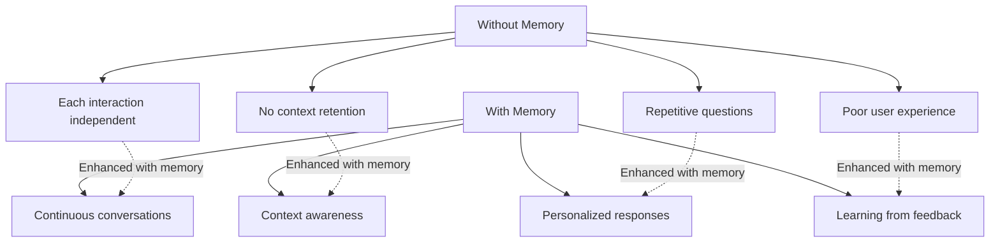
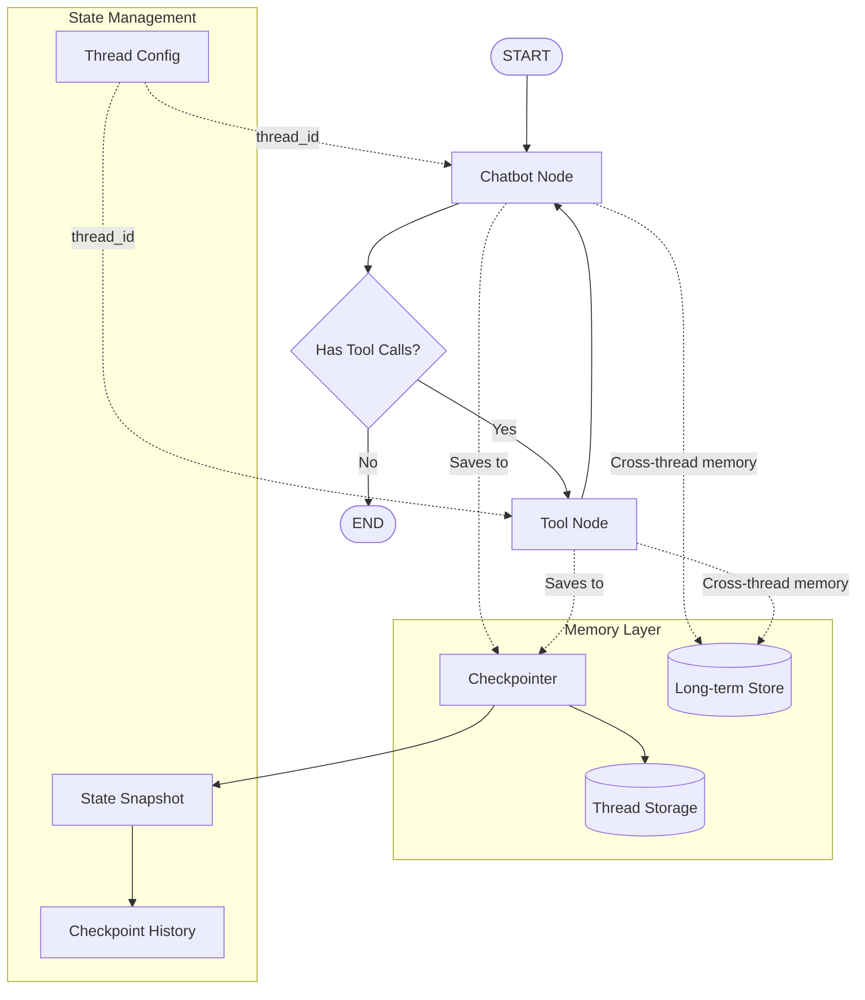
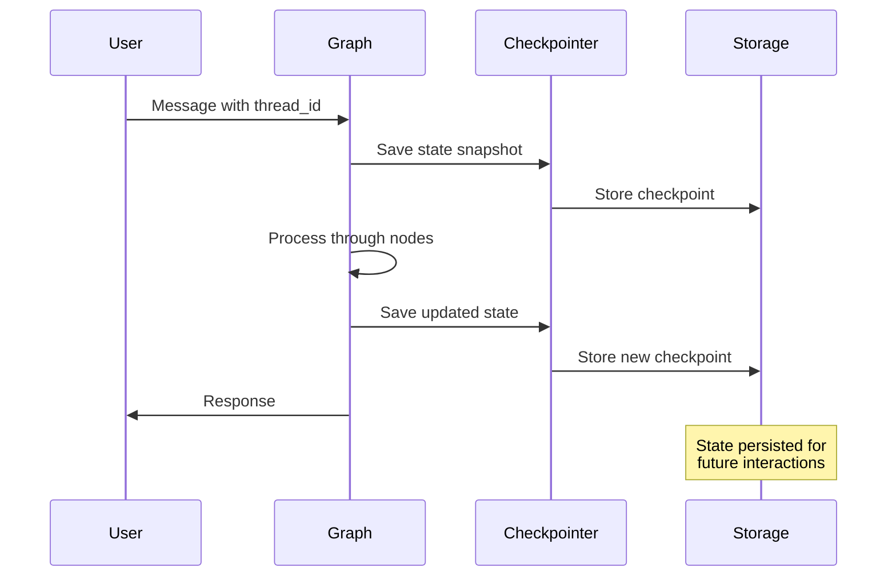
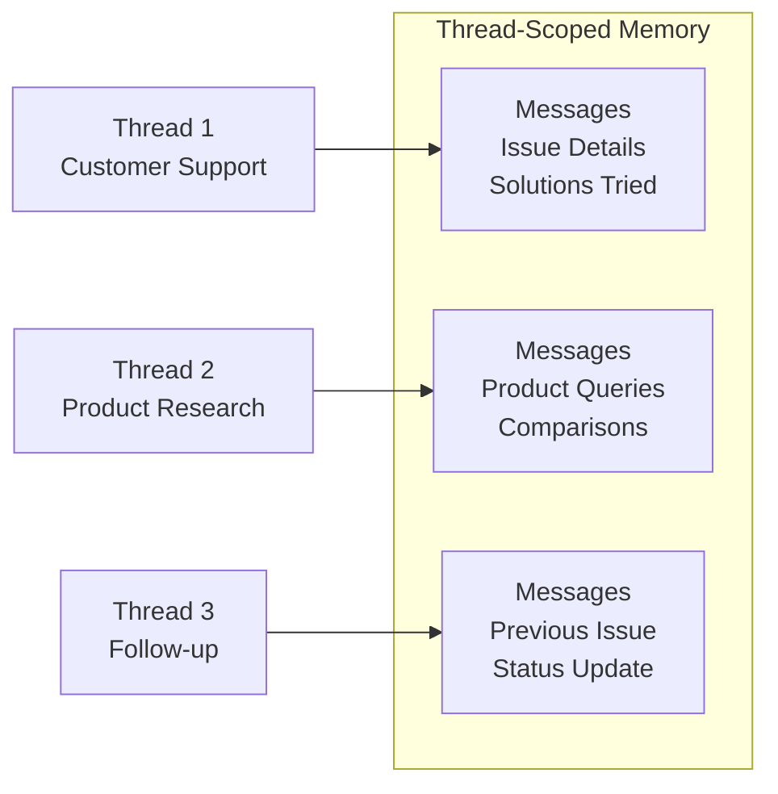
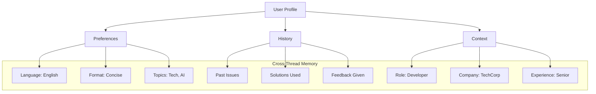

# Topic03: Add Memory and Conversation History

## Overview
This tutorial adds persistent memory to your tool-enhanced chatbot, enabling it to maintain conversation context across sessions. You'll learn about checkpointing, thread-based persistence, and both short-term and long-term memory patterns that make agents truly conversational.

## What is Memory in LangGraph?
Memory in LangGraph allows agents to retain and recall information across interactions. It's the difference between a stateless request-response system and a truly conversational AI that learns and adapts over time.

### Key Concepts:
- **Checkpointing**: Automatic state persistence at each graph step
- **Threads**: Conversation sessions with unique identifiers
- **Short-term Memory**: Context within a single conversation thread
- **Long-term Memory**: Information shared across multiple threads
- **State Snapshots**: Point-in-time captures of graph state

## Why Add Memory?

### From Stateless to Stateful



## Visual Architecture: Memory-Enhanced Agent



## Understanding Checkpointing



## Implementation

### Step 1: Set Up Checkpointing

```python
from langgraph.checkpoint.memory import MemorySaver
from langgraph.checkpoint.sqlite import SqliteSaver  # Production alternative
import sqlite3

# Option A: In-memory checkpointer (for development/testing)
memory_checkpointer = MemorySaver()

# Option B: SQLite checkpointer (for production/persistence)
connection = sqlite3.connect("chatbot_memory.db", check_same_thread=False)
sqlite_checkpointer = SqliteSaver(connection)

# Choose based on your needs
checkpointer = memory_checkpointer  # or sqlite_checkpointer
```

**Checkpointer Options:**
- **MemorySaver**: Fast, in-memory storage that doesn't persist across restarts
- **SqliteSaver**: File-based persistence, ideal for single-user applications
- **PostgresSaver**: Database-backed, suitable for production multi-user systems

### Step 2: Compile Graph with Memory

```python
from typing import Annotated
from typing_extensions import TypedDict
from langchain.chat_models import init_chat_model
from langchain_tavily import TavilySearch
from langgraph.graph import StateGraph, START, END
from langgraph.graph.message import add_messages
from langgraph.prebuilt import ToolNode, tools_condition

# State definition (same as before)
class State(TypedDict):
    messages: Annotated[list, add_messages]

# Set up components
llm = init_chat_model("anthropic:claude-3-5-sonnet-latest")
tool = TavilySearch(max_results=2)
tools = [tool]
llm_with_tools = llm.bind_tools(tools)

def chatbot(state: State):
    return {"messages": [llm_with_tools.invoke(state["messages"])]}

# Build the graph
graph_builder = StateGraph(State)
graph_builder.add_node("chatbot", chatbot)
graph_builder.add_node("tools", ToolNode(tools=[tool]))
graph_builder.add_conditional_edges("chatbot", tools_condition)
graph_builder.add_edge("tools", "chatbot")
graph_builder.add_edge(START, "chatbot")

# ⭐ KEY CHANGE: Compile with checkpointer for memory
graph = graph_builder.compile(checkpointer=checkpointer)
```

### Step 3: Thread-Based Conversations

```python
def run_conversation_with_memory():
    """
    Demonstrate persistent conversation memory using thread IDs.
    """
    # Thread ID acts as a conversation session identifier
    thread_id = "user_conversation_001"
    config = {"configurable": {"thread_id": thread_id}}
    
    print("🧠 Memory-Enhanced Chatbot")
    print(f"🔗 Thread ID: {thread_id}")
    print("=" * 50)
    
    while True:
        try:
            user_input = input("\n👤 User: ")
            if user_input.lower() in ["quit", "exit", "q"]:
                print("👋 Goodbye! Your conversation history is saved.")
                break
            
            # Stream the conversation with memory
            print("🤖 Assistant: ", end="")
            for event in graph.stream(
                {"messages": [{"role": "user", "content": user_input}]},
                config,
                stream_mode="values"
            ):
                # Print only the latest assistant message
                if event["messages"] and hasattr(event["messages"][-1], 'content'):
                    # Only print if it's a new message
                    last_message = event["messages"][-1]
                    if hasattr(last_message, 'content') and last_message.content:
                        print(last_message.content)
                        break
                        
        except KeyboardInterrupt:
            print("\n👋 Goodbye! Your conversation history is saved.")
            break
        except Exception as e:
            print(f"❌ Error: {e}")

# Start the conversation
run_conversation_with_memory()
```

### Step 4: Demonstrating Memory Persistence

```python
def demonstrate_memory_features():
    """
    Show how memory works across different scenarios.
    """
    
    # First conversation
    print("🔄 Starting first conversation...")
    config_1 = {"configurable": {"thread_id": "demo_thread_1"}}
    
    # Initial message with personal info
    result_1 = graph.invoke(
        {"messages": [{"role": "user", "content": "Hi! My name is Alex and I'm a software engineer."}]},
        config_1
    )
    print("Assistant:", result_1["messages"][-1].content)
    
    # Follow-up to test memory
    result_2 = graph.invoke(
        {"messages": [{"role": "user", "content": "What's my name and profession?"}]},
        config_1
    )
    print("Assistant:", result_2["messages"][-1].content)
    
    print("\n" + "="*50)
    
    # Different thread - should not remember
    print("🔄 Starting new conversation thread...")
    config_2 = {"configurable": {"thread_id": "demo_thread_2"}}
    
    result_3 = graph.invoke(
        {"messages": [{"role": "user", "content": "What's my name?"}]},
        config_2
    )
    print("Assistant:", result_3["messages"][-1].content)
    
    print("\n" + "="*50)
    
    # Return to first thread - should remember
    print("🔄 Returning to first conversation...")
    result_4 = graph.invoke(
        {"messages": [{"role": "user", "content": "Do you remember what we talked about?"}]},
        config_1
    )
    print("Assistant:", result_4["messages"][-1].content)

# Run the demonstration
demonstrate_memory_features()
```

### Step 5: Inspecting Memory State

```python
def inspect_memory_state(thread_id: str):
    """
    Examine the internal state and history of a conversation thread.
    """
    config = {"configurable": {"thread_id": thread_id}}
    
    # Get current state
    print(f"🔍 Inspecting Thread: {thread_id}")
    print("=" * 40)
    
    # Current state snapshot
    current_state = graph.get_state(config)
    print(f"📸 Current State:")
    print(f"   - Messages: {len(current_state.values['messages'])}")
    print(f"   - Next nodes: {current_state.next}")
    print(f"   - Checkpoint ID: {current_state.config['configurable']['checkpoint_id']}")
    
    # State history
    print(f"\n📚 Conversation History:")
    history = list(graph.get_state_history(config))
    for i, snapshot in enumerate(history):
        messages_count = len(snapshot.values.get('messages', []))
        print(f"   Step {i+1}: {messages_count} messages, Next: {snapshot.next}")
    
    # Message contents
    print(f"\n💬 Message Contents:")
    for i, message in enumerate(current_state.values['messages']):
        role = getattr(message, 'role', 'unknown')
        content_preview = getattr(message, 'content', str(message))[:50]
        print(f"   {i+1}. {role}: {content_preview}...")

# Example usage
inspect_memory_state("demo_thread_1")
```

## Advanced Memory Patterns

### Managing Long Conversations

```python
from langchain_core.messages import RemoveMessage

def manage_conversation_length(state: State, max_messages: int = 20):
    """
    Manage memory by trimming old messages when conversation gets too long.
    """
    messages = state.get("messages", [])
    
    if len(messages) > max_messages:
        # Keep system message (if any) and recent messages
        system_messages = [msg for msg in messages if getattr(msg, 'type', None) == 'system']
        recent_messages = messages[-(max_messages-len(system_messages)):]
        
        # Create removal instructions for old messages
        messages_to_remove = messages[:-(max_messages-len(system_messages))]
        removal_messages = [RemoveMessage(id=msg.id) for msg in messages_to_remove if hasattr(msg, 'id')]
        
        return {"messages": removal_messages}
    
    return {}

# Enhanced state with memory management
class ManagedState(TypedDict):
    messages: Annotated[list, add_messages]
    conversation_count: int

def enhanced_chatbot(state: ManagedState):
    """Enhanced chatbot with conversation tracking."""
    # Increment conversation counter
    count = state.get("conversation_count", 0) + 1
    
    # Regular chatbot response
    response = llm_with_tools.invoke(state["messages"])
    
    # Manage conversation length every 10 exchanges
    updates = {"messages": [response], "conversation_count": count}
    
    if count % 10 == 0:
        # Trigger memory management
        memory_update = manage_conversation_length(state)
        if memory_update.get("messages"):
            updates["messages"].extend(memory_update["messages"])
    
    return updates
```

### Conversation Summarization

```python
def create_conversation_summary(messages: list, llm) -> str:
    """
    Create a summary of conversation history to preserve context
    while reducing token usage.
    """
    # Extract non-system messages for summarization
    conversation_messages = [
        msg for msg in messages 
        if getattr(msg, 'type', None) not in ['system', 'tool']
    ]
    
    if len(conversation_messages) < 4:
        return ""
    
    # Create summarization prompt
    summary_prompt = f"""
    Please create a concise summary of the following conversation, 
    highlighting key points, user preferences, and important context:
    
    {conversation_messages}
    
    Summary:
    """
    
    summary_response = llm.invoke([{"role": "user", "content": summary_prompt}])
    return summary_response.content

class SummarizedState(TypedDict):
    messages: Annotated[list, add_messages]
    conversation_summary: str

def summarizing_chatbot(state: SummarizedState):
    """Chatbot that maintains conversation summaries."""
    messages = state["messages"]
    
    # Check if we need to summarize
    if len(messages) > 15:  # Threshold for summarization
        # Create summary
        summary = create_conversation_summary(messages[:-5], llm)
        
        # Keep recent messages and summary
        recent_messages = messages[-5:]
        summary_message = {
            "role": "system", 
            "content": f"Previous conversation summary: {summary}"
        }
        
        # Remove old messages, keep summary and recent messages
        removal_messages = [RemoveMessage(id=msg.id) for msg in messages[:-5] if hasattr(msg, 'id')]
        
        # Generate response with context
        response = llm_with_tools.invoke([summary_message] + recent_messages)
        
        return {
            "messages": removal_messages + [response],
            "conversation_summary": summary
        }
    else:
        # Normal operation
        response = llm_with_tools.invoke(messages)
        return {
            "messages": [response],
            "conversation_summary": state.get("conversation_summary", "")
        }
```

## Long-Term Memory with Stores

```python
from langgraph.store.memory import InMemoryStore
import uuid

# Set up long-term memory store
store = InMemoryStore()

def save_user_preference(user_id: str, preference_type: str, preference_value: str):
    """Save user preferences to long-term memory."""
    namespace = (user_id, "preferences")
    preference_id = str(uuid.uuid4())
    
    store.put(
        namespace,
        preference_id,
        {
            "type": preference_type,
            "value": preference_value,
            "timestamp": str(datetime.now())
        }
    )

def get_user_preferences(user_id: str, preference_type: str = None):
    """Retrieve user preferences from long-term memory."""
    namespace = (user_id, "preferences")
    preferences = store.search(namespace)
    
    if preference_type:
        return [p for p in preferences if p.value.get("type") == preference_type]
    return preferences

def memory_enhanced_chatbot(state: State, config: dict, *, store: InMemoryStore):
    """Chatbot with both short-term and long-term memory."""
    user_id = config["configurable"].get("user_id", "default_user")
    
    # Get user preferences from long-term memory
    preferences = get_user_preferences(user_id)
    preference_context = ""
    
    if preferences:
        pref_strings = [f"{p.value['type']}: {p.value['value']}" for p in preferences[-3:]]
        preference_context = f"\nUser preferences: {'; '.join(pref_strings)}"
    
    # Enhance system message with preferences
    messages = state["messages"]
    if preference_context:
        enhanced_messages = messages + [{
            "role": "system",
            "content": f"Consider these user preferences when responding:{preference_context}"
        }]
    else:
        enhanced_messages = messages
    
    # Generate response
    response = llm_with_tools.invoke(enhanced_messages)
    
    # Analyze response for new preferences to save
    # (This would typically involve more sophisticated preference extraction)
    
    return {"messages": [response]}

# Compile graph with store
graph_with_store = graph_builder.compile(
    checkpointer=checkpointer,
    store=store
)
```

## Complete Working Example

```python
import os
from typing import Annotated
from typing_extensions import TypedDict
from langchain.chat_models import init_chat_model
from langchain_tavily import TavilySearch
from langgraph.graph import StateGraph, START
from langgraph.graph.message import add_messages
from langgraph.prebuilt import ToolNode, tools_condition
from langgraph.checkpoint.memory import MemorySaver

# Set up environment
os.environ["ANTHROPIC_API_KEY"] = "your-api-key"
os.environ["TAVILY_API_KEY"] = "your-tavily-api-key"

# Define state
class State(TypedDict):
    messages: Annotated[list, add_messages]

# Initialize components
llm = init_chat_model("anthropic:claude-3-5-sonnet-latest")
tool = TavilySearch(max_results=2)
tools = [tool]
llm_with_tools = llm.bind_tools(tools)

# Create chatbot node
def chatbot(state: State):
    return {"messages": [llm_with_tools.invoke(state["messages"])]}

# Build graph with memory
graph_builder = StateGraph(State)
graph_builder.add_node("chatbot", chatbot)
graph_builder.add_node("tools", ToolNode(tools=[tool]))
graph_builder.add_conditional_edges("chatbot", tools_condition)
graph_builder.add_edge("tools", "chatbot")
graph_builder.add_edge(START, "chatbot")

# ⭐ Compile with memory checkpointer
memory = MemorySaver()
graph = graph_builder.compile(checkpointer=memory)

def run_persistent_chatbot():
    """Run chatbot with persistent memory across sessions."""
    print("🧠 Persistent Memory Chatbot")
    print("Your conversations are saved and remembered!")
    print("Use the same session ID to continue previous conversations.")
    print("=" * 60)
    
    # Get or create session
    session_id = input("Enter session ID (or press Enter for new session): ").strip()
    if not session_id:
        session_id = f"session_{uuid.uuid4().hex[:8]}"
        print(f"Created new session: {session_id}")
    
    config = {"configurable": {"thread_id": session_id}}
    
    # Show conversation history if resuming
    try:
        state = graph.get_state(config)
        if state.values.get("messages"):
            print(f"\n📚 Resuming conversation with {len(state.values['messages'])} previous messages")
            # Show last few messages for context
            recent_messages = state.values["messages"][-4:]
            for msg in recent_messages:
                role = getattr(msg, 'role', 'unknown')
                content = getattr(msg, 'content', str(msg))[:100]
                print(f"   {role}: {content}{'...' if len(content) > 100 else ''}")
            print()
    except:
        print(f"\n🆕 Starting new conversation in session: {session_id}\n")
    
    # Interactive loop
    while True:
        try:
            user_input = input("👤 User: ")
            if user_input.lower() in ["quit", "exit", "q"]:
                print(f"👋 Goodbye! Session {session_id} is saved.")
                break
            
            print("🤖 Assistant: ", end="")
            for event in graph.stream(
                {"messages": [{"role": "user", "content": user_input}]},
                config,
                stream_mode="values"
            ):
                if event["messages"]:
                    last_message = event["messages"][-1]
                    if hasattr(last_message, 'content'):
                        print(last_message.content)
                        break
                        
        except KeyboardInterrupt:
            print(f"\n👋 Session {session_id} saved!")
            break
        except Exception as e:
            print(f"❌ Error: {e}")

# Start the persistent chatbot
if __name__ == "__main__":
    run_persistent_chatbot()
```

## Memory Types and Use Cases

### Short-Term Memory (Thread-Scoped)



### Long-Term Memory (Cross-Thread)



## Best Practices

### Do's ✅
- **Use meaningful thread IDs** that represent user sessions
- **Implement memory management** for long conversations
- **Handle memory gracefully** when threads become stale
- **Use appropriate checkpointers** for your deployment environment
- **Monitor memory usage** and implement cleanup policies
- **Test memory persistence** across different scenarios
- **Implement fallbacks** for memory system failures

### Don'ts ❌
- **Don't use random thread IDs** for persistent conversations
- **Don't let conversations grow indefinitely** without management
- **Don't ignore checkpointer errors** - they affect reliability
- **Don't expose sensitive data** in conversation history
- **Don't assume memory is always available** - plan for failures
- **Don't mix different user conversations** in the same thread

## Common Issues & Troubleshooting

### Issue: "Memory not persisting between sessions"
```python
# Problem: Missing or incorrect thread_id
config = {}  # ❌ No thread_id specified

# Solution: Always provide consistent thread_id
config = {"configurable": {"thread_id": "user_123_session"}}  # ✅
```

### Issue: "Out of memory errors with long conversations"
```python
# Problem: No conversation length management
# Conversation grows indefinitely

# Solution: Implement memory management
def trim_conversation_history(state: State, max_length: int = 50):
    messages = state["messages"]
    if len(messages) > max_length:
        # Keep system messages and recent messages
        system_msgs = [m for m in messages if m.type == "system"]
        recent_msgs = messages[-(max_length - len(system_msgs)):]
        return {"messages": system_msgs + recent_msgs}
    return {}
```

### Issue: "Checkpointer database errors"
```python
# Problem: Database connection issues
try:
    graph.invoke({"messages": [msg]}, config)
except Exception as e:
    print(f"Memory error: {e}")
    # Fallback to stateless operation
    fallback_graph.invoke({"messages": [msg]})
```

## Integration with Other Concepts
- **Topic01**: Memory builds on the basic chatbot foundation
- **Topic02**: Tools now benefit from conversation context and history
- **Topic04**: Human-in-the-loop uses memory for better oversight decisions
- **Topic05**: Custom state enables sophisticated memory management
- **Multi-Agent Topics**: Shared memory across agent teams and workflows

## Next Steps
1. **Add human-in-the-loop controls** for conversation oversight
2. **Implement custom state management** for domain-specific memory
3. **Create conversation analytics** using memory data
4. **Build memory-aware tool chains** that learn from usage patterns
5. **Explore advanced memory patterns** like semantic memory search

**🎉 Congratulations!** Your chatbot now has persistent memory and can maintain coherent conversations across sessions. This transforms it from a simple question-answering system into a truly conversational AI that learns and adapts over time - the foundation for personalized, context-aware AI assistants. 