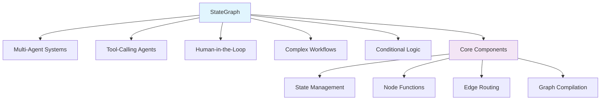
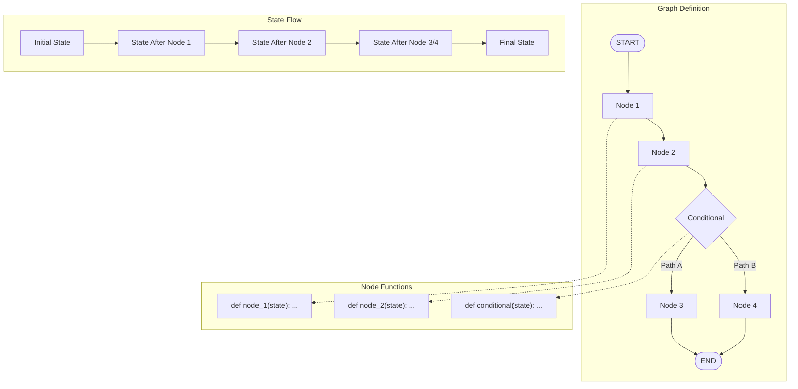
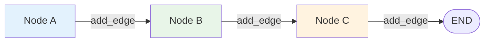
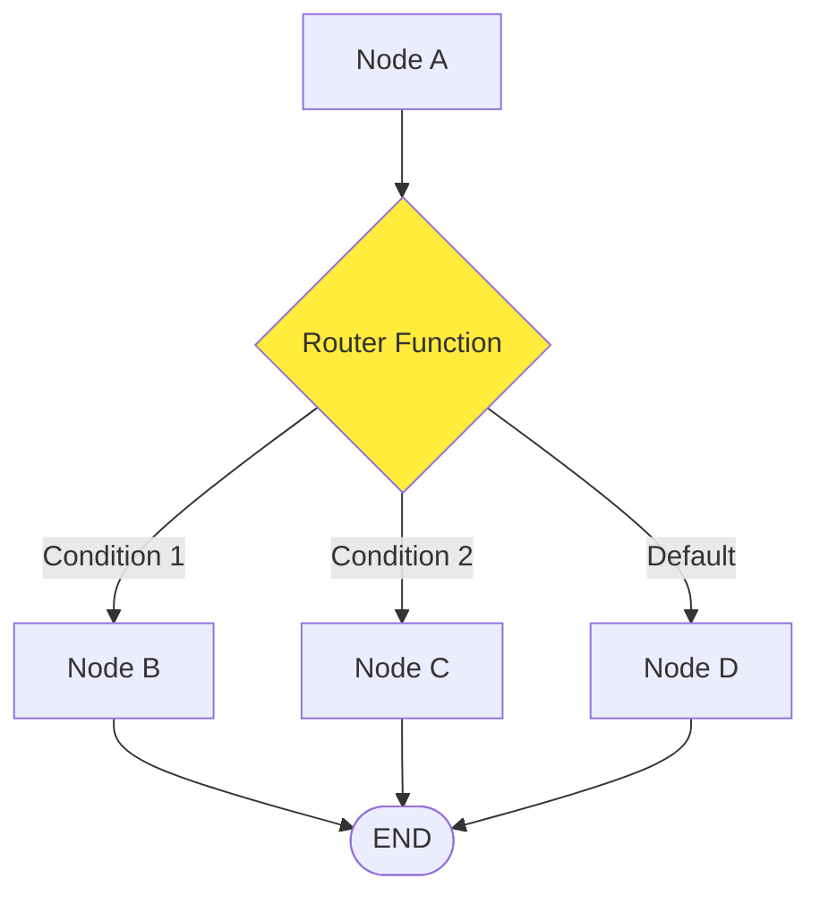

# Topic06: Master StateGraph Fundamentals - Nodes, Edges, and State

## Overview
This topic covers the core building blocks of LangGraph: StateGraph, nodes, edges, and state management. You'll master the low-level API that powers all LangGraph applications and understand how graphs model agent workflows as state machines.

## What is StateGraph?
StateGraph is the fundamental building block of LangGraph applications. It's a directed graph that models agent workflows as state machines where:
- **Nodes** are units of work (functions)
- **Edges** define the flow between nodes
- **State** holds the data that flows through the graph

### Core Concepts:
- **State Schema**: Defines the structure and types of data in your graph
- **Reducers**: Functions that control how state gets updated
- **Compilation**: Process of converting graph definition into executable form
- **Execution**: Running the graph with specific inputs and configuration

## Why Master StateGraph Fundamentals?

### Foundation for Everything in LangGraph



## Visual Architecture: StateGraph Components



## State Management Deep Dive

### 1. State Schema Definition

```python
from typing import Annotated, Optional, List, Dict, Any
from typing_extensions import TypedDict
from langgraph.graph.message import add_messages

# Basic state schema
class BasicState(TypedDict):
    counter: int
    user_input: str
    processing_complete: bool

# Advanced state with reducers
class AdvancedState(TypedDict):
    # Messages with built-in reducer for conversation history
    messages: Annotated[List[Any], add_messages]
    
    # Custom list with append behavior
    steps: Annotated[List[str], lambda x, y: x + y]
    
    # Dictionary that merges updates
    metadata: Annotated[Dict[str, Any], lambda old, new: {**old, **new}]
    
    # Simple overwrite for scalars
    current_step: str
    error_count: int
```

### 2. Understanding Reducers

```mermaid
graph TD
    subgraph "Without Reducers (Default Overwrite)"
        OS1[Old State: {counter: 5}] --> OS2[New State: {counter: 10}]
        OS1 -.->|overwrites| OS2
    end
    
    subgraph "With Reducers (Custom Logic)"
        RS1[Old State: {messages: [msg1, msg2]}] --> RS2[Update: {messages: [msg3]}]
        RS2 --> RS3[Final: {messages: [msg1, msg2, msg3]}]
        RS1 -.->|add_messages reducer| RS3
    end
```

```python
# Custom reducer examples
def accumulate_numbers(old: List[int], new: List[int]) -> List[int]:
    """Accumulate numbers and keep only unique values."""
    return list(set(old + new))

def merge_with_priority(old: Dict, new: Dict) -> Dict:
    """Merge dictionaries, with new values taking priority."""
    result = old.copy()
    result.update(new)
    return result

def count_updates(old: int, new: int) -> int:
    """Count how many times this field has been updated."""
    return old + 1

class CustomState(TypedDict):
    unique_numbers: Annotated[List[int], accumulate_numbers]
    config: Annotated[Dict[str, Any], merge_with_priority]
    update_count: Annotated[int, count_updates]
```

### 3. Working with Messages State

```python
from langchain_core.messages import HumanMessage, AIMessage, SystemMessage
from langgraph.graph.message import add_messages

class ConversationState(TypedDict):
    messages: Annotated[List[Any], add_messages]

# The add_messages reducer handles:
# - Appending new messages to the list
# - Updating existing messages by ID
# - Removing messages (when content is None)

def demonstrate_message_operations():
    initial_state = {
        "messages": [
            SystemMessage(content="You are a helpful assistant."),
            HumanMessage(content="Hello!")
        ]
    }
    
    # Adding a response
    update_1 = {
        "messages": [AIMessage(content="Hi! How can I help you?")]
    }
    
    # Result: All three messages in chronological order
    # add_messages automatically appends the new message
    
    return initial_state, update_1
```

## Node Implementation Patterns

### 1. Basic Node Function

```python
def simple_node(state: BasicState) -> Dict[str, Any]:
    """
    Simple node that processes state and returns updates.
    
    Args:
        state: Current graph state
        
    Returns:
        Dictionary containing state updates
    """
    processed_input = state["user_input"].upper()
    new_counter = state["counter"] + 1
    
    return {
        "user_input": processed_input,
        "counter": new_counter,
        "processing_complete": True
    }
```

### 2. Node with Error Handling

```python
def robust_node(state: BasicState) -> Dict[str, Any]:
    """Node with comprehensive error handling."""
    try:
        # Validate required state
        if "user_input" not in state:
            raise ValueError("Missing required user_input")
        
        # Process with validation
        user_input = state["user_input"]
        if not isinstance(user_input, str):
            raise TypeError("user_input must be a string")
        
        # Perform processing
        result = process_user_input(user_input)
        
        return {
            "user_input": result,
            "counter": state.get("counter", 0) + 1,
            "processing_complete": True,
            "error_count": state.get("error_count", 0)  # No error, keep count
        }
        
    except Exception as e:
        # Return error state instead of raising
        return {
            "processing_complete": False,
            "error_count": state.get("error_count", 0) + 1,
            "last_error": str(e)
        }

def process_user_input(text: str) -> str:
    """Helper function for processing."""
    return text.strip().title()
```

### 3. Node with External API Calls

```python
import asyncio
import httpx
from typing import Dict, Any

def api_node(state: BasicState) -> Dict[str, Any]:
    """Node that makes external API calls."""
    
    async def fetch_data(query: str) -> Dict[str, Any]:
        async with httpx.AsyncClient() as client:
            response = await client.get(
                "https://api.example.com/search",
                params={"q": query},
                timeout=10.0
            )
            response.raise_for_status()
            return response.json()
    
    try:
        # Run async operation in sync context
        data = asyncio.run(fetch_data(state["user_input"]))
        
        return {
            "api_data": data,
            "counter": state["counter"] + 1,
            "processing_complete": True
        }
        
    except Exception as e:
        return {
            "processing_complete": False,
            "error_count": state.get("error_count", 0) + 1,
            "last_error": f"API call failed: {str(e)}"
        }
```

## Edge Types and Routing

### 1. Normal Edges (Static Routing)



```python
from langgraph.graph import StateGraph, START, END

# Build graph with normal edges
graph_builder = StateGraph(BasicState)

# Add nodes
graph_builder.add_node("process", simple_node)
graph_builder.add_node("validate", validation_node)
graph_builder.add_node("finalize", finalization_node)

# Add normal edges (static routing)
graph_builder.add_edge(START, "process")
graph_builder.add_edge("process", "validate")
graph_builder.add_edge("validate", "finalize")
graph_builder.add_edge("finalize", END)
```

### 2. Conditional Edges (Dynamic Routing)



```python
def route_based_on_state(state: BasicState) -> str:
    """
    Router function that determines next node based on state.
    
    Args:
        state: Current graph state
        
    Returns:
        String indicating which node to route to
    """
    error_count = state.get("error_count", 0)
    
    if error_count > 3:
        return "error_handler"
    elif state.get("processing_complete", False):
        return "success_handler"
    else:
        return "continue_processing"

# Add conditional edge
graph_builder.add_conditional_edges(
    "validation",  # Source node
    route_based_on_state,  # Router function
    {
        "error_handler": "handle_errors",
        "success_handler": "finalize_success",
        "continue_processing": "additional_processing"
    }
)
```

### 3. Advanced Routing with Send API

```python
from langgraph.constants import Send

def dynamic_fan_out(state: BasicState) -> List[Send]:
    """
    Create multiple parallel tasks based on state.
    
    Returns:
        List of Send objects for parallel execution
    """
    tasks = []
    user_input = state.get("user_input", "")
    
    # Create parallel processing tasks
    words = user_input.split()
    for i, word in enumerate(words):
        tasks.append(
            Send(
                "word_processor",
                {"word": word, "position": i, "total": len(words)}
            )
        )
    
    return tasks

# Use with conditional edges for dynamic parallel execution
graph_builder.add_conditional_edges(
    "input_analyzer",
    dynamic_fan_out
)
```

## Graph Compilation and Configuration

### 1. Basic Compilation

```python
# Compile the graph for execution
compiled_graph = graph_builder.compile()

# Optional: Compile with debugging info
compiled_graph = graph_builder.compile(debug=True)
```

### 2. Compilation with Checkpointer

```python
from langgraph.checkpoint.memory import MemorySaver

# Compile with memory for persistence
checkpointer = MemorySaver()
compiled_graph = graph_builder.compile(checkpointer=checkpointer)
```

### 3. Runtime Configuration

```python
# Configure recursion limits
config = {
    "recursion_limit": 100,  # Maximum steps before stopping
    "configurable": {
        "thread_id": "conversation_1",  # For persistence
        "user_id": "user_123"          # For user-specific behavior
    }
}

# Run with configuration
result = compiled_graph.invoke(
    {"user_input": "Hello, world!"},
    config=config
)
```

## Complete Working Example

```python
from typing import Annotated, Dict, Any
from typing_extensions import TypedDict
from langgraph.graph import StateGraph, START, END

# 1. Define State Schema
class ProcessingState(TypedDict):
    input_text: str
    processed_text: str
    step_count: int
    is_complete: bool
    errors: Annotated[list, lambda old, new: old + new]

# 2. Create Node Functions
def input_validator(state: ProcessingState) -> Dict[str, Any]:
    """Validate input and prepare for processing."""
    text = state.get("input_text", "")
    
    if not text.strip():
        return {
            "errors": ["Empty input provided"],
            "is_complete": False
        }
    
    return {
        "processed_text": text.strip(),
        "step_count": state.get("step_count", 0) + 1
    }

def text_processor(state: ProcessingState) -> Dict[str, Any]:
    """Process the text in some way."""
    processed = state.get("processed_text", "")
    
    # Simple processing: title case and word count
    result = processed.title()
    word_count = len(processed.split())
    
    return {
        "processed_text": f"{result} (Words: {word_count})",
        "step_count": state["step_count"] + 1
    }

def finalizer(state: ProcessingState) -> Dict[str, Any]:
    """Finalize processing."""
    return {
        "is_complete": True,
        "step_count": state["step_count"] + 1
    }

# 3. Router Function
def should_continue(state: ProcessingState) -> str:
    """Determine if processing should continue or end."""
    if state.get("errors"):
        return "error"
    elif state.get("is_complete"):
        return "done"
    else:
        return "continue"

# 4. Build Graph
def create_processing_graph():
    graph_builder = StateGraph(ProcessingState)
    
    # Add nodes
    graph_builder.add_node("validate", input_validator)
    graph_builder.add_node("process", text_processor)
    graph_builder.add_node("finalize", finalizer)
    
    # Add edges
    graph_builder.add_edge(START, "validate")
    
    # Conditional routing after validation
    graph_builder.add_conditional_edges(
        "validate",
        should_continue,
        {
            "continue": "process",
            "error": END,
            "done": END
        }
    )
    
    graph_builder.add_edge("process", "finalize")
    graph_builder.add_edge("finalize", END)
    
    return graph_builder.compile()

# 5. Run the Graph
def run_example():
    graph = create_processing_graph()
    
    # Test with valid input
    result = graph.invoke({"input_text": "hello world"})
    print("Valid input result:", result)
    
    # Test with empty input
    result = graph.invoke({"input_text": ""})
    print("Empty input result:", result)

if __name__ == "__main__":
    run_example()
```

## Graph Visualization and Debugging

```python
def visualize_graph(graph):
    """Generate visual representation of the graph."""
    try:
        from IPython.display import Image, display
        # Generate mermaid diagram
        display(Image(graph.get_graph().draw_mermaid_png()))
    except ImportError:
        # Fallback to text representation
        print("Graph structure:")
        print(graph.get_graph().to_json())

def debug_graph_execution(graph, initial_state):
    """Debug graph execution step by step."""
    print("🔍 Debugging Graph Execution")
    print("=" * 40)
    
    for i, step in enumerate(graph.stream(initial_state)):
        print(f"\nStep {i + 1}:")
        for node_name, node_state in step.items():
            print(f"  Node: {node_name}")
            print(f"  State: {node_state}")
```

## Best Practices

### Do's ✅
- **Define clear state schemas** with appropriate types
- **Use reducers** for complex state updates (lists, dicts)
- **Handle errors gracefully** in node functions
- **Keep nodes focused** on single responsibilities
- **Use meaningful node and edge names**
- **Validate state** before processing
- **Test edge cases** and error conditions

### Don'ts ❌
- **Don't mutate state directly** - always return new state
- **Don't create circular dependencies** without careful consideration
- **Don't ignore compilation errors**
- **Don't forget to handle empty/missing state fields**
- **Don't make nodes too complex** - split into smaller nodes if needed

## Common Issues & Troubleshooting

### Issue: "Node returned invalid state"
```python
# Problem: Returning wrong format
def bad_node(state):
    return "just a string"  # ❌

# Solution: Always return dict with state updates
def good_node(state):
    return {"field": "value"}  # ✅
```

### Issue: "State type mismatch"
```python
# Problem: Inconsistent state types
class State(TypedDict):
    counter: int  # Expects int

def bad_node(state):
    return {"counter": "5"}  # ❌ Returns string

# Solution: Match type annotations
def good_node(state):
    return {"counter": 5}  # ✅ Returns int
```

### Issue: "Infinite recursion"
```python
# Problem: Circular routing
def bad_router(state):
    return "same_node"  # ❌ Routes back to itself

# Solution: Add termination conditions
def good_router(state):
    if state.get("max_iterations", 0) > 10:
        return END
    return "next_node"  # ✅
```

## Integration with Other Concepts
- **Topic07**: Graph compilation will build on these fundamentals
- **Topic08**: State schemas and reducers extend this foundation
- **Topic09**: Node functions will use these patterns
- **Topic10**: Edge routing builds on conditional edges
- **Topic11**: START/END nodes complete the graph structure

## Next Steps
1. **Master graph compilation** and configuration options
2. **Learn advanced state patterns** with custom reducers
3. **Explore node composition** and reusable patterns
4. **Study conditional routing** for complex workflows
5. **Practice with real-world examples** and debugging techniques

**🎉 Congratulations!** You now understand the core building blocks that power every LangGraph application. These fundamentals enable you to build sophisticated agent workflows, from simple sequences to complex multi-agent systems with conditional logic and parallel execution. 