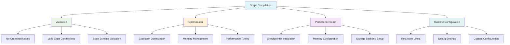
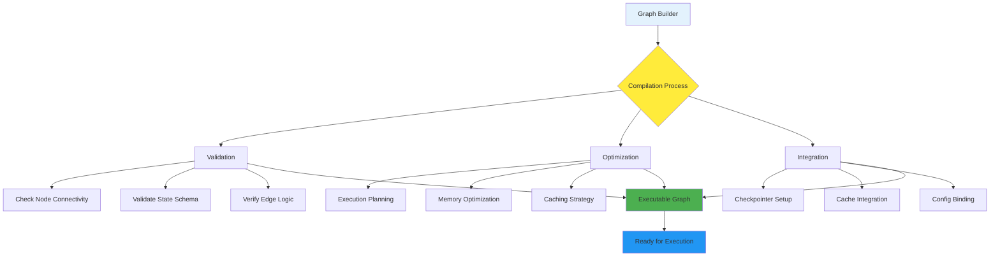

# Topic07: Graph Compilation and Configuration

## Overview
This topic covers how to compile your LangGraph graphs for execution and configure them with runtime parameters, checkpointers, recursion limits, and other essential settings. Understanding compilation and configuration is crucial for deploying robust, production-ready LangGraph applications.

## What is Graph Compilation?
Graph compilation is the process of converting your graph definition (nodes, edges, state) into an executable form that can actually run. It's like building and validating your graph before execution.

### Core Concepts:
- **Compilation Process**: Converting graph builder to executable graph
- **Validation**: Checking graph structure and connectivity
- **Runtime Configuration**: Settings that control execution behavior
- **Checkpointers**: Persistence layers for state management
- **Recursion Limits**: Safety mechanisms to prevent infinite loops

## Why Compile Your Graph?

### Compilation Benefits



## Basic Graph Compilation

### Step 1: Build Your Graph

```python
from typing_extensions import TypedDict
from langgraph.graph import StateGraph, START, END

# Define state
class State(TypedDict):
    input: str
    output: str
    step_count: int

# Create graph builder
graph_builder = StateGraph(State)

# Add nodes
def process_input(state: State):
    return {
        "output": f"Processed: {state['input']}",
        "step_count": state.get("step_count", 0) + 1
    }

def finalize(state: State):
    return {
        "output": f"Final: {state['output']}",
        "step_count": state["step_count"] + 1
    }

graph_builder.add_node("process", process_input)
graph_builder.add_node("finalize", finalize)

# Add edges
graph_builder.add_edge(START, "process")
graph_builder.add_edge("process", "finalize")
graph_builder.add_edge("finalize", END)
```

### Step 2: Compile the Graph

```python
# Basic compilation - REQUIRED before execution
graph = graph_builder.compile()

# You MUST compile before using the graph
result = graph.invoke({"input": "Hello, World!"})
print(result)
# {'input': 'Hello, World!', 'output': 'Final: Processed: Hello, World!', 'step_count': 2}
```

**⚠️ Important**: You **MUST** compile your graph before you can use it. The graph builder is just a definition - compilation makes it executable.

## Compilation with Checkpointers (Memory)

### Memory Checkpointer (Development)

```python
from langgraph.checkpoint.memory import MemorySaver

# In-memory checkpointer for development
memory_checkpointer = MemorySaver()

# Compile with memory
graph = graph_builder.compile(checkpointer=memory_checkpointer)

# Now your graph has memory across invocations
config_1 = {"configurable": {"thread_id": "conversation_1"}}
config_2 = {"configurable": {"thread_id": "conversation_2"}}

# Each thread maintains separate state
result_1 = graph.invoke({"input": "First message"}, config=config_1)
result_2 = graph.invoke({"input": "Different conversation"}, config=config_2)

# Continue conversation 1
result_1_continued = graph.invoke({"input": "Second message"}, config=config_1)
```

### SQLite Checkpointer (Production)

```python
import sqlite3
from langgraph.checkpoint.sqlite import SqliteSaver

# File-based persistence
connection = sqlite3.connect("graph_memory.db", check_same_thread=False)
sqlite_checkpointer = SqliteSaver(connection)

# Compile with persistent storage
graph = graph_builder.compile(checkpointer=sqlite_checkpointer)

# Memory persists across application restarts
config = {"configurable": {"thread_id": "persistent_conversation"}}
graph.invoke({"input": "This will be remembered"}, config=config)
```

### PostgreSQL Checkpointer (Enterprise)

```python
import psycopg
from langgraph.checkpoint.postgres import PostgresSaver

# Enterprise-grade persistence
connection = psycopg.connect(
    host="localhost",
    port=5432,
    user="langgraph",
    password="password",
    dbname="graph_db"
)
postgres_checkpointer = PostgresSaver(connection)

# Compile for production
graph = graph_builder.compile(checkpointer=postgres_checkpointer)
```

## Runtime Configuration

### Basic Configuration Schema

```python
from typing_extensions import TypedDict

class ConfigSchema(TypedDict):
    model_name: str
    temperature: float
    max_tokens: int
    debug_mode: bool

# Define configurable graph
graph = StateGraph(State, config_schema=ConfigSchema)

# Add nodes that use configuration
def configurable_node(state: State, config):
    """Node that adapts behavior based on configuration."""
    model_config = config.get("configurable", {})
    model_name = model_config.get("model_name", "gpt-3.5-turbo")
    temperature = model_config.get("temperature", 0.7)
    debug_mode = model_config.get("debug_mode", False)
    
    if debug_mode:
        print(f"Using model: {model_name} with temperature: {temperature}")
    
    # Use configuration in processing
    processed_output = f"[{model_name}] Processed: {state['input']}"
    
    return {
        "output": processed_output,
        "step_count": state.get("step_count", 0) + 1
    }

graph.add_node("configurable_process", configurable_node)
graph.add_edge(START, "configurable_process")
graph.add_edge("configurable_process", END)

# Compile
compiled_graph = graph.compile()
```

### Using Runtime Configuration

```python
# Configuration for different scenarios
production_config = {
    "configurable": {
        "model_name": "gpt-4",
        "temperature": 0.1,
        "max_tokens": 2000,
        "debug_mode": False
    }
}

development_config = {
    "configurable": {
        "model_name": "gpt-3.5-turbo", 
        "temperature": 0.7,
        "max_tokens": 1000,
        "debug_mode": True
    }
}

testing_config = {
    "configurable": {
        "model_name": "mock_model",
        "temperature": 1.0,
        "max_tokens": 500,
        "debug_mode": True
    }
}

# Run with different configurations
prod_result = compiled_graph.invoke(
    {"input": "Production query"},
    config=production_config
)

dev_result = compiled_graph.invoke(
    {"input": "Development query"},
    config=development_config
)
```

## Advanced Configuration Options

### Recursion Limits

```python
# Recursion limit prevents infinite loops
safe_config = {
    "recursion_limit": 10,  # Maximum 10 steps
    "configurable": {
        "model_name": "gpt-4"
    }
}

# This will stop execution after 10 steps
try:
    result = graph.invoke({"input": "Complex query"}, config=safe_config)
except Exception as e:
    print(f"Graph stopped due to recursion limit: {e}")
```

### Debug Configuration

```python
# Enable detailed debugging
debug_config = {
    "recursion_limit": 25,
    "configurable": {
        "debug_mode": True,
        "log_level": "DEBUG",
        "trace_execution": True
    }
}

# Compile with debug settings
debug_graph = graph_builder.compile(debug=True)

# Run with extensive logging
result = debug_graph.invoke({"input": "Debug this"}, config=debug_config)
```

### Thread-Based Configuration

```python
# Different threads can have different configurations
user_configs = {
    "user_123": {
        "recursion_limit": 15,
        "configurable": {
            "thread_id": "user_123_session",
            "model_name": "gpt-4",
            "temperature": 0.2,
            "user_preferences": {"language": "en", "style": "formal"}
        }
    },
    "user_456": {
        "recursion_limit": 20,
        "configurable": {
            "thread_id": "user_456_session", 
            "model_name": "gpt-3.5-turbo",
            "temperature": 0.8,
            "user_preferences": {"language": "es", "style": "casual"}
        }
    }
}

# Use different configs for different users
for user_id, config in user_configs.items():
    result = graph.invoke(
        {"input": f"Hello from {user_id}"},
        config=config
    )
    print(f"Result for {user_id}: {result}")
```

## Node Caching Configuration

```python
from langgraph.cache.memory import InMemoryCache
from langgraph.types import CachePolicy
import time

class CachedState(TypedDict):
    query: str
    result: str
    computation_time: float

def expensive_computation(state: CachedState):
    """Simulate expensive computation."""
    start_time = time.time()
    time.sleep(2)  # Simulate expensive work
    computation_time = time.time() - start_time
    
    return {
        "result": f"Computed result for: {state['query']}",
        "computation_time": computation_time
    }

# Build graph with caching
cache_builder = StateGraph(CachedState)
cache_builder.add_node(
    "expensive_node", 
    expensive_computation,
    cache_policy=CachePolicy(ttl=60)  # Cache for 60 seconds
)
cache_builder.add_edge(START, "expensive_node") 
cache_builder.add_edge("expensive_node", END)

# Compile with cache
cache = InMemoryCache()
cached_graph = cache_builder.compile(cache=cache)

# First run - takes 2 seconds
start = time.time()
result1 = cached_graph.invoke({"query": "expensive computation"})
print(f"First run took: {time.time() - start:.2f} seconds")

# Second run - uses cache, nearly instant
start = time.time() 
result2 = cached_graph.invoke({"query": "expensive computation"})
print(f"Second run took: {time.time() - start:.2f} seconds")
print(f"Cache hit: {'cached' in str(result2)}")
```

## Complete Configuration Example

```python
import sqlite3
from typing_extensions import TypedDict
from langgraph.graph import StateGraph, START, END
from langgraph.checkpoint.sqlite import SqliteSaver
from langgraph.cache.memory import InMemoryCache
from langgraph.types import CachePolicy

# State definition
class ApplicationState(TypedDict):
    user_input: str
    processed_output: str
    step_count: int
    user_id: str
    session_data: dict

# Configuration schema
class AppConfig(TypedDict):
    model_name: str
    temperature: float
    max_steps: int
    enable_caching: bool
    log_level: str

# Node functions
def input_processor(state: ApplicationState, config):
    """Process user input with configuration."""
    model_config = config.get("configurable", {})
    model_name = model_config.get("model_name", "default")
    temperature = model_config.get("temperature", 0.7)
    
    processed = f"[{model_name}@{temperature}] {state['user_input']}"
    
    return {
        "processed_output": processed,
        "step_count": state.get("step_count", 0) + 1
    }

def output_formatter(state: ApplicationState, config):
    """Format final output."""
    return {
        "processed_output": f"Final: {state['processed_output']}",
        "step_count": state["step_count"] + 1
    }

# Build comprehensive graph
app_builder = StateGraph(ApplicationState, config_schema=AppConfig)
app_builder.add_node("process", input_processor)
app_builder.add_node(
    "format", 
    output_formatter,
    cache_policy=CachePolicy(ttl=300)  # 5-minute cache
)

app_builder.add_edge(START, "process")
app_builder.add_edge("process", "format")
app_builder.add_edge("format", END)

# Set up persistence and caching
connection = sqlite3.connect("app.db", check_same_thread=False)
checkpointer = SqliteSaver(connection)
cache = InMemoryCache()

# Compile with all features
app = app_builder.compile(
    checkpointer=checkpointer,
    cache=cache,
    debug=True
)

# Production configuration
prod_config = {
    "recursion_limit": 10,
    "configurable": {
        "thread_id": "prod_session_123",
        "model_name": "gpt-4",
        "temperature": 0.1,
        "max_steps": 5,
        "enable_caching": True,
        "log_level": "INFO"
    }
}

# Run the application
result = app.invoke(
    {
        "user_input": "Process this important request",
        "user_id": "user_123",
        "session_data": {"preferences": {"style": "professional"}}
    },
    config=prod_config
)

print("Application result:", result)
```

## Visual Architecture: Compilation Process



## Best Practices

### Do's ✅
- **Always compile** before executing your graph
- **Use checkpointers** for any stateful applications
- **Set appropriate recursion limits** to prevent infinite loops
- **Configure different settings** for development vs production
- **Use caching** for expensive operations
- **Define clear configuration schemas** for maintainability
- **Test with different configurations** to ensure robustness

### Don'ts ❌
- **Don't skip compilation** - it's required for execution
- **Don't use the same thread_id** for different users
- **Don't set recursion limits too low** for complex workflows
- **Don't ignore configuration validation errors**
- **Don't use MemorySaver** in production (data doesn't persist)
- **Don't hard-code configuration values** that should be runtime parameters

## Common Issues & Troubleshooting

### Issue: "Graph must be compiled before use"
```python
# Problem: Trying to use uncompiled graph
graph_builder = StateGraph(State)
result = graph_builder.invoke(...)  # ❌ Error

# Solution: Always compile first
graph = graph_builder.compile()  # ✅
result = graph.invoke(...)
```

### Issue: "Recursion limit exceeded"
```python
# Problem: Graph runs too many steps
config = {"recursion_limit": 5}  # Too low
result = graph.invoke(data, config=config)  # ❌ May hit limit

# Solution: Set appropriate limit
config = {"recursion_limit": 25}  # ✅ Reasonable default
result = graph.invoke(data, config=config)
```

### Issue: "Configuration not accessible in nodes"
```python
# Problem: Wrong config access
def bad_node(state, config):
    model = config["model_name"]  # ❌ Wrong path

# Solution: Access via configurable key
def good_node(state, config):
    model = config.get("configurable", {}).get("model_name", "default")  # ✅
```

## Integration with Other Concepts
- **Topic06**: StateGraph fundamentals provide the foundation for compilation
- **Topic08**: State schemas and reducers must be validated during compilation
- **Topic09**: Node functions receive configuration parameters
- **Topic10**: Edge routing can use configuration for conditional behavior
- **Topic11**: START/END nodes are validated during compilation

## Next Steps
1. **Master state schemas** and custom reducers
2. **Learn advanced node patterns** with configuration
3. **Explore conditional edges** with runtime parameters
4. **Study checkpointing strategies** for different use cases
5. **Practice production deployment** with proper configuration management

**🎉 Congratulations!** You now understand how to properly compile and configure LangGraph applications for development, testing, and production environments. This knowledge is essential for building robust, scalable agent systems. 