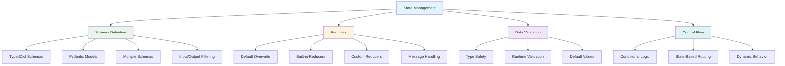

# Topic08: Define and Work with State Schemas and Reducers

## Overview
This topic covers how to define sophisticated state schemas and use reducers to control how state updates are applied in LangGraph. Mastering state management is crucial for building complex, stateful applications that handle data correctly across multiple nodes and interactions.

## What are State Schemas and Reducers?
State schemas define the structure and types of data your graph manages, while reducers are functions that control how updates to that data are applied. Together, they provide powerful control over your application's data flow.

### Core Concepts:
- **State Schema**: Structure definition using TypedDict or Pydantic models
- **Reducers**: Functions that merge state updates with existing state
- **Default Behavior**: Simple overwrite when no reducer is specified
- **Built-in Reducers**: Predefined functions like `add_messages` for common patterns
- **Custom Reducers**: Your own logic for complex state management

## Why Master State Schemas and Reducers?

### State Management Power



## Basic State Schema Patterns

### 1. Simple TypedDict Schema

```python
from typing_extensions import TypedDict

# Basic schema with default overwrite behavior
class SimpleState(TypedDict):
    user_input: str
    processing_status: str
    result: str
    step_count: int

# Usage example
def process_node(state: SimpleState):
    """Node that updates multiple state fields."""
    return {
        "processing_status": "processed",
        "result": f"Processed: {state['user_input']}",
        "step_count": state.get("step_count", 0) + 1
    }
```

### 2. Schema with Optional Fields

```python
from typing import Optional, List

class FlexibleState(TypedDict, total=False):
    # Required fields
    user_id: str
    session_id: str
    
    # Optional fields
    user_input: Optional[str]
    processing_results: Optional[List[str]]
    error_message: Optional[str]
    metadata: Optional[dict]

# Alternative approach with explicit Optional
class ExplicitState(TypedDict):
    user_id: str  # Required
    user_input: Optional[str]  # Optional
    results: Optional[List[str]]  # Optional
```

### 3. Pydantic Model Schema (Advanced)

```python
from pydantic import BaseModel, Field
from typing import List, Optional
from datetime import datetime

class PydanticState(BaseModel):
    """Advanced state with validation and defaults."""
    
    user_id: str = Field(..., description="Unique user identifier")
    session_id: str = Field(..., description="Session identifier")
    
    # Fields with defaults
    created_at: datetime = Field(default_factory=datetime.now)
    step_count: int = Field(default=0, ge=0)  # Must be >= 0
    
    # Optional fields
    user_input: Optional[str] = None
    processing_results: List[str] = Field(default_factory=list)
    
    # Computed fields
    @property
    def is_active(self) -> bool:
        return self.user_input is not None
    
    # Validation
    def validate_input(self):
        if self.user_input and len(self.user_input) > 1000:
            raise ValueError("Input too long")

# Usage with LangGraph
from langgraph.graph import StateGraph

# Use Pydantic model as state
graph_builder = StateGraph(PydanticState)
```

## Understanding Reducers

### 1. Default Reducer (Overwrite)

```python
class DefaultState(TypedDict):
    counter: int
    status: str
    data: list

# Without reducers, updates overwrite existing values
initial_state = {
    "counter": 5,
    "status": "processing", 
    "data": ["item1", "item2"]
}

# Node returns update
node_update = {
    "counter": 10,
    "data": ["item3"]
}

# Result: {"counter": 10, "status": "processing", "data": ["item3"]}
# Note: "status" unchanged, "data" completely replaced
```

### 2. Built-in Reducers

```python
from typing import Annotated
from operator import add
from langgraph.graph.message import add_messages

class ReducerState(TypedDict):
    # List concatenation
    items: Annotated[List[str], add]
    
    # Dictionary merging
    metadata: Annotated[dict, lambda old, new: {**old, **new}]
    
    # Message handling
    messages: Annotated[list, add_messages]
    
    # Custom numeric aggregation
    total_score: Annotated[int, lambda old, new: old + new]

# Example usage
def demonstrate_reducers():
    initial = {
        "items": ["a", "b"],
        "metadata": {"version": "1.0", "author": "user1"},
        "messages": [{"role": "system", "content": "Hello"}],
        "total_score": 100
    }
    
    update = {
        "items": ["c", "d"],  # Will be added to existing list
        "metadata": {"version": "1.1", "features": ["new"]},  # Will merge
        "messages": [{"role": "user", "content": "Hi there"}],  # Will append
        "total_score": 50  # Will be added to existing score
    }
    
    # Result after applying reducers:
    # {
    #   "items": ["a", "b", "c", "d"],
    #   "metadata": {"version": "1.1", "author": "user1", "features": ["new"]},
    #   "messages": [
    #       {"role": "system", "content": "Hello"},
    #       {"role": "user", "content": "Hi there"}
    #   ],
    #   "total_score": 150
    # }
```

### 3. Custom Reducers

```python
from typing import List, Dict, Any

def unique_list_reducer(old: List[str], new: List[str]) -> List[str]:
    """Merge lists while maintaining uniqueness and order."""
    seen = set(old)
    result = old.copy()
    for item in new:
        if item not in seen:
            result.append(item)
            seen.add(item)
    return result

def priority_dict_reducer(old: Dict[str, Any], new: Dict[str, Any]) -> Dict[str, Any]:
    """Merge dictionaries with priority-based conflict resolution."""
    result = old.copy()
    for key, value in new.items():
        if key in result:
            # Handle conflicts based on priority
            if isinstance(value, dict) and value.get("priority", 0) > result[key].get("priority", 0):
                result[key] = value
        else:
            result[key] = value
    return result

def accumulate_with_limit(old: List[Any], new: List[Any], limit: int = 100) -> List[Any]:
    """Accumulate items with a maximum limit."""
    combined = old + new
    return combined[-limit:] if len(combined) > limit else combined

# Create a partial function for the limit
from functools import partial
limited_accumulator = partial(accumulate_with_limit, limit=50)

class AdvancedState(TypedDict):
    unique_tags: Annotated[List[str], unique_list_reducer]
    config_data: Annotated[Dict[str, Any], priority_dict_reducer]
    recent_events: Annotated[List[Any], limited_accumulator]
```

## Working with Messages

### 1. Basic Message Handling

```python
from langchain_core.messages import AnyMessage, HumanMessage, AIMessage, SystemMessage
from langgraph.graph.message import add_messages

class ConversationState(TypedDict):
    messages: Annotated[List[AnyMessage], add_messages]
    context: dict

def chatbot_node(state: ConversationState):
    """Simple chatbot node that processes messages."""
    messages = state["messages"]
    last_message = messages[-1]
    
    # Generate response based on last message
    response = AIMessage(content=f"I received: {last_message.content}")
    
    return {"messages": [response]}

# Example usage
initial_state = {
    "messages": [
        SystemMessage(content="You are a helpful assistant."),
        HumanMessage(content="Hello!")
    ],
    "context": {"user_id": "123"}
}

# The add_messages reducer handles:
# 1. Appending new messages
# 2. Updating existing messages by ID
# 3. Maintaining chronological order
```

### 2. Message Serialization Support

```python
# Both formats are supported automatically
node_update_1 = {
    "messages": [HumanMessage(content="Direct message object")]
}

node_update_2 = {
    "messages": [{"type": "human", "content": "Dictionary format"}]
}

# add_messages automatically converts dict format to Message objects
```

### 3. MessagesState Convenience Class

```python
from langgraph.graph import MessagesState

# Pre-built state class with messages
class ExtendedMessagesState(MessagesState):
    # Add additional fields to MessagesState
    user_id: str
    session_data: dict
    processing_flags: List[str]

# MessagesState already includes:
# messages: Annotated[List[AnyMessage], add_messages]
```

## Advanced Schema Patterns

### 1. Multiple Schemas (Input/Output Filtering)

```python
class InputState(TypedDict):
    user_input: str
    user_id: str

class OutputState(TypedDict):
    final_result: str
    status: str

class InternalState(TypedDict):
    user_input: str
    user_id: str
    final_result: str
    status: str
    # Internal processing fields
    intermediate_results: List[str]
    debug_info: dict
    processing_metadata: dict

class PrivateState(TypedDict):
    # Private state for internal node communication
    temp_data: str
    internal_cache: dict

def input_processor(state: InputState) -> InternalState:
    """Process input and expand to internal state."""
    return {
        "intermediate_results": [f"Processing {state['user_input']}"],
        "debug_info": {"processed_at": "2024-01-01"},
        "status": "processing"
    }

def internal_processor(state: InternalState) -> PrivateState:
    """Internal processing with private state."""
    return {
        "temp_data": "temporary_processing_result",
        "internal_cache": {"cached_value": state["user_input"]}
    }

def output_generator(state: PrivateState) -> OutputState:
    """Generate final output."""
    return {
        "final_result": f"Final: {state['temp_data']}",
        "status": "completed"
    }

# Build graph with multiple schemas
builder = StateGraph(
    InternalState,
    input=InputState,
    output=OutputState
)

builder.add_node("input_process", input_processor)
builder.add_node("internal_process", internal_processor)
builder.add_node("output_generate", output_generator)

builder.add_edge(START, "input_process")
builder.add_edge("input_process", "internal_process")
builder.add_edge("internal_process", "output_generate")
builder.add_edge("output_generate", END)

graph = builder.compile()

# Input only requires InputState fields
result = graph.invoke({"user_input": "test", "user_id": "123"})
# Output only contains OutputState fields
print(result)  # {"final_result": "Final: temporary_processing_result", "status": "completed"}
```

### 2. Dynamic State Fields

```python
def dynamic_field_reducer(old: dict, new: dict) -> dict:
    """Reducer that allows dynamic field addition."""
    result = old.copy()
    for key, value in new.items():
        if key in result:
            # Merge existing fields intelligently
            if isinstance(result[key], list) and isinstance(value, list):
                result[key].extend(value)
            elif isinstance(result[key], dict) and isinstance(value, dict):
                result[key].update(value)
            else:
                result[key] = value
        else:
            # Add new fields dynamically
            result[key] = value
    return result

class DynamicState(TypedDict):
    # Core required fields
    session_id: str
    
    # Dynamic fields container
    dynamic_data: Annotated[dict, dynamic_field_reducer]

def node_that_adds_fields(state: DynamicState):
    """Node that can add arbitrary fields."""
    return {
        "dynamic_data": {
            "new_field": "new_value",
            "computed_result": "some_computation",
            "timestamp": "2024-01-01"
        }
    }
```

## Complete Working Example

```python
from typing import Annotated, List, Dict, Any, Optional
from typing_extensions import TypedDict
from langgraph.graph import StateGraph, START, END
from langgraph.graph.message import add_messages
from langchain_core.messages import AnyMessage, HumanMessage, AIMessage
import json

# Custom reducers
def merge_metadata(old: Dict[str, Any], new: Dict[str, Any]) -> Dict[str, Any]:
    """Merge metadata dictionaries with conflict resolution."""
    result = old.copy()
    for key, value in new.items():
        if key in result and isinstance(result[key], dict) and isinstance(value, dict):
            result[key] = {**result[key], **value}
        else:
            result[key] = value
    return result

def accumulate_unique_items(old: List[str], new: List[str]) -> List[str]:
    """Accumulate unique items maintaining order."""
    seen = set(old)
    result = old.copy()
    for item in new:
        if item not in seen:
            result.append(item)
            seen.add(item)
    return result

# Comprehensive state schema
class ComprehensiveState(TypedDict):
    # Basic fields
    session_id: str
    user_id: str
    
    # Message handling
    messages: Annotated[List[AnyMessage], add_messages]
    
    # Accumulating lists
    processing_steps: Annotated[List[str], accumulate_unique_items]
    error_log: Annotated[List[str], lambda old, new: old + new]
    
    # Metadata with intelligent merging
    metadata: Annotated[Dict[str, Any], merge_metadata]
    
    # Simple overwrites
    current_status: str
    step_count: int
    
    # Optional fields
    final_result: Optional[str]

# Node implementations
def input_handler(state: ComprehensiveState):
    """Handle input and initialize processing."""
    last_message = state["messages"][-1]
    
    return {
        "processing_steps": ["input_received", "validation_passed"],
        "metadata": {
            "input_length": len(last_message.content),
            "processing_started": True,
            "input_metadata": {"type": "user_message"}
        },
        "current_status": "processing",
        "step_count": 1
    }

def processor(state: ComprehensiveState):
    """Main processing logic."""
    messages = state["messages"]
    last_message = messages[-1]
    
    # Simulate processing
    processed_content = f"Processed: {last_message.content}"
    
    return {
        "messages": [AIMessage(content=processed_content)],
        "processing_steps": ["main_processing_complete"],
        "metadata": {
            "processing_metadata": {
                "algorithm": "basic_processor",
                "success": True
            }
        },
        "current_status": "processed",
        "step_count": state["step_count"] + 1
    }

def finalizer(state: ComprehensiveState):
    """Finalize processing and generate result."""
    return {
        "processing_steps": ["finalization_complete"],
        "final_result": f"Final result for session {state['session_id']}",
        "current_status": "completed",
        "step_count": state["step_count"] + 1,
        "metadata": {
            "completion_metadata": {
                "total_steps": state["step_count"] + 1,
                "success": True
            }
        }
    }

# Error handler
def error_handler(state: ComprehensiveState):
    """Handle errors gracefully."""
    return {
        "error_log": ["Error occurred during processing"],
        "current_status": "error",
        "metadata": {
            "error_metadata": {
                "error_handled": True,
                "recovery_attempted": True
            }
        }
    }

# Conditional routing
def should_continue(state: ComprehensiveState) -> str:
    """Route based on current status."""
    if state.get("current_status") == "error":
        return "error"
    elif state.get("step_count", 0) >= 3:
        return "finalize"
    else:
        return "process"

# Build the graph
def create_comprehensive_graph():
    builder = StateGraph(ComprehensiveState)
    
    # Add nodes
    builder.add_node("input_handler", input_handler)
    builder.add_node("processor", processor)
    builder.add_node("finalizer", finalizer)
    builder.add_node("error_handler", error_handler)
    
    # Add edges
    builder.add_edge(START, "input_handler")
    
    # Conditional routing
    builder.add_conditional_edges(
        "input_handler",
        should_continue,
        {
            "process": "processor",
            "finalize": "finalizer",
            "error": "error_handler"
        }
    )
    
    builder.add_conditional_edges(
        "processor",
        should_continue,
        {
            "process": "processor",
            "finalize": "finalizer",
            "error": "error_handler"
        }
    )
    
    builder.add_edge("finalizer", END)
    builder.add_edge("error_handler", END)
    
    return builder.compile()

# Usage example
def run_comprehensive_example():
    graph = create_comprehensive_graph()
    
    initial_state = {
        "session_id": "sess_123",
        "user_id": "user_456",
        "messages": [
            HumanMessage(content="Please process this request")
        ],
        "processing_steps": [],
        "error_log": [],
        "metadata": {"initialization": {"timestamp": "2024-01-01"}},
        "current_status": "initialized",
        "step_count": 0,
        "final_result": None
    }
    
    result = graph.invoke(initial_state)
    
    print("Final State:")
    print(json.dumps(result, indent=2, default=str))
    
    return result

if __name__ == "__main__":
    run_comprehensive_example()
```

## Best Practices

### Do's ✅
- **Use TypedDict** for clear type definitions
- **Choose appropriate reducers** for your data patterns
- **Design schemas** that reflect your application's data flow
- **Use Pydantic models** when you need validation and defaults
- **Test reducer behavior** with various update patterns
- **Document custom reducers** clearly
- **Use MessagesState** for conversation-based applications

### Don'ts ❌
- **Don't ignore type annotations** - they help catch errors early
- **Don't use complex reducers** unnecessarily - simple overwrites often suffice
- **Don't forget about state mutations** - always return new state
- **Don't mix different data patterns** without clear reducers
- **Don't create overly complex schemas** - keep them focused

## Common Issues & Troubleshooting

### Issue: "State update overwrites instead of merging"
```python
# Problem: No reducer specified
class State(TypedDict):
    items: List[str]  # ❌ Will overwrite

# Solution: Add appropriate reducer
class State(TypedDict):
    items: Annotated[List[str], lambda old, new: old + new]  # ✅
```

### Issue: "Custom reducer not working"
```python
# Problem: Incorrect reducer signature
def bad_reducer(old, new):
    return old.extend(new)  # ❌ extend returns None

# Solution: Return new state
def good_reducer(old, new):
    return old + new  # ✅ Returns new list
```

### Issue: "Message handling errors"
```python
# Problem: Wrong annotation
class State(TypedDict):
    messages: List[AnyMessage]  # ❌ No reducer

# Solution: Use add_messages
class State(TypedDict):
    messages: Annotated[List[AnyMessage], add_messages]  # ✅
```

## Integration with Other Concepts
- **Topic06**: StateGraph fundamentals provide the foundation
- **Topic07**: Graph compilation validates state schemas
- **Topic09**: Node functions work with these state patterns
- **Topic10**: Edge routing uses state for conditional logic
- **Topic11**: START/END nodes respect state schemas

## Next Steps
1. **Master node implementation** with proper state handling
2. **Learn edge routing** with state-based conditions
3. **Explore START/END nodes** and graph entry/exit points
4. **Study advanced patterns** like Send API and Command objects
5. **Practice with real applications** using complex state schemas

**🎉 Congratulations!** You now understand how to design sophisticated state schemas and use reducers to control data flow in LangGraph applications. This knowledge enables you to build complex, stateful systems that manage data correctly across multiple interactions and nodes.
