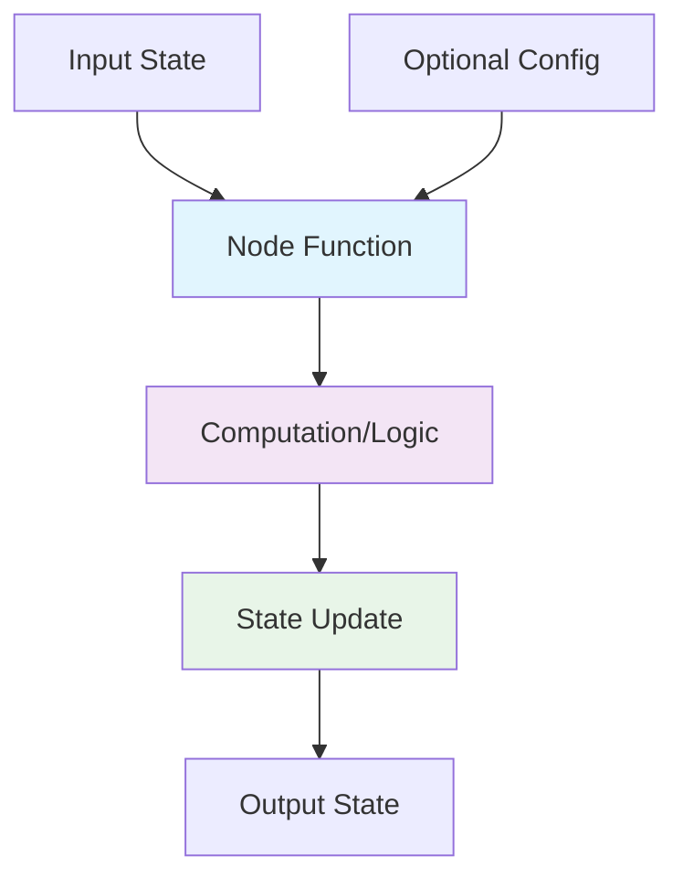
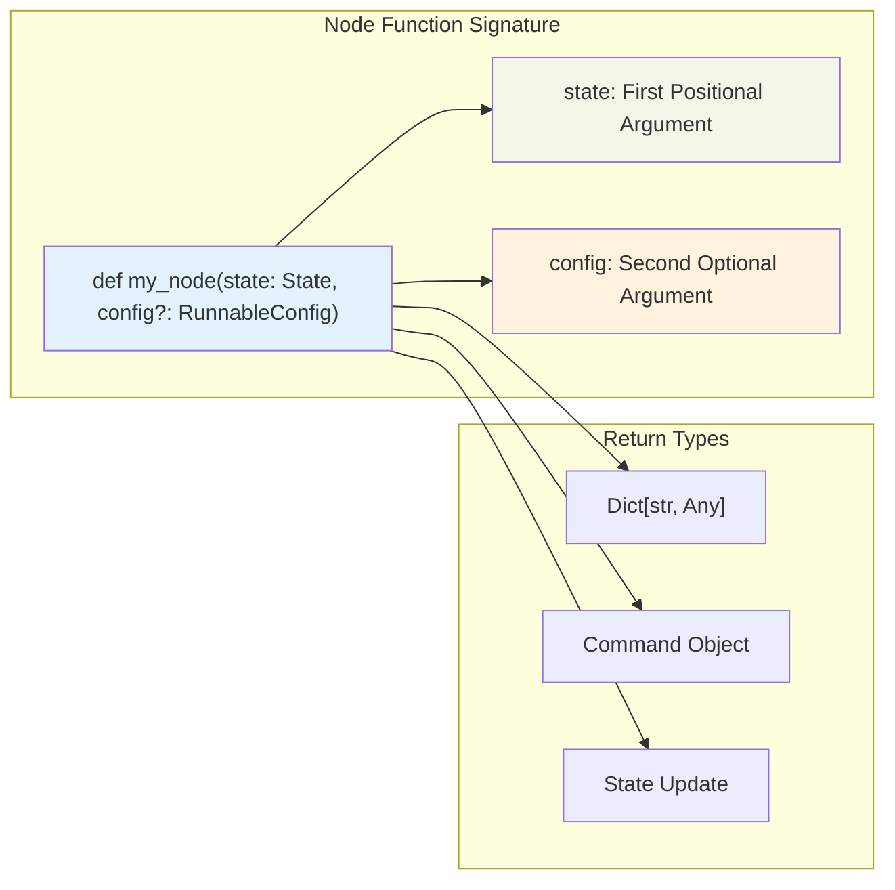
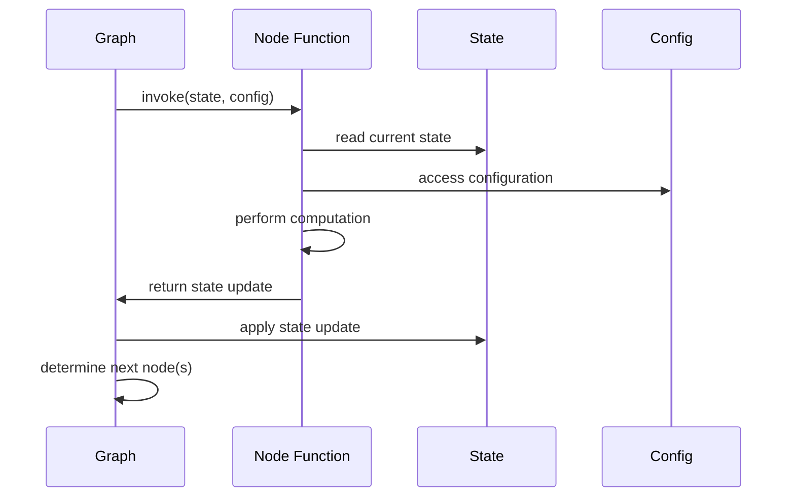

# Topic09: Nodes as Python Functions with Proper Signatures

## Overview
This topic covers how to implement nodes as Python functions in LangGraph with proper signatures, including understanding function requirements, configuration handling, and node execution patterns.

## What are Nodes in LangGraph?

Nodes are the **workhorses** of your LangGraph applications. They are Python functions that:
- Receive the current **State** as input
- Perform computation or side-effects
- Return an updated **State**
- Can optionally accept configuration parameters

**Key Principle**: *Nodes do the work, edges tell what to do next*

## Why Use Proper Node Signatures?



### Benefits:
- **Type Safety**: Clear input/output expectations
- **Configuration Support**: Runtime parameter access
- **Debugging**: Better error messages and traceability
- **Parallelism**: Automatic async/batch support
- **Tracing**: Built-in monitoring and debugging

## Visual Architecture: Node Function Signatures



## Implementation: Basic Node Functions

### 1. Simple Node (State Only)

```python
from typing_extensions import TypedDict

class State(TypedDict):
    input: str
    results: str
    count: int

def simple_node(state: State) -> dict[str, str]:
    """Basic node that only uses state"""
    return {"results": f"Processed: {state['input']}"}

# Usage
from langgraph.graph import StateGraph

builder = StateGraph(State)
builder.add_node("process", simple_node)
```

### 2. Node with Configuration

```python
from langchain_core.runnables import RunnableConfig

def configurable_node(state: State, config: RunnableConfig) -> dict[str, str]:
    """Node that uses configuration parameters"""
    user_id = config["configurable"].get("user_id", "anonymous")
    multiplier = config["configurable"].get("multiplier", 1)
    
    print(f"Processing for user: {user_id}")
    
    return {
        "results": f"User {user_id}: {state['input']} x{multiplier}",
        "count": state.get("count", 0) + multiplier
    }

# Usage with configuration
builder.add_node("configurable_process", configurable_node)

# When invoking the graph
config = {
    "configurable": {
        "user_id": "alice",
        "multiplier": 2
    }
}
result = graph.invoke({"input": "hello"}, config=config)
```

### 3. Async Node Function

```python
import asyncio

async def async_node(state: State) -> dict[str, str]:
    """Async node for I/O operations"""
    # Simulate async operation
    await asyncio.sleep(0.1)
    
    return {"results": f"Async processed: {state['input']}"}

# Usage
builder.add_node("async_process", async_node)
```

### 4. Node with Complex State Updates

```python
from typing import Annotated
from operator import add

class ExtendedState(TypedDict):
    messages: Annotated[list[str], add]  # Using reducer
    input: str
    metadata: dict

def complex_node(state: ExtendedState) -> dict:
    """Node that updates multiple state fields"""
    new_message = f"Processed: {state['input']}"
    
    return {
        "messages": [new_message],  # Will be added to existing messages
        "metadata": {
            "processed_at": "2024-01-01T00:00:00",
            "processor": "complex_node"
        }
    }
```

## Implementation: Advanced Node Patterns

### 1. Node with Error Handling

```python
import logging

def robust_node(state: State, config: RunnableConfig) -> dict[str, str]:
    """Node with proper error handling"""
    try:
        # Your processing logic here
        if not state.get("input"):
            raise ValueError("Input is required")
            
        result = state["input"].upper()
        
        return {"results": result}
        
    except Exception as e:
        logging.error(f"Error in robust_node: {e}")
        return {
            "results": f"Error: {str(e)}",
            "error": True
        }
```

### 2. Node with Conditional Logic

```python
def conditional_node(state: State) -> dict:
    """Node that behaves differently based on state"""
    input_value = state.get("input", "")
    
    if input_value.startswith("urgent:"):
        return {
            "results": f"PRIORITY: {input_value[7:]}",
            "priority": "high"
        }
    else:
        return {
            "results": f"Standard: {input_value}",
            "priority": "normal"
        }
```

### 3. Node Using External APIs

```python
import requests
from typing import Optional

def api_node(state: State, config: RunnableConfig) -> dict:
    """Node that calls external APIs"""
    api_key = config["configurable"].get("api_key")
    if not api_key:
        return {"results": "Error: API key not provided"}
    
    try:
        # Mock API call
        response = {
            "data": f"API response for: {state['input']}",
            "status": "success"
        }
        
        return {
            "results": response["data"],
            "api_status": response["status"]
        }
        
    except requests.RequestException as e:
        return {
            "results": f"API Error: {str(e)}",
            "api_status": "failed"
        }
```

## Node Naming and Registration

### 1. Automatic Naming

```python
def process_data(state: State) -> dict:
    return {"results": "processed"}

# Node name will be "process_data"
builder.add_node(process_data)
```

### 2. Explicit Naming

```python
def generic_processor(state: State) -> dict:
    return {"results": "processed"}

# Give it a specific name
builder.add_node("data_processor", generic_processor)
```

### 3. Multiple Nodes with Same Function

```python
def reusable_processor(state: State, config: RunnableConfig) -> dict:
    processor_type = config["configurable"].get("type", "default")
    return {"results": f"{processor_type}: {state['input']}"}

# Register same function with different names
builder.add_node("text_processor", reusable_processor)
builder.add_node("image_processor", reusable_processor)
```

## Visual Flow: Node Execution Lifecycle



## Best Practices

### ✅ Do's

```python
# ✅ Use proper type hints
def good_node(state: MyState, config: RunnableConfig) -> dict[str, Any]:
    pass

# ✅ Return only state updates, not full state
def efficient_node(state: State) -> dict:
    return {"new_field": "value"}  # Only what changed

# ✅ Handle missing state fields gracefully
def safe_node(state: State) -> dict:
    input_val = state.get("input", "default_value")
    return {"results": f"Processed: {input_val}"}

# ✅ Use configuration for runtime parameters
def configurable_node(state: State, config: RunnableConfig) -> dict:
    model_name = config["configurable"].get("model", "gpt-4")
    return {"model_used": model_name}
```

### ❌ Don'ts

```python
# ❌ Don't return the entire state
def bad_node(state: State) -> State:
    state["new_field"] = "value"
    return state  # Don't do this

# ❌ Don't modify state in place
def dangerous_node(state: State) -> dict:
    state["field"] = "modified"  # Don't mutate input
    return {"other_field": "value"}

# ❌ Don't ignore configuration when needed
def inflexible_node(state: State, config: RunnableConfig) -> dict:
    # Hard-coded instead of using config
    api_key = "hardcoded-key"  # Bad!
    return {"results": "processed"}
```

## Common Issues & Troubleshooting

### Issue 1: Invalid Return Type

**Problem**: Node returns non-dict value
```python
def broken_node(state: State) -> str:
    return "just a string"  # ❌ Wrong!
```

**Solution**: Always return a dictionary
```python
def fixed_node(state: State) -> dict[str, str]:
    return {"results": "just a string"}  # ✅ Correct!
```

### Issue 2: Missing State Fields

**Problem**: Accessing non-existent state fields
```python
def unsafe_node(state: State) -> dict:
    return {"results": state["missing_field"]}  # ❌ KeyError!
```

**Solution**: Use safe access patterns
```python
def safe_node(state: State) -> dict:
    value = state.get("missing_field", "default")  # ✅ Safe!
    return {"results": value}
```

### Issue 3: Configuration Access Errors

**Problem**: Incorrectly accessing configuration
```python
def bad_config_node(state: State, config: RunnableConfig) -> dict:
    value = config["user_id"]  # ❌ Wrong path!
    return {"results": value}
```

**Solution**: Use proper configuration path
```python
def good_config_node(state: State, config: RunnableConfig) -> dict:
    value = config["configurable"].get("user_id", "default")  # ✅ Correct!
    return {"results": value}
```

## Integration with Other Concepts

### Connection to Edges
- Nodes perform work, edges determine flow
- Node return values can influence conditional edges
- Use `Command` objects to combine state updates with routing

### Connection to State Management
- Nodes receive and update the shared state
- Use reducers for complex state merging
- Respect state schema definitions

### Connection to Configuration
- Runtime parameters passed via `config` argument
- Enables flexible, reusable node functions
- Essential for multi-tenant applications

## Next Steps

After mastering node functions, you should explore:
- **Topic10**: Normal and Conditional Edges
- **Topic11**: START and END Nodes  
- **Topic12**: Send API for Dynamic Patterns
- **Topic13**: Command Objects for Combined Updates and Routing

## Complete Example: Customer Service Bot Node

```python
from typing_extensions import TypedDict
from langchain_core.runnables import RunnableConfig
from langgraph.graph import StateGraph
import logging

class CustomerState(TypedDict):
    customer_id: str
    query: str
    response: str
    priority: str
    resolved: bool

def customer_service_node(state: CustomerState, config: RunnableConfig) -> dict:
    """
    Customer service processing node with proper signature
    """
    # Access configuration
    agent_id = config["configurable"].get("agent_id", "AI")
    max_response_length = config["configurable"].get("max_length", 200)
    
    # Log the interaction
    logging.info(f"Agent {agent_id} processing query for customer {state['customer_id']}")
    
    # Process the query
    query = state.get("query", "")
    
    # Determine priority
    priority = "high" if any(word in query.lower() for word in ["urgent", "emergency", "broken"]) else "normal"
    
    # Generate response (simplified)
    response = f"Thank you for contacting us about: {query}. Agent {agent_id} will assist you."
    
    # Truncate if needed
    if len(response) > max_response_length:
        response = response[:max_response_length] + "..."
    
    return {
        "response": response,
        "priority": priority,
        "resolved": priority == "normal"  # Simple resolution logic
    }

# Build the graph
builder = StateGraph(CustomerState)
builder.add_node("customer_service", customer_service_node)

# Configuration
config = {
    "configurable": {
        "agent_id": "Agent_007",
        "max_length": 150
    }
}

# Usage example would go here after adding edges and compiling
```

This comprehensive guide covers everything needed to implement proper node functions in LangGraph! 