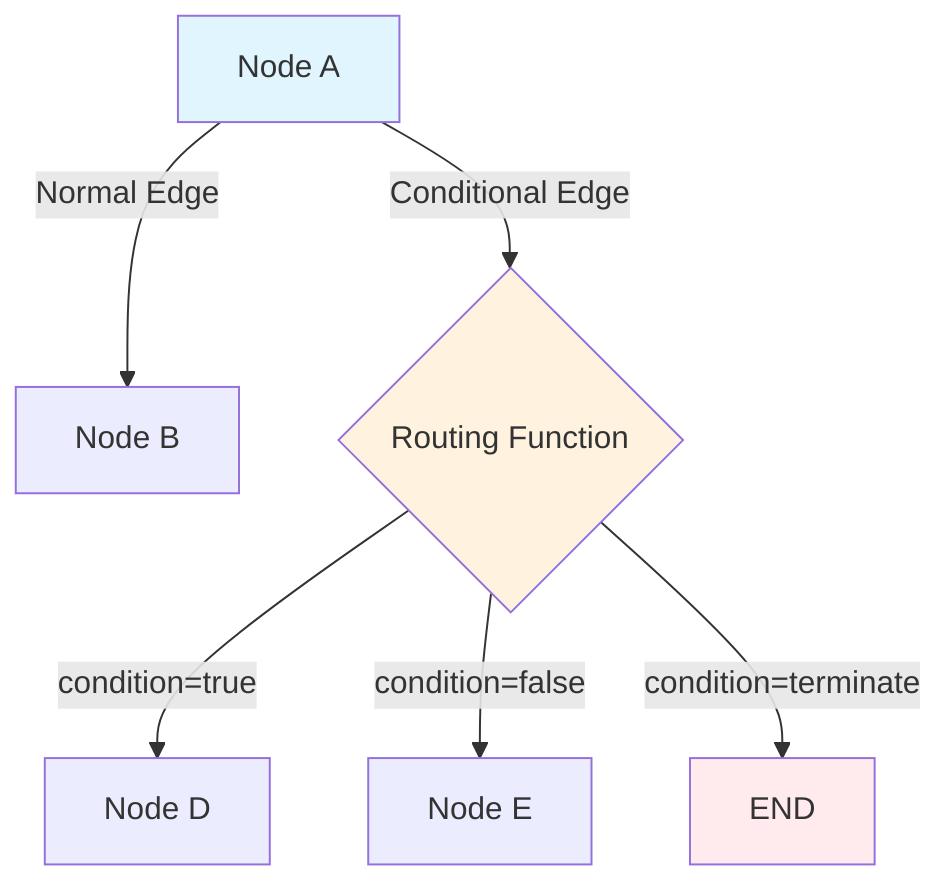
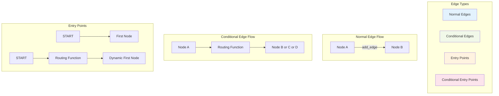
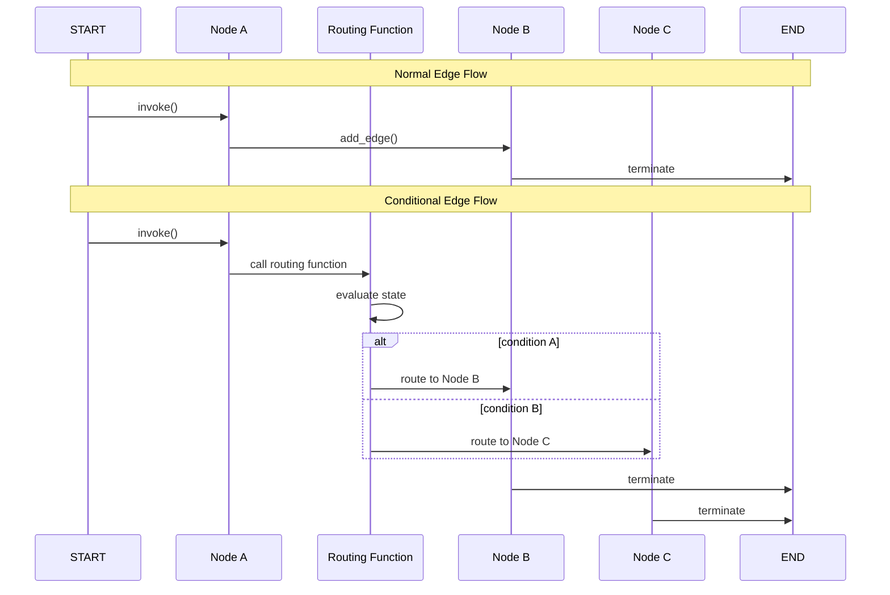

# Topic10: Normal and Conditional Edges for Control Flow

## Overview
This topic covers how to create normal and conditional edges to control flow between nodes in LangGraph, including entry points, routing logic, and advanced edge patterns.

## What are Edges in LangGraph?

Edges are the **control flow mechanisms** of your LangGraph applications. They determine:
- **Which node(s) to execute next** after a node completes
- **How the graph flows** from one operation to another
- **When the graph should terminate** or continue processing

**Key Principle**: *Nodes do the work, edges tell what to do next*

## Why Use Proper Edge Control Flow?



### Benefits:
- **Flow Control**: Direct execution paths between nodes
- **Conditional Logic**: Dynamic routing based on state
- **Parallelism**: Multiple destination nodes execute simultaneously
- **Entry Points**: Flexible graph starting points
- **Termination**: Clean graph completion

## Visual Architecture: Edge Types



## Implementation: Normal Edges

Normal edges create **direct, unconditional** paths between nodes.

### 1. Basic Normal Edge

```python
from langgraph.graph import StateGraph, START, END
from typing_extensions import TypedDict

class State(TypedDict):
    input: str
    result: str
    processed: bool

def process_node(state: State) -> dict:
    return {"result": f"Processed: {state['input']}"}

def validate_node(state: State) -> dict:
    return {"processed": True}

# Build graph with normal edges
builder = StateGraph(State)
builder.add_node("process", process_node)
builder.add_node("validate", validate_node)

# Normal edges - always go from one node to the next
builder.add_edge(START, "process")      # Entry point
builder.add_edge("process", "validate")  # Sequential flow
builder.add_edge("validate", END)       # Termination

graph = builder.compile()
```

### 2. Parallel Execution with Multiple Edges

```python
def process_text(state: State) -> dict:
    return {"text_result": f"Text: {state['input']}"}

def process_metadata(state: State) -> dict:
    return {"meta_result": f"Meta: {state['input']}"}

def combine_results(state: State) -> dict:
    text = state.get("text_result", "")
    meta = state.get("meta_result", "")
    return {"result": f"{text} + {meta}"}

# Build graph with parallel execution
builder = StateGraph(State)
builder.add_node("input_handler", lambda state: state)
builder.add_node("process_text", process_text)
builder.add_node("process_metadata", process_metadata)
builder.add_node("combine", combine_results)

# One node to multiple nodes (parallel execution)
builder.add_edge(START, "input_handler")
builder.add_edge("input_handler", "process_text")     # Both will run in parallel
builder.add_edge("input_handler", "process_metadata") # in the same super-step
builder.add_edge("process_text", "combine")
builder.add_edge("process_metadata", "combine")
builder.add_edge("combine", END)
```

## Implementation: Conditional Edges

Conditional edges use **routing functions** to dynamically determine the next node(s).

### 1. Basic Conditional Edge

```python
def priority_router(state: State) -> str:
    """Routing function that returns the name of the next node"""
    input_text = state.get("input", "").lower()
    
    if "urgent" in input_text:
        return "high_priority_handler"
    elif "normal" in input_text:
        return "normal_handler"
    else:
        return "default_handler"

def high_priority_handler(state: State) -> dict:
    return {"result": f"HIGH PRIORITY: {state['input']}"}

def normal_handler(state: State) -> dict:
    return {"result": f"Normal: {state['input']}"}

def default_handler(state: State) -> dict:
    return {"result": f"Default: {state['input']}"}

# Build graph with conditional edges
builder = StateGraph(State)
builder.add_node("router_node", lambda state: state)  # Pass-through node
builder.add_node("high_priority_handler", high_priority_handler)
builder.add_node("normal_handler", normal_handler)
builder.add_node("default_handler", default_handler)

# Conditional edge with routing function
builder.add_edge(START, "router_node")
builder.add_conditional_edges(
    "router_node",           # Source node
    priority_router          # Routing function
)

# All handlers end the graph
builder.add_edge("high_priority_handler", END)
builder.add_edge("normal_handler", END)
builder.add_edge("default_handler", END)
```

### 2. Conditional Edge with Mapping Dictionary

```python
def simple_router(state: State) -> bool:
    """Simple routing function returning boolean"""
    return len(state.get("input", "")) > 10

def long_text_handler(state: State) -> dict:
    return {"result": f"Long text: {state['input'][:20]}..."}

def short_text_handler(state: State) -> dict:
    return {"result": f"Short text: {state['input']}"}

# Build graph with mapping dictionary
builder = StateGraph(State)
builder.add_node("classifier", lambda state: state)
builder.add_node("long_handler", long_text_handler)
builder.add_node("short_handler", short_text_handler)

builder.add_edge(START, "classifier")
builder.add_conditional_edges(
    "classifier",
    simple_router,
    {
        True: "long_handler",    # Map True to long_handler
        False: "short_handler"   # Map False to short_handler
    }
)

builder.add_edge("long_handler", END)
builder.add_edge("short_handler", END)
```

### 3. Multiple Destination Routing

```python
def multi_destination_router(state: State) -> list[str]:
    """Router that returns multiple destinations for parallel execution"""
    input_text = state.get("input", "")
    destinations = []
    
    if any(keyword in input_text.lower() for keyword in ["analyze", "process"]):
        destinations.append("analyzer")
    
    if any(keyword in input_text.lower() for keyword in ["log", "record"]):
        destinations.append("logger")
    
    if any(keyword in input_text.lower() for keyword in ["notify", "alert"]):
        destinations.append("notifier")
    
    return destinations if destinations else ["default_handler"]

def analyzer(state: State) -> dict:
    return {"analysis": f"Analyzed: {state['input']}"}

def logger(state: State) -> dict:
    return {"log": f"Logged: {state['input']}"}

def notifier(state: State) -> dict:
    return {"notification": f"Notified: {state['input']}"}

# Multiple destinations will execute in parallel
builder.add_conditional_edges("dispatcher", multi_destination_router)
```

## Implementation: Entry Points

Entry points determine where the graph starts execution.

### 1. Normal Entry Point

```python
def entry_processor(state: State) -> dict:
    return {"processed": True, "entry_time": "2024-01-01"}

builder = StateGraph(State)
builder.add_node("entry_processor", entry_processor)
builder.add_node("main_logic", lambda state: {"result": "processed"})

# Simple entry point
builder.add_edge(START, "entry_processor")
builder.add_edge("entry_processor", "main_logic")
builder.add_edge("main_logic", END)
```

### 2. Conditional Entry Point

```python
def entry_router(state: State) -> str:
    """Determine starting node based on input"""
    input_type = state.get("type", "unknown")
    
    if input_type == "user_query":
        return "query_processor"
    elif input_type == "system_event":
        return "event_processor"
    elif input_type == "batch_job":
        return "batch_processor"
    else:
        return "default_processor"

def query_processor(state: State) -> dict:
    return {"result": f"Query processed: {state['input']}"}

def event_processor(state: State) -> dict:
    return {"result": f"Event processed: {state['input']}"}

def batch_processor(state: State) -> dict:
    return {"result": f"Batch processed: {state['input']}"}

def default_processor(state: State) -> dict:
    return {"result": f"Default processed: {state['input']}"}

# Build graph with conditional entry
builder = StateGraph(State)
builder.add_node("query_processor", query_processor)
builder.add_node("event_processor", event_processor)
builder.add_node("batch_processor", batch_processor)
builder.add_node("default_processor", default_processor)

# Conditional entry point
builder.add_conditional_edges(START, entry_router)

# All processors end the graph
for processor in ["query_processor", "event_processor", "batch_processor", "default_processor"]:
    builder.add_edge(processor, END)
```

## Visual Flow: Edge Execution Patterns



## Advanced Edge Patterns

### 1. Looping with Conditional Edges

```python
def should_continue(state: State) -> str:
    """Create loops by routing back to previous nodes"""
    attempts = state.get("attempts", 0)
    max_attempts = state.get("max_attempts", 3)
    success = state.get("success", False)
    
    if success:
        return "completion_handler"
    elif attempts < max_attempts:
        return "retry_handler"
    else:
        return "failure_handler"

def retry_handler(state: State) -> dict:
    return {
        "attempts": state.get("attempts", 0) + 1,
        "result": f"Retry attempt {state.get('attempts', 0) + 1}"
    }

def success_checker(state: State) -> dict:
    # Simulate success after 2 attempts
    success = state.get("attempts", 0) >= 2
    return {"success": success}

# Build looping graph
builder = StateGraph(State)
builder.add_node("processor", success_checker)
builder.add_node("retry_handler", retry_handler)
builder.add_node("completion_handler", lambda state: {"result": "Success!"})
builder.add_node("failure_handler", lambda state: {"result": "Failed after max attempts"})

builder.add_edge(START, "processor")
builder.add_conditional_edges("processor", should_continue)
builder.add_edge("retry_handler", "processor")  # Loop back
builder.add_edge("completion_handler", END)
builder.add_edge("failure_handler", END)
```

### 2. Complex Routing with State Analysis

```python
def intelligent_router(state: State) -> str:
    """Complex routing based on multiple state factors"""
    input_text = state.get("input", "")
    user_type = state.get("user_type", "guest")
    priority = state.get("priority", "normal")
    
    # Complex routing logic
    if user_type == "admin":
        if priority == "high":
            return "admin_high_priority"
        else:
            return "admin_normal"
    elif user_type == "premium":
        return "premium_handler"
    elif "error" in input_text.lower():
        return "error_handler"
    elif len(input_text) > 100:
        return "long_content_handler"
    else:
        return "standard_handler"

# Each handler can be specifically designed for its use case
def admin_high_priority(state: State) -> dict:
    return {
        "result": f"ADMIN HIGH PRIORITY: {state['input']}",
        "response_time": "immediate"
    }

def premium_handler(state: State) -> dict:
    return {
        "result": f"Premium service: {state['input']}",
        "response_time": "fast"
    }

# Add conditional edge with complex routing
builder.add_conditional_edges("classifier", intelligent_router)
```

## Best Practices

### ✅ Do's

```python
# ✅ Use descriptive routing function names
def is_high_priority_user(state: State) -> bool:
    return state.get("user_type") == "premium"

# ✅ Handle all possible routing outcomes
def comprehensive_router(state: State) -> str:
    status = state.get("status", "unknown")
    if status == "new":
        return "new_handler"
    elif status == "processing":
        return "processing_handler"
    else:
        return "default_handler"  # Always have a default

# ✅ Use mapping dictionaries for simple conditions
builder.add_conditional_edges(
    "node",
    simple_boolean_check,
    {True: "success_handler", False: "failure_handler"}
)

# ✅ Keep routing functions pure (no side effects)
def pure_router(state: State) -> str:
    # Only read state, don't modify it
    return "next_node" if state.get("ready") else "wait_node"
```

### ❌ Don'ts

```python
# ❌ Don't return non-existent node names
def bad_router(state: State) -> str:
    return "nonexistent_node"  # Will cause error!

# ❌ Don't modify state in routing functions
def impure_router(state: State) -> str:
    state["modified"] = True  # Don't do this!
    return "next_node"

# ❌ Don't create routing functions without default cases
def incomplete_router(state: State) -> str:
    if state.get("type") == "A":
        return "handler_a"
    # Missing default case - what if type is not "A"?

# ❌ Don't forget to connect all nodes to END
builder.add_node("orphan_node", some_function)
# Missing: builder.add_edge("orphan_node", END)
```

## Common Issues & Troubleshooting

### Issue 1: Routing to Non-existent Nodes

**Problem**: Router returns invalid node name
```python
def broken_router(state: State) -> str:
    return "missing_node"  # ❌ Node doesn't exist!
```

**Solution**: Ensure all routing destinations exist
```python
def safe_router(state: State) -> str:
    valid_nodes = ["handler_a", "handler_b", "default"]
    result = determine_route(state)
    return result if result in valid_nodes else "default"  # ✅ Safe!
```

### Issue 2: Missing Entry Points

**Problem**: Nodes with no path from START
```python
builder.add_node("isolated_node", some_function)
# ❌ No edge from START or other nodes
```

**Solution**: Ensure all nodes are reachable
```python
builder.add_edge(START, "isolated_node")  # ✅ Now reachable!
```

### Issue 3: Orphaned Nodes

**Problem**: Nodes with no path to END
```python
builder.add_node("dead_end", some_function)
builder.add_edge(START, "dead_end")
# ❌ No edge to END - graph never terminates
```

**Solution**: Connect all terminal nodes to END
```python
builder.add_edge("dead_end", END)  # ✅ Graph can terminate!
```

## Integration with Other Concepts

### Connection to Nodes
- Edges determine which nodes execute and in what order
- Multiple outgoing edges create parallel node execution
- Routing functions can access node outputs via state

### Connection to State Management
- Routing functions read current state to make decisions
- State updates from nodes influence subsequent routing
- Conditional edges enable state-driven workflows

### Connection to Command Objects
- Command objects combine state updates with routing
- Use Command for complex node-to-node transitions
- Alternative to separate conditional edges

## Next Steps

After mastering edges, you should explore:
- **Topic11**: START and END Nodes for Graph Entry/Exit Points
- **Topic12**: Send API for Dynamic Map-Reduce Patterns  
- **Topic13**: Command Objects for Combined Updates and Routing
- **Topic14**: Configuration and Runtime Parameters

## Complete Example: Customer Support Routing System

```python
from typing_extensions import TypedDict
from langgraph.graph import StateGraph, START, END

class SupportState(TypedDict):
    query: str
    category: str
    priority: str
    user_type: str
    result: str
    escalated: bool

def categorize_query(state: SupportState) -> dict:
    """Analyze and categorize the incoming query"""
    query = state.get("query", "").lower()
    
    if any(word in query for word in ["bug", "error", "broken"]):
        category = "technical"
    elif any(word in query for word in ["bill", "payment", "charge"]):
        category = "billing"
    elif any(word in query for word in ["cancel", "refund", "return"]):
        category = "cancellation"
    else:
        category = "general"
    
    # Determine priority
    priority = "high" if any(word in query for word in ["urgent", "critical", "down"]) else "normal"
    
    return {"category": category, "priority": priority}

def support_router(state: SupportState) -> str:
    """Route to appropriate handler based on category and priority"""
    category = state.get("category", "general")
    priority = state.get("priority", "normal")
    user_type = state.get("user_type", "standard")
    
    # High priority gets escalated immediately
    if priority == "high":
        return "escalation_handler"
    
    # Premium users get special treatment
    if user_type == "premium":
        return "premium_support"
    
    # Route by category
    category_routes = {
        "technical": "technical_support",
        "billing": "billing_support", 
        "cancellation": "retention_team",
        "general": "general_support"
    }
    
    return category_routes.get(category, "general_support")

def escalation_check(state: SupportState) -> str:
    """Check if case needs escalation after initial handling"""
    return "escalation_handler" if state.get("escalated", False) else "resolution_handler"

# Handler functions
def technical_support(state: SupportState) -> dict:
    return {
        "result": f"Technical support: {state['query']}",
        "escalated": "critical" in state.get("query", "").lower()
    }

def billing_support(state: SupportState) -> dict:
    return {"result": f"Billing handled: {state['query']}"}

def retention_team(state: SupportState) -> dict:
    return {"result": f"Retention team: {state['query']}"}

def premium_support(state: SupportState) -> dict:
    return {"result": f"Premium support: {state['query']}"}

def general_support(state: SupportState) -> dict:
    return {"result": f"General support: {state['query']}"}

def escalation_handler(state: SupportState) -> dict:
    return {"result": f"ESCALATED: {state['query']}"}

def resolution_handler(state: SupportState) -> dict:
    return {"result": f"RESOLVED: {state.get('result', '')}"}

# Build the support routing graph
builder = StateGraph(SupportState)

# Add all nodes
builder.add_node("categorize", categorize_query)
builder.add_node("technical_support", technical_support)
builder.add_node("billing_support", billing_support)
builder.add_node("retention_team", retention_team)
builder.add_node("premium_support", premium_support)
builder.add_node("general_support", general_support)
builder.add_node("escalation_handler", escalation_handler)
builder.add_node("resolution_handler", resolution_handler)

# Entry point
builder.add_edge(START, "categorize")

# Main routing logic
builder.add_conditional_edges("categorize", support_router)

# Secondary routing for escalation check
for support_type in ["technical_support", "billing_support", "retention_team", "general_support"]:
    builder.add_conditional_edges(support_type, escalation_check)

# Terminal edges
builder.add_edge("premium_support", END)  # Premium bypasses escalation check
builder.add_edge("escalation_handler", END)
builder.add_edge("resolution_handler", END)

# Compile the graph
support_graph = builder.compile()

# Example usage
test_cases = [
    {
        "query": "urgent billing issue with my payment",
        "user_type": "standard"
    },
    {
        "query": "general question about features", 
        "user_type": "premium"
    },
    {
        "query": "critical system bug affecting production",
        "user_type": "standard"
    }
]

for test_case in test_cases:
    result = support_graph.invoke(test_case)
    print(f"Query: {test_case['query']}")
    print(f"Result: {result['result']}")
    print("---")
```

This comprehensive guide covers everything needed to implement proper edge control flow in LangGraph! 