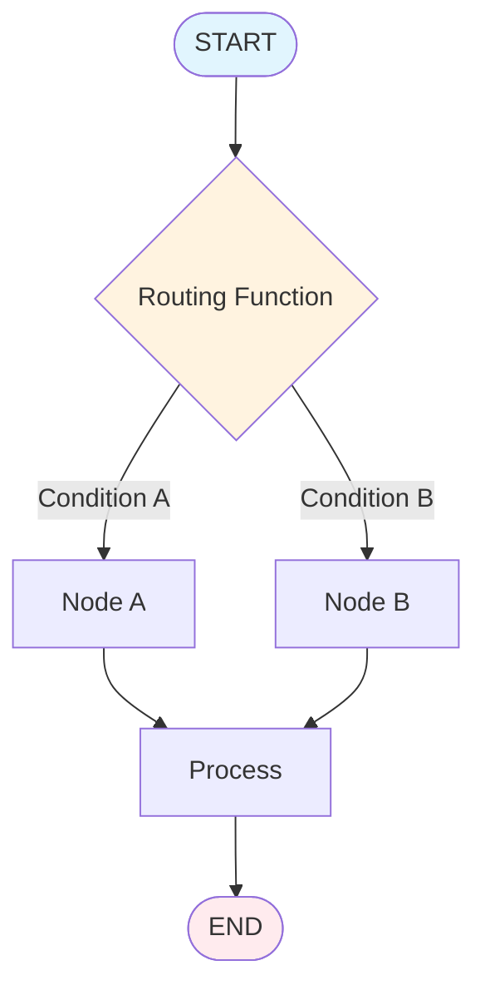
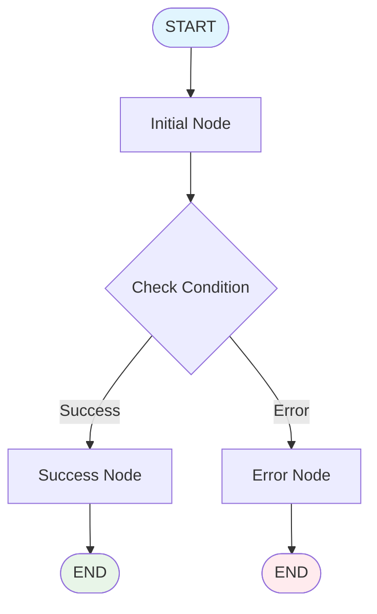
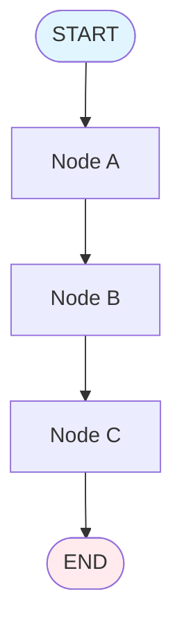
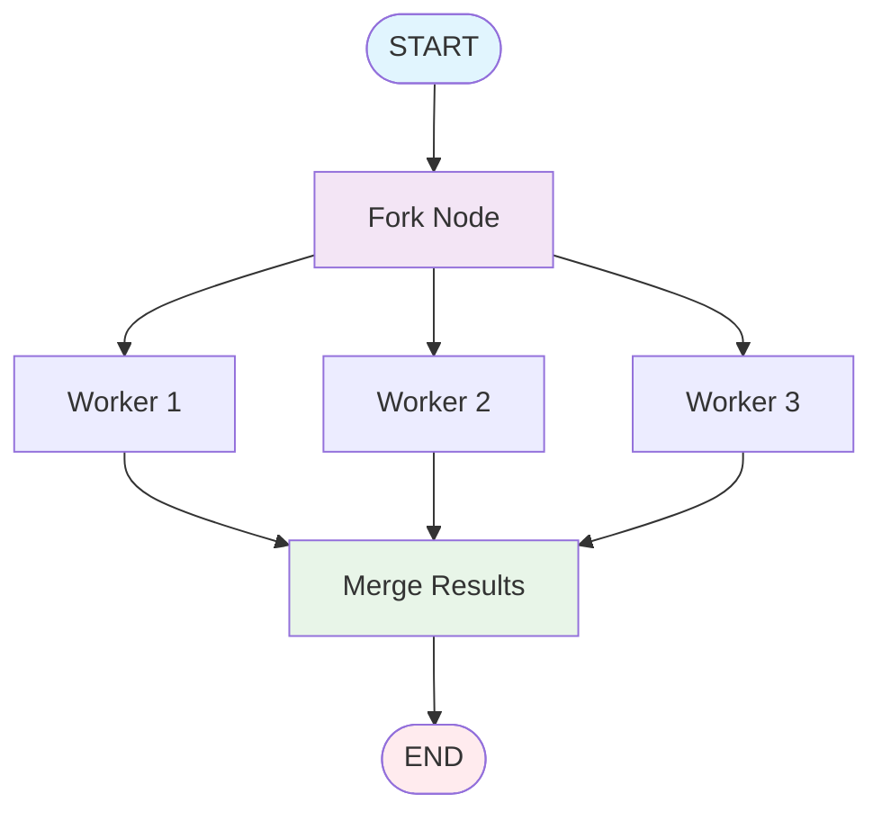

# Topic11: START and END Nodes

## Overview
START and END nodes are special virtual nodes in LangGraph that define entry and exit points for your graph execution. They provide clean, explicit ways to control where graph execution begins and terminates.

## What are START and END Nodes?

### START Node
The `START` node is a special virtual node that represents the entry point where user input enters the graph. It's not a function you define - it's a constant provided by LangGraph to reference the beginning of execution.

### END Node 
The `END` node is a special virtual node that represents terminal points in your graph. When execution reaches an END node, the graph stops processing.

## Why Use START and END Nodes?

### Benefits
- **Explicit Control Flow**: Clear definition of entry and exit points
- **Clean Architecture**: Separates graph topology from business logic
- **Multiple Entry Points**: Support for conditional entry points based on input
- **Predictable Termination**: Explicit control over when execution stops
- **Visual Clarity**: Makes graph structure immediately apparent

## Visual Architecture

### Basic Linear Flow


### Multiple Entry Points


### Multiple Exit Points


### Parallel Execution with Convergence


## Implementation

### Basic START and END Usage

```python
from typing_extensions import TypedDict
from langgraph.graph import StateGraph, START, END

# Define state schema
class State(TypedDict):
    input: str
    processed: str
    result: str

# Create graph builder
builder = StateGraph(State)

# Define nodes
def process_input(state: State) -> dict:
    """Process the initial input"""
    return {
        "processed": f"Processed: {state['input']}"
    }

def generate_result(state: State) -> dict:
    """Generate final result"""
    return {
        "result": f"Result: {state['processed']}"
    }

# Add nodes to graph
builder.add_node("process", process_input)
builder.add_node("generate", generate_result)

# Define flow with START and END
builder.add_edge(START, "process")        # Entry point
builder.add_edge("process", "generate")   # Sequential flow
builder.add_edge("generate", END)         # Exit point

# Compile graph
graph = builder.compile()

# Test the flow
result = graph.invoke({"input": "Hello World"})
print(result)
# Output: {
#     'input': 'Hello World', 
#     'processed': 'Processed: Hello World', 
#     'result': 'Result: Processed: Hello World'
# }
```

### Conditional Entry Points

```python
from langgraph.graph import StateGraph, START, END

class RouterState(TypedDict):
    user_type: str
    message: str
    response: str

builder = StateGraph(RouterState)

# Define different handler nodes
def admin_handler(state: RouterState) -> dict:
    return {"response": f"Admin handling: {state['message']}"}

def user_handler(state: RouterState) -> dict:
    return {"response": f"User handling: {state['message']}"}

def guest_handler(state: RouterState) -> dict:
    return {"response": f"Guest handling: {state['message']}"}

# Add nodes
builder.add_node("admin", admin_handler)
builder.add_node("user", user_handler) 
builder.add_node("guest", guest_handler)

# Define routing function
def route_by_user_type(state: RouterState) -> str:
    """Route to different handlers based on user type"""
    user_type = state.get("user_type", "guest")
    
    if user_type == "admin":
        return "admin"
    elif user_type == "user":
        return "user"
    else:
        return "guest"

# Add conditional entry point
builder.add_conditional_edges(
    START,
    route_by_user_type,
    {
        "admin": "admin",
        "user": "user", 
        "guest": "guest"
    }
)

# All paths lead to END
builder.add_edge("admin", END)
builder.add_edge("user", END)
builder.add_edge("guest", END)

graph = builder.compile()

# Test different entry points
print(graph.invoke({"user_type": "admin", "message": "Delete user"}))
# Output: {'user_type': 'admin', 'message': 'Delete user', 'response': 'Admin handling: Delete user'}

print(graph.invoke({"user_type": "user", "message": "Update profile"}))
# Output: {'user_type': 'user', 'message': 'Update profile', 'response': 'User handling: Update profile'}

print(graph.invoke({"message": "View content"}))  # No user_type = guest
# Output: {'message': 'View content', 'response': 'Guest handling: View content'}
```

### Multiple Exit Points (Error Handling)

```python
from langgraph.graph import StateGraph, START, END

class ProcessingState(TypedDict):
    data: str
    validation_passed: bool
    error_message: str
    result: str

builder = StateGraph(ProcessingState)

def validate_input(state: ProcessingState) -> dict:
    """Validate input data"""
    data = state.get("data", "")
    
    if len(data) < 3:
        return {
            "validation_passed": False,
            "error_message": "Data too short (minimum 3 characters)"
        }
    elif not data.isalnum():
        return {
            "validation_passed": False, 
            "error_message": "Data must be alphanumeric"
        }
    else:
        return {"validation_passed": True}

def process_data(state: ProcessingState) -> dict:
    """Process valid data"""
    return {"result": f"Processed: {state['data'].upper()}"}

def handle_error(state: ProcessingState) -> dict:
    """Handle validation errors"""
    return {"result": f"Error: {state['error_message']}"}

# Add nodes
builder.add_node("validate", validate_input)
builder.add_node("process", process_data)
builder.add_node("error", handle_error)

# Entry point
builder.add_edge(START, "validate")

# Conditional routing after validation
def route_after_validation(state: ProcessingState) -> str:
    if state.get("validation_passed", False):
        return "process"
    else:
        return "error"

builder.add_conditional_edges(
    "validate",
    route_after_validation,
    {
        "process": "process",
        "error": "error"
    }
)

# Multiple exit points
builder.add_edge("process", END)  # Success path
builder.add_edge("error", END)    # Error path

graph = builder.compile()

# Test success case
result1 = graph.invoke({"data": "hello123"})
print(result1)
# Output: {'data': 'hello123', 'validation_passed': True, 'result': 'Processed: HELLO123'}

# Test error case  
result2 = graph.invoke({"data": "hi"})
print(result2)
# Output: {'data': 'hi', 'validation_passed': False, 'error_message': 'Data too short (minimum 3 characters)', 'result': 'Error: Data too short (minimum 3 characters)'}
```

## Best Practices

### DO's
- **Always define clear entry points** using START edges
- **Use END nodes for all terminal paths** to make flow explicit  
- **Name your routing functions descriptively** for conditional entry points
- **Handle all possible routing outcomes** in conditional edges
- **Use multiple END nodes** for different exit scenarios (success, error, etc.)
- **Test all entry/exit paths** to ensure complete coverage

### DON'Ts
- **Don't forget END nodes** - this can cause graphs to hang
- **Don't create unreachable nodes** - every node should have a path from START
- **Don't create infinite loops** without proper termination conditions
- **Don't rely on implicit termination** - always use explicit END nodes
- **Don't mix business logic in routing functions** - keep them focused on decision-making

## Common Issues & Troubleshooting

### Issue: Graph Never Terminates
```python
# ❌ BAD - Missing END node
builder.add_edge(START, "process")
builder.add_edge("process", "analyze") 
# No path to END!

# ✅ GOOD - Explicit termination
builder.add_edge(START, "process")
builder.add_edge("process", "analyze")
builder.add_edge("analyze", END)  # Clear termination
```

### Issue: Unreachable Nodes
```python
# ❌ BAD - Node not connected to START
builder.add_node("orphan", orphan_function)  # No path from START

# ✅ GOOD - All nodes reachable
builder.add_edge(START, "entry")
builder.add_edge("entry", "orphan")  # Now reachable
builder.add_edge("orphan", END)
```

## Integration with Other Concepts

### Relationship to Nodes and Edges
- **START/END are virtual nodes** - they don't execute functions
- **Regular nodes** contain your business logic
- **Edges connect everything** including START and END nodes
- **Conditional edges** can route from START or to END

### State Management
- **START receives initial state** from graph.invoke()
- **END returns final state** as graph output
- **State flows through** all nodes between START and END
- **Multiple END paths** can return different state structures

## Next Steps

After mastering START and END nodes, continue with:
- **Topic12**: Send API for dynamic map-reduce patterns
- **Topic13**: Command objects for combining state updates and routing  
- **Topic14**: Configuration and recursion limits
- **Topic15**: Visualization and debugging graph structures

START and END nodes form the foundation of graph control flow - master these concepts before moving to more advanced routing patterns.
START and END nodes are special virtual nodes in LangGraph that define entry and exit points for your graph execution. They provide clean, explicit ways to control where graph execution begins and terminates.

## What are START and END Nodes?

### START Node
The `START` node is a special virtual node that represents the entry point where user input enters the graph. It's not a function you define - it's a constant provided by LangGraph to reference the beginning of execution.

### END Node 
The `END` node is a special virtual node that represents terminal points in your graph. When execution reaches an END node, the graph stops processing.

## Why Use START and END Nodes?

### Benefits
- **Explicit Control Flow**: Clear definition of entry and exit points
- **Clean Architecture**: Separates graph topology from business logic
- **Multiple Entry Points**: Support for conditional entry points based on input
- **Predictable Termination**: Explicit control over when execution stops
- **Visual Clarity**: Makes graph structure immediately apparent

## Visual Architecture

### Basic Linear Flow


### Multiple Entry Points


### Multiple Exit Points


### Parallel Execution with Convergence


## Implementation

### Basic START and END Usage

```python
from typing_extensions import TypedDict
from langgraph.graph import StateGraph, START, END

# Define state schema
class State(TypedDict):
    input: str
    processed: str
    result: str

# Create graph builder
builder = StateGraph(State)

# Define nodes
def process_input(state: State) -> dict:
    """Process the initial input"""
    return {
        "processed": f"Processed: {state['input']}"
    }

def generate_result(state: State) -> dict:
    """Generate final result"""
    return {
        "result": f"Result: {state['processed']}"
    }

# Add nodes to graph
builder.add_node("process", process_input)
builder.add_node("generate", generate_result)

# Define flow with START and END
builder.add_edge(START, "process")        # Entry point
builder.add_edge("process", "generate")   # Sequential flow
builder.add_edge("generate", END)         # Exit point

# Compile graph
graph = builder.compile()

# Test the flow
result = graph.invoke({"input": "Hello World"})
print(result)
# Output: {
#     'input': 'Hello World', 
#     'processed': 'Processed: Hello World', 
#     'result': 'Result: Processed: Hello World'
# }
```

### Conditional Entry Points

```python
from langgraph.graph import StateGraph, START, END

class RouterState(TypedDict):
    user_type: str
    message: str
    response: str

builder = StateGraph(RouterState)

# Define different handler nodes
def admin_handler(state: RouterState) -> dict:
    return {"response": f"Admin handling: {state['message']}"}

def user_handler(state: RouterState) -> dict:
    return {"response": f"User handling: {state['message']}"}

def guest_handler(state: RouterState) -> dict:
    return {"response": f"Guest handling: {state['message']}"}

# Add nodes
builder.add_node("admin", admin_handler)
builder.add_node("user", user_handler) 
builder.add_node("guest", guest_handler)

# Define routing function
def route_by_user_type(state: RouterState) -> str:
    """Route to different handlers based on user type"""
    user_type = state.get("user_type", "guest")
    
    if user_type == "admin":
        return "admin"
    elif user_type == "user":
        return "user"
    else:
        return "guest"

# Add conditional entry point
builder.add_conditional_edges(
    START,
    route_by_user_type,
    {
        "admin": "admin",
        "user": "user", 
        "guest": "guest"
    }
)

# All paths lead to END
builder.add_edge("admin", END)
builder.add_edge("user", END)
builder.add_edge("guest", END)

graph = builder.compile()

# Test different entry points
print(graph.invoke({"user_type": "admin", "message": "Delete user"}))
# Output: {'user_type': 'admin', 'message': 'Delete user', 'response': 'Admin handling: Delete user'}

print(graph.invoke({"user_type": "user", "message": "Update profile"}))
# Output: {'user_type': 'user', 'message': 'Update profile', 'response': 'User handling: Update profile'}

print(graph.invoke({"message": "View content"}))  # No user_type = guest
# Output: {'message': 'View content', 'response': 'Guest handling: View content'}
```

### Multiple Exit Points (Error Handling)

```python
from langgraph.graph import StateGraph, START, END

class ProcessingState(TypedDict):
    data: str
    validation_passed: bool
    error_message: str
    result: str

builder = StateGraph(ProcessingState)

def validate_input(state: ProcessingState) -> dict:
    """Validate input data"""
    data = state.get("data", "")
    
    if len(data) < 3:
        return {
            "validation_passed": False,
            "error_message": "Data too short (minimum 3 characters)"
        }
    elif not data.isalnum():
        return {
            "validation_passed": False, 
            "error_message": "Data must be alphanumeric"
        }
    else:
        return {"validation_passed": True}

def process_data(state: ProcessingState) -> dict:
    """Process valid data"""
    return {"result": f"Processed: {state['data'].upper()}"}

def handle_error(state: ProcessingState) -> dict:
    """Handle validation errors"""
    return {"result": f"Error: {state['error_message']}"}

# Add nodes
builder.add_node("validate", validate_input)
builder.add_node("process", process_data)
builder.add_node("error", handle_error)

# Entry point
builder.add_edge(START, "validate")

# Conditional routing after validation
def route_after_validation(state: ProcessingState) -> str:
    if state.get("validation_passed", False):
        return "process"
    else:
        return "error"

builder.add_conditional_edges(
    "validate",
    route_after_validation,
    {
        "process": "process",
        "error": "error"
    }
)

# Multiple exit points
builder.add_edge("process", END)  # Success path
builder.add_edge("error", END)    # Error path

graph = builder.compile()

# Test success case
result1 = graph.invoke({"data": "hello123"})
print(result1)
# Output: {'data': 'hello123', 'validation_passed': True, 'result': 'Processed: HELLO123'}

# Test error case  
result2 = graph.invoke({"data": "hi"})
print(result2)
# Output: {'data': 'hi', 'validation_passed': False, 'error_message': 'Data too short (minimum 3 characters)', 'result': 'Error: Data too short (minimum 3 characters)'}
```

### Complex Workflow with Multiple START/END Patterns

```python
from langgraph.graph import StateGraph, START, END

class WorkflowState(TypedDict):
    task_type: str
    priority: str
    data: list[str]
    processed_items: list[str]
    summary: str
    error: str

builder = StateGraph(WorkflowState)

# Entry point routing
def route_entry(state: WorkflowState) -> str:
    task = state.get("task_type", "")
    priority = state.get("priority", "normal")
    
    if task == "batch" and priority == "high":
        return "fast_batch"
    elif task == "batch":
        return "normal_batch"
    elif task == "single":
        return "single_item"
    else:
        return "unknown_task"

# Processing nodes
def fast_batch_processor(state: WorkflowState) -> dict:
    """High priority batch processing"""
    items = state.get("data", [])
    processed = [f"FAST-{item.upper()}" for item in items]
    return {"processed_items": processed}

def normal_batch_processor(state: WorkflowState) -> dict:
    """Normal batch processing"""
    items = state.get("data", [])
    processed = [f"batch-{item}" for item in items]
    return {"processed_items": processed}

def single_processor(state: WorkflowState) -> dict:
    """Single item processing"""
    items = state.get("data", [])
    if items:
        processed = [f"single-{items[0]}"]
    else:
        processed = []
    return {"processed_items": processed}

def error_handler(state: WorkflowState) -> dict:
    """Handle unknown tasks"""
    return {"error": f"Unknown task type: {state.get('task_type', 'None')}"}

def summarize_results(state: WorkflowState) -> dict:
    """Create summary of processed items"""
    items = state.get("processed_items", [])
    summary = f"Processed {len(items)} items: {', '.join(items)}"
    return {"summary": summary}

# Add all nodes
builder.add_node("fast_batch", fast_batch_processor)
builder.add_node("normal_batch", normal_batch_processor)
builder.add_node("single_item", single_processor)
builder.add_node("error_task", error_handler)
builder.add_node("summarize", summarize_results)

# Conditional entry point
builder.add_conditional_edges(
    START,
    route_entry,
    {
        "fast_batch": "fast_batch",
        "normal_batch": "normal_batch", 
        "single_item": "single_item",
        "unknown_task": "error_task"
    }
)

# Processing paths converge to summary (except errors)
builder.add_edge("fast_batch", "summarize")
builder.add_edge("normal_batch", "summarize")
builder.add_edge("single_item", "summarize")

# Multiple exit points
builder.add_edge("summarize", END)  # Success path
builder.add_edge("error_task", END) # Error path

graph = builder.compile()

# Test different workflows
print("=== High Priority Batch ===")
result1 = graph.invoke({
    "task_type": "batch",
    "priority": "high", 
    "data": ["item1", "item2", "item3"]
})
print(result1["summary"])
# Output: Processed 3 items: FAST-ITEM1, FAST-ITEM2, FAST-ITEM3

print("\n=== Normal Batch ===")
result2 = graph.invoke({
    "task_type": "batch",
    "data": ["alpha", "beta"]
})
print(result2["summary"]) 
# Output: Processed 2 items: batch-alpha, batch-beta

print("\n=== Single Item ===")
result3 = graph.invoke({
    "task_type": "single",
    "data": ["solo"]
})
print(result3["summary"])
# Output: Processed 1 items: single-solo

print("\n=== Error Case ===")
result4 = graph.invoke({
    "task_type": "invalid"
})
print(result4.get("error", "No error"))
# Output: Unknown task type: invalid
```

## Best Practices

### DO's
- **Always define clear entry points** using START edges
- **Use END nodes for all terminal paths** to make flow explicit  
- **Name your routing functions descriptively** for conditional entry points
- **Handle all possible routing outcomes** in conditional edges
- **Use multiple END nodes** for different exit scenarios (success, error, etc.)
- **Test all entry/exit paths** to ensure complete coverage

### DON'Ts
- **Don't forget END nodes** - this can cause graphs to hang
- **Don't create unreachable nodes** - every node should have a path from START
- **Don't create infinite loops** without proper termination conditions
- **Don't rely on implicit termination** - always use explicit END nodes
- **Don't mix business logic in routing functions** - keep them focused on decision-making

## Common Issues & Troubleshooting

### Issue: Graph Never Terminates
```python
# ❌ BAD - Missing END node
builder.add_edge(START, "process")
builder.add_edge("process", "analyze") 
# No path to END!

# ✅ GOOD - Explicit termination
builder.add_edge(START, "process")
builder.add_edge("process", "analyze")
builder.add_edge("analyze", END)  # Clear termination
```

### Issue: Unreachable Nodes
```python
# ❌ BAD - Node not connected to START
builder.add_node("orphan", orphan_function)  # No path from START

# ✅ GOOD - All nodes reachable
builder.add_edge(START, "entry")
builder.add_edge("entry", "orphan")  # Now reachable
builder.add_edge("orphan", END)
```

### Issue: Missing Routing Cases
```python
# ❌ BAD - Incomplete routing
def incomplete_router(state):
    if state["type"] == "A":
        return "node_a"
    # Missing cases for type "B", "C", etc.

# ✅ GOOD - Complete routing  
def complete_router(state):
    task_type = state.get("type", "default")
    
    if task_type == "A":
        return "node_a"
    elif task_type == "B":
        return "node_b"
    else:
        return "default_handler"  # Always have a fallback
```

## Integration with Other Concepts

### Relationship to Nodes and Edges
- **START/END are virtual nodes** - they don't execute functions
- **Regular nodes** contain your business logic
- **Edges connect everything** including START and END nodes
- **Conditional edges** can route from START or to END

### State Management
- **START receives initial state** from graph.invoke()
- **END returns final state** as graph output
- **State flows through** all nodes between START and END
- **Multiple END paths** can return different state structures

### Error Handling
- **END nodes for error paths** provide clean error termination
- **START routing** can prevent invalid inputs from entering main flow
- **Conditional exits** allow graceful error handling

## Next Steps

After mastering START and END nodes, continue with:
- **Topic12**: Send API for dynamic map-reduce patterns
- **Topic13**: Command objects for combining state updates and routing  
- **Topic14**: Configuration and recursion limits
- **Topic15**: Visualization and debugging graph structures

START and END nodes form the foundation of graph control flow - master these concepts before moving to more advanced routing patterns. 