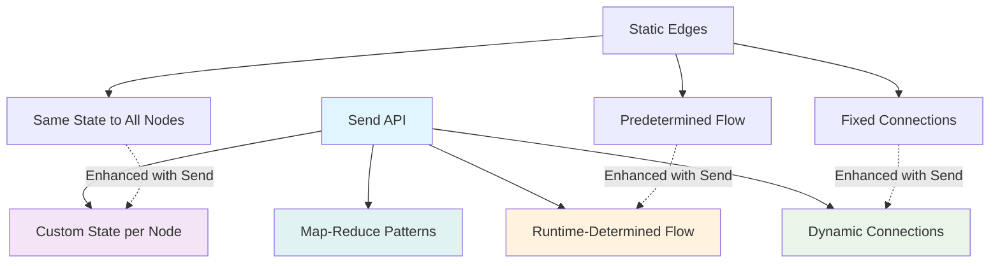
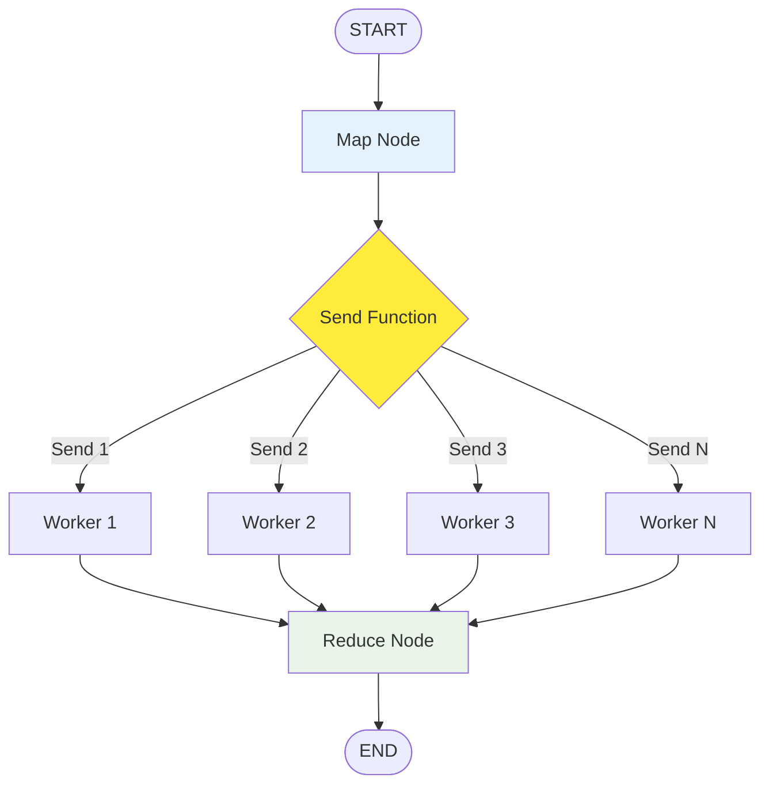
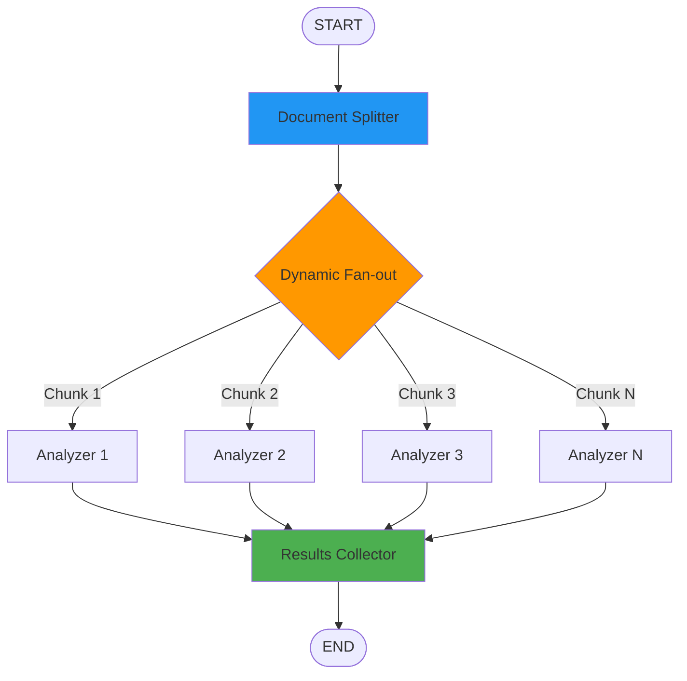

# Topic12: Send API for Dynamic Map-Reduce Patterns

## Overview
The Send API is LangGraph's powerful mechanism for creating dynamic map-reduce patterns where the number of parallel tasks and their inputs aren't known ahead of time. This enables sophisticated workflows like parallel processing, dynamic fan-out operations, and advanced multi-agent coordination.

## What is the Send API?

### Core Concepts
The `Send` API allows you to:
- **Dynamically create edges** at runtime based on state
- **Send different state** to different nodes simultaneously  
- **Implement map-reduce patterns** where mapping targets are determined dynamically
- **Enable parallel processing** with varying numbers of workers

### Key Difference from Regular Edges
- **Regular edges**: Static connections defined at graph build time
- **Send API**: Dynamic connections created during execution based on current state

## Why Use the Send API?

### Dynamic Workflow Benefits



### Use Cases
- **Document Processing**: Split large documents into chunks for parallel analysis
- **Batch Operations**: Process variable-length lists of items
- **Multi-Agent Tasks**: Assign different tasks to specialized agents
- **API Fanout**: Make multiple API calls with different parameters
- **Data Pipeline**: Process datasets of unknown size

## Visual Architecture: Send API Patterns

### Basic Map-Reduce Pattern


### Dynamic Document Processing


## Implementation

### Basic Send API Usage

```python
from typing_extensions import TypedDict
from langgraph.graph import StateGraph, START, END
from langgraph.constants import Send

# Define state schemas
class OverallState(TypedDict):
    subjects: list[str]
    jokes: list[str]

class JokeState(TypedDict):
    subject: str

# Create graph builder
builder = StateGraph(OverallState)

def generate_subjects(state: OverallState) -> dict:
    """Generate subjects for joke generation"""
    return {
        "subjects": ["cats", "dogs", "programming", "coffee", "monday"]
    }

def continue_to_jokes(state: OverallState) -> list[Send]:
    """
    Dynamic fan-out function that creates Send objects for each subject.
    This is where the magic happens - we determine at runtime how many
    parallel tasks to create and what data each should receive.
    """
    return [
        Send("generate_joke", {"subject": subject}) 
        for subject in state["subjects"]
    ]

def generate_joke(state: JokeState) -> dict:
    """
    Worker node that generates a joke for a specific subject.
    Each parallel execution gets its own state with just the subject.
    """
    subject = state["subject"]
    
    # Simple joke templates (in real app, use LLM)
    jokes = {
        "cats": f"Why don't {subject} ever pay bills? Because they have nine lives to avoid debt!",
        "dogs": f"Why do {subject} never worry? Because every day is a paws-itive day!",
        "programming": f"Why do {subject} love coffee? Because they need to stay caffeinated while debugging!",
        "coffee": f"Why is {subject} so energizing? Because it's grounds for improvement!",
        "monday": f"Why does {subject} feel so long? Because it's just trying to catch up to Friday!"
    }
    
    joke = jokes.get(subject, f"Why is {subject} funny? Because humor is subjective!")
    
    return {"jokes": [joke]}

# Build the graph
builder.add_node("generate_subjects", generate_subjects)
builder.add_node("generate_joke", generate_joke)

# Add edges
builder.add_edge(START, "generate_subjects")
builder.add_conditional_edges("generate_subjects", continue_to_jokes)
builder.add_edge("generate_joke", END)

# Compile and test
graph = builder.compile()

result = graph.invoke({"subjects": [], "jokes": []})
print("Generated Jokes:")
for joke in result["jokes"]:
    print(f"- {joke}")
```

### Document Processing with Send API

```python
from typing import Annotated
from operator import add

# State schemas for document processing
class DocumentState(TypedDict):
    document: str
    chunks: list[str]
    analyses: Annotated[list[dict], add]  # Accumulate analysis results
    summary: str

class ChunkState(TypedDict):
    chunk: str
    chunk_id: int

def split_document(state: DocumentState) -> dict:
    """Split document into processable chunks"""
    document = state.get("document", "")
    
    # Simple chunking by sentences (in practice, use more sophisticated methods)
    sentences = document.split(". ")
    chunk_size = 2  # 2 sentences per chunk
    
    chunks = []
    for i in range(0, len(sentences), chunk_size):
        chunk = ". ".join(sentences[i:i+chunk_size])
        if chunk and not chunk.endswith("."):
            chunk += "."
        chunks.append(chunk)
    
    return {"chunks": chunks}

def create_analysis_tasks(state: DocumentState) -> list[Send]:
    """Create parallel analysis tasks for each chunk"""
    tasks = []
    for i, chunk in enumerate(state["chunks"]):
        tasks.append(
            Send("analyze_chunk", {
                "chunk": chunk,
                "chunk_id": i
            })
        )
    return tasks

def analyze_chunk(state: ChunkState) -> dict:
    """Analyze a single document chunk"""
    chunk = state["chunk"]
    chunk_id = state["chunk_id"]
    
    # Simple analysis (in practice, use NLP libraries or LLMs)
    word_count = len(chunk.split())
    sentence_count = len([s for s in chunk.split(".") if s.strip()])
    
    # Extract key topics (simplified)
    topics = []
    if "technology" in chunk.lower():
        topics.append("technology")
    if "business" in chunk.lower():
        topics.append("business")
    if "science" in chunk.lower():
        topics.append("science")
    
    analysis = {
        "chunk_id": chunk_id,
        "word_count": word_count,
        "sentence_count": sentence_count,
        "topics": topics,
        "chunk_text": chunk[:100] + "..." if len(chunk) > 100 else chunk
    }
    
    return {"analyses": [analysis]}

def summarize_analyses(state: DocumentState) -> dict:
    """Create final summary from all chunk analyses"""
    analyses = state.get("analyses", [])
    
    total_words = sum(a["word_count"] for a in analyses)
    total_sentences = sum(a["sentence_count"] for a in analyses)
    
    # Collect all topics
    all_topics = []
    for analysis in analyses:
        all_topics.extend(analysis["topics"])
    unique_topics = list(set(all_topics))
    
    summary = f"""
Document Analysis Summary:
- Total chunks processed: {len(analyses)}
- Total words: {total_words}
- Total sentences: {total_sentences}
- Key topics identified: {', '.join(unique_topics) if unique_topics else 'None detected'}
- Average words per chunk: {total_words / len(analyses) if analyses else 0:.1f}
"""
    
    return {"summary": summary.strip()}

# Build document processing graph
doc_builder = StateGraph(DocumentState)

doc_builder.add_node("split_document", split_document)
doc_builder.add_node("analyze_chunk", analyze_chunk)
doc_builder.add_node("summarize_analyses", summarize_analyses)

# Connect with Send API
doc_builder.add_edge(START, "split_document")
doc_builder.add_conditional_edges("split_document", create_analysis_tasks)
doc_builder.add_edge("analyze_chunk", "summarize_analyses")
doc_builder.add_edge("summarize_analyses", END)

doc_graph = doc_builder.compile()

# Test with sample document
sample_doc = """
Artificial intelligence is transforming business operations worldwide. Companies are implementing machine learning algorithms to improve efficiency and reduce costs.

Data science has become a critical field for organizations seeking competitive advantages. Businesses are collecting and analyzing vast amounts of customer data to make informed decisions.

Modern technology platforms enable seamless integration of AI tools into existing business workflows. Organizations must adapt their technology infrastructure to support these advanced capabilities.
"""

result = doc_graph.invoke({
    "document": sample_doc,
    "chunks": [],
    "analyses": [],
    "summary": ""
})

print("\nDocument Processing Results:")
print(f"Chunks created: {len(result['chunks'])}")
print(f"\n{result['summary']}")
```

### Multi-Agent Task Distribution

```python
# Multi-agent state schemas
class TaskDistributionState(TypedDict):
    tasks: list[dict]
    results: Annotated[list[dict], add]

class AgentTaskState(TypedDict):
    task: dict
    agent_type: str

def generate_tasks(state: TaskDistributionState) -> dict:
    """Generate various tasks that need to be completed"""
    tasks = [
        {"id": 1, "type": "analysis", "data": "Market research data", "complexity": "high"},
        {"id": 2, "type": "calculation", "data": "Financial projections", "complexity": "medium"},
        {"id": 3, "type": "research", "data": "Competitor analysis", "complexity": "high"},
        {"id": 4, "type": "calculation", "data": "Budget calculations", "complexity": "low"}
    ]
    return {"tasks": tasks}

def assign_tasks_to_agents(state: TaskDistributionState) -> list[Send]:
    """Dynamically assign tasks to specialized agents"""
    assignments = []
    
    for task in state["tasks"]:
        # Determine agent type based on task characteristics
        if task["type"] == "analysis":
            agent_type = "analyst_agent"
        elif task["type"] == "calculation":
            agent_type = "calculator_agent"
        elif task["type"] == "research":
            agent_type = "researcher_agent"
        else:
            agent_type = "general_agent"
        
        assignments.append(
            Send(agent_type, {
                "task": task,
                "agent_type": agent_type
            })
        )
    
    return assignments

def analyst_agent(state: AgentTaskState) -> dict:
    """Specialized agent for analysis tasks"""
    task = state["task"]
    
    result = {
        "task_id": task["id"],
        "agent": "Analyst Agent",
        "status": "completed",
        "analysis": f"Analyzed {task['data']} with deep insights",
        "insights": ["Key trend identified", "Pattern recognition completed"],
        "processing_time": "45 minutes" if task["complexity"] == "high" else "20 minutes"
    }
    
    return {"results": [result]}

def calculator_agent(state: AgentTaskState) -> dict:
    """Specialized agent for calculation tasks"""
    task = state["task"]
    
    result = {
        "task_id": task["id"],
        "agent": "Calculator Agent", 
        "status": "completed",
        "calculations": f"Processed {task['data']} with mathematical precision",
        "metrics": ["ROI calculated", "Variance analyzed"],
        "processing_time": "15 minutes" if task["complexity"] == "low" else "30 minutes"
    }
    
    return {"results": [result]}

def researcher_agent(state: AgentTaskState) -> dict:
    """Specialized agent for research tasks"""
    task = state["task"]
    
    result = {
        "task_id": task["id"],
        "agent": "Researcher Agent",
        "status": "completed", 
        "research": f"Comprehensive research on {task['data']}",
        "findings": ["Multiple sources analyzed", "Data validated"],
        "processing_time": "60 minutes"
    }
    
    return {"results": [result]}

# Build multi-agent task distribution graph
agent_builder = StateGraph(TaskDistributionState)

# Add agent nodes
agent_builder.add_node("generate_tasks", generate_tasks)
agent_builder.add_node("analyst_agent", analyst_agent)
agent_builder.add_node("calculator_agent", calculator_agent) 
agent_builder.add_node("researcher_agent", researcher_agent)

# Connect with Send API for dynamic agent assignment
agent_builder.add_edge(START, "generate_tasks")
agent_builder.add_conditional_edges("generate_tasks", assign_tasks_to_agents)

# All agents feed back to END for result compilation
for agent in ["analyst_agent", "calculator_agent", "researcher_agent"]:
    agent_builder.add_edge(agent, END)

agent_graph = agent_builder.compile()

# Execute multi-agent workflow
result = agent_graph.invoke({
    "tasks": [],
    "results": []
})

print("\nMulti-Agent Task Distribution Results:")
for res in result['results']:
    print(f"Task {res['task_id']}: {res['agent']} - {res['status']}")
```

## Common Issues & Troubleshooting

### Issue: State Schema Mismatch
```python
# ❌ BAD - Worker state doesn't match Send data
def bad_send_function(state):
    return [Send("worker", {"wrong_field": "data"})]

def worker(state: WorkerState):  # Expects different fields
    return {"result": state["correct_field"]}  # KeyError!

# ✅ GOOD - Matching schemas
class WorkerState(TypedDict):
    work_item: str
    
def good_send_function(state):
    return [Send("worker", {"work_item": item}) for item in state["items"]]

def worker(state: WorkerState):
    return {"results": [f"Processed {state['work_item']}"]}
```

### Issue: Missing Result Aggregation
```python
# ❌ BAD - No way to collect parallel results
def bad_design(state):
    return [Send("worker", {"data": item}) for item in state["items"]]
    # No reducer to accumulate results

# ✅ GOOD - Proper result accumulation
class State(TypedDict):
    items: list[str]
    results: Annotated[list[str], add]  # Accumulate results

def worker(state):
    return {"results": [f"Processed {state['data']}"]}
```

## Best Practices

### DO's
- **Use Send for truly dynamic scenarios** where the number of parallel tasks varies
- **Keep worker nodes focused** on single responsibilities
- **Design clear state schemas** for both overall and worker states
- **Handle variable result aggregation** with proper reducers
- **Test with different input sizes** to ensure scalability

### DON'Ts
- **Don't use Send for static parallelism** - regular edges are simpler
- **Don't create too many parallel tasks** - consider system limits
- **Don't ignore error handling** in worker nodes
- **Don't forget about state accumulation** patterns
- **Don't mix business logic** in Send routing functions

## Integration with Other Concepts

### Relationship to Conditional Edges
- **Send API** returns list of Send objects from conditional edges
- **Conditional edges** determine when to use Send vs regular routing
- **Routing functions** decide between static and dynamic flows

### Connection to State Management
- **Worker states** are subsets of overall state
- **Reducers** handle parallel result aggregation
- **State isolation** prevents worker interference

## Next Steps

After mastering the Send API, continue with:
- **Topic13**: Command objects for combining state updates and routing
- **Topic14**: Configuration and recursion limits for robust execution
- **Topic15**: Visualization and debugging for complex graphs
- **Topic16**: Multi-agent systems building on Send patterns

The Send API is fundamental for building sophisticated, dynamic workflows in LangGraph - master these patterns before moving to advanced multi-agent architectures. 