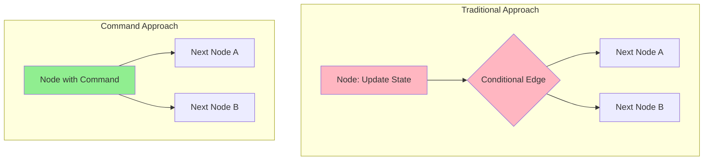
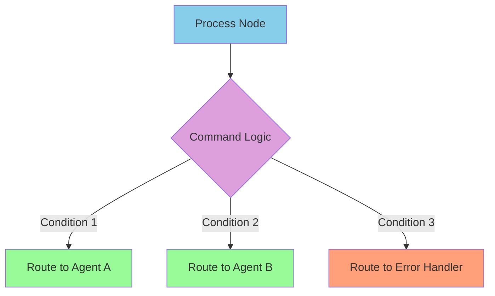
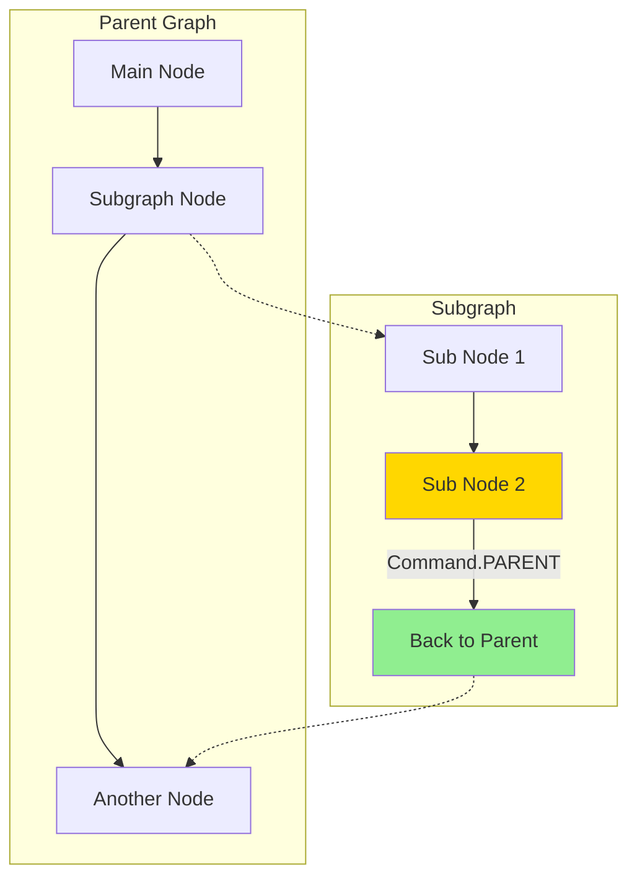

# Topic13: Master Command Objects for Combining State Updates and Routing

## What are Command Objects?

Command objects in LangGraph provide a powerful way to combine two essential operations in a single node:
1. **State Updates**: Modify the graph's state with new data
2. **Routing**: Determine which node to execute next

Instead of separating these concerns between nodes (for state updates) and conditional edges (for routing), Command objects allow you to handle both in one place, making your code more concise and logical.

## Why Command Objects Matter

### Traditional Approach Limitations
Without Command objects, you need:
- Separate nodes for state updates
- Conditional edges for routing decisions
- Multiple steps to achieve simple workflows

### Command Object Benefits
- **Unified Logic**: Combine state updates and routing in single functions
- **Cleaner Code**: Reduce complexity and improve readability
- **Better Performance**: Fewer graph transitions and evaluations
- **Enhanced Control**: More precise control over workflow execution

### Visual Comparison: Traditional vs Command Approach



## Core Command Object Concepts

### Basic Command Structure

```python
from langgraph.types import Command
from typing import Literal

def my_node(state: State) -> Command[Literal["next_node"]]:
    return Command(
        update={"key": "value"},  # State update
        goto="next_node"          # Routing decision
    )
```

### Dynamic Command Routing



## Working Examples

### Example 1: Basic Command Usage - Task Router

```python
from typing_extensions import TypedDict
from typing import Literal
from langgraph.graph import StateGraph, START, END
from langgraph.types import Command

class TaskState(TypedDict):
    task_type: str
    priority: str
    assigned_agent: str
    status: str
    result: str

def task_router(state: TaskState) -> Command[Literal["urgent_handler", "normal_handler", "batch_handler"]]:
    """Route tasks based on type and priority while updating state"""
    
    # Update state with processing status
    updated_state = {
        "status": "routing",
        "assigned_agent": "router"
    }
    
    # Determine routing based on task characteristics
    if state["priority"] == "urgent":
        updated_state["assigned_agent"] = "urgent_specialist"
        return Command(
            update=updated_state,
            goto="urgent_handler"
        )
    elif state["task_type"] == "batch":
        updated_state["assigned_agent"] = "batch_processor"
        return Command(
            update=updated_state,
            goto="batch_handler"
        )
    else:
        updated_state["assigned_agent"] = "general_worker"
        return Command(
            update=updated_state,
            goto="normal_handler"
        )

def urgent_handler(state: TaskState) -> dict:
    """Handle urgent tasks with high priority"""
    return {
        "status": "completed",
        "result": f"URGENT: {state['task_type']} handled immediately by {state['assigned_agent']}"
    }

def normal_handler(state: TaskState) -> dict:
    """Handle normal priority tasks"""
    return {
        "status": "completed", 
        "result": f"NORMAL: {state['task_type']} processed by {state['assigned_agent']}"
    }

def batch_handler(state: TaskState) -> dict:
    """Handle batch processing tasks"""
    return {
        "status": "completed",
        "result": f"BATCH: {state['task_type']} queued for batch processing by {state['assigned_agent']}"
    }

# Build the graph
builder = StateGraph(TaskState)
builder.add_node("task_router", task_router)
builder.add_node("urgent_handler", urgent_handler)
builder.add_node("normal_handler", normal_handler)
builder.add_node("batch_handler", batch_handler)

# Set up edges
builder.add_edge(START, "task_router")
builder.add_edge("urgent_handler", END)
builder.add_edge("normal_handler", END) 
builder.add_edge("batch_handler", END)

graph = builder.compile()

# Test the routing
urgent_task = {
    "task_type": "customer_complaint",
    "priority": "urgent",
    "assigned_agent": "",
    "status": "pending",
    "result": ""
}

result = graph.invoke(urgent_task)
print(f"Result: {result}")
# Output: Result: {'task_type': 'customer_complaint', 'priority': 'urgent', 'assigned_agent': 'urgent_specialist', 'status': 'completed', 'result': 'URGENT: customer_complaint handled immediately by urgent_specialist'}
```

### Example 2: Multi-Agent Handoff System

```python
from typing_extensions import TypedDict
from typing import Literal, Optional
from langgraph.graph import StateGraph, START, END
from langgraph.types import Command
import random

class HandoffState(TypedDict):
    user_query: str
    current_agent: str
    conversation_history: list[str]
    requires_handoff: bool
    confidence_score: float
    final_response: str

def initial_agent(state: HandoffState) -> Command[Literal["specialist_agent", "escalation_agent", "final_response"]]:
    """Initial agent that processes queries and decides on handoffs"""
    
    query = state["user_query"].lower()
    confidence = random.uniform(0.3, 0.9)  # Simulate confidence scoring
    
    # Update conversation history
    updated_state = {
        "current_agent": "initial_agent",
        "conversation_history": state["conversation_history"] + [f"Initial Agent: Processing '{query}'"],
        "confidence_score": confidence
    }
    
    # Decision logic for handoffs
    if "technical" in query or "api" in query:
        updated_state["requires_handoff"] = True
        return Command(
            update=updated_state,
            goto="specialist_agent"
        )
    elif confidence < 0.5 or "manager" in query:
        updated_state["requires_handoff"] = True
        return Command(
            update=updated_state,
            goto="escalation_agent"
        )
    else:
        # Handle directly
        updated_state["requires_handoff"] = False
        updated_state["final_response"] = f"Initial agent handled: {query}"
        return Command(
            update=updated_state,
            goto="final_response"
        )

def specialist_agent(state: HandoffState) -> Command[Literal["escalation_agent", "final_response"]]:
    """Technical specialist that handles complex queries"""
    
    # Process the technical query
    response = f"Technical analysis: {state['user_query']} - Specialized solution provided"
    confidence = random.uniform(0.7, 0.95)
    
    updated_state = {
        "current_agent": "specialist_agent",
        "conversation_history": state["conversation_history"] + [f"Specialist: {response}"],
        "confidence_score": confidence
    }
    
    # Check if escalation is still needed
    if confidence < 0.8:
        updated_state["requires_handoff"] = True
        return Command(
            update=updated_state,
            goto="escalation_agent"
        )
    else:
        updated_state["final_response"] = response
        return Command(
            update=updated_state,
            goto="final_response"
        )

def escalation_agent(state: HandoffState) -> dict:
    """Senior agent for complex escalations"""
    response = f"Senior escalation handling: {state['user_query']} - Executive resolution applied"
    
    return {
        "current_agent": "escalation_agent",
        "conversation_history": state["conversation_history"] + [f"Escalation: {response}"],
        "final_response": response,
        "confidence_score": 0.95
    }

def final_response(state: HandoffState) -> dict:
    """Format and return final response"""
    return {
        "conversation_history": state["conversation_history"] + ["Final response delivered"],
        "current_agent": "completed"
    }

# Build the handoff graph
builder = StateGraph(HandoffState)
builder.add_node("initial_agent", initial_agent)
builder.add_node("specialist_agent", specialist_agent)
builder.add_node("escalation_agent", escalation_agent)
builder.add_node("final_response", final_response)

builder.add_edge(START, "initial_agent")
builder.add_edge("escalation_agent", "final_response")
builder.add_edge("final_response", END)

handoff_graph = builder.compile()

# Test different scenarios
test_queries = [
    "I need help with the API integration",
    "Simple billing question",
    "I want to speak to a manager about this issue"
]

for query in test_queries:
    print(f"\n--- Testing Query: '{query}' ---")
    initial_state = {
        "user_query": query,
        "current_agent": "",
        "conversation_history": [],
        "requires_handoff": False,
        "confidence_score": 0.0,
        "final_response": ""
    }
    
    result = handoff_graph.invoke(initial_state)
    print(f"Final Agent: {result['current_agent']}")
    print(f"Response: {result['final_response']}")
    print(f"Confidence: {result['confidence_score']:.2f}")
```

### Example 3: Dynamic Workflow with Error Handling

```python
from typing_extensions import TypedDict
from typing import Literal, Union
from langgraph.graph import StateGraph, START, END
from langgraph.types import Command
import json

class WorkflowState(TypedDict):
    input_data: dict
    validation_errors: list[str]
    processing_stage: str
    retry_count: int
    max_retries: int
    success: bool
    output_data: dict

def validator_node(state: WorkflowState) -> Command[Literal["processor_node", "error_handler", "retry_node"]]:
    """Validate input and route accordingly"""
    
    data = state["input_data"]
    errors = []
    
    # Validation rules
    if not data.get("id"):
        errors.append("Missing required field: id")
    if not data.get("type"):
        errors.append("Missing required field: type")
    if data.get("amount", 0) <= 0:
        errors.append("Amount must be positive")
    
    updated_state = {
        "validation_errors": errors,
        "processing_stage": "validation_complete"
    }
    
    if errors:
        # Check retry logic
        if state["retry_count"] < state["max_retries"]:
            return Command(
                update=updated_state,
                goto="retry_node"
            )
        else:
            return Command(
                update=updated_state,
                goto="error_handler"
            )
    else:
        # Valid data, proceed to processing
        return Command(
            update=updated_state,
            goto="processor_node"
        )

def processor_node(state: WorkflowState) -> Command[Literal["success_handler", "error_handler"]]:
    """Process the validated data"""
    
    try:
        # Simulate processing
        data = state["input_data"]
        processed_data = {
            "processed_id": f"PROC_{data['id']}",
            "type": data["type"].upper(),
            "calculated_amount": data["amount"] * 1.1,  # Add processing fee
            "timestamp": "2024-01-01T12:00:00Z"
        }
        
        return Command(
            update={
                "processing_stage": "processing_complete",
                "success": True,
                "output_data": processed_data
            },
            goto="success_handler"
        )
        
    except Exception as e:
        return Command(
            update={
                "processing_stage": "processing_failed",
                "validation_errors": [f"Processing error: {str(e)}"]
            },
            goto="error_handler"
        )

def retry_node(state: WorkflowState) -> Command[Literal["validator_node", "error_handler"]]:
    """Handle retry logic"""
    
    new_retry_count = state["retry_count"] + 1
    
    # Simulate data correction for demo
    corrected_data = state["input_data"].copy()
    if not corrected_data.get("id"):
        corrected_data["id"] = f"AUTO_ID_{new_retry_count}"
    if not corrected_data.get("type"):
        corrected_data["type"] = "default"
    if corrected_data.get("amount", 0) <= 0:
        corrected_data["amount"] = 10.0
    
    if new_retry_count < state["max_retries"]:
        return Command(
            update={
                "input_data": corrected_data,
                "retry_count": new_retry_count,
                "processing_stage": f"retry_attempt_{new_retry_count}"
            },
            goto="validator_node"
        )
    else:
        return Command(
            update={
                "retry_count": new_retry_count,
                "processing_stage": "max_retries_exceeded"
            },
            goto="error_handler"
        )

def success_handler(state: WorkflowState) -> dict:
    """Handle successful processing"""
    return {
        "processing_stage": "completed_successfully"
    }

def error_handler(state: WorkflowState) -> dict:
    """Handle errors and failures"""
    return {
        "processing_stage": "completed_with_errors",
        "success": False
    }

# Build the workflow graph
builder = StateGraph(WorkflowState)
builder.add_node("validator_node", validator_node)
builder.add_node("processor_node", processor_node)
builder.add_node("retry_node", retry_node)
builder.add_node("success_handler", success_handler)
builder.add_node("error_handler", error_handler)

builder.add_edge(START, "validator_node")
builder.add_edge("success_handler", END)
builder.add_edge("error_handler", END)

workflow_graph = builder.compile()

# Test cases
test_cases = [
    # Valid data
    {"id": "123", "type": "payment", "amount": 100.0},
    # Invalid data that can be corrected
    {"type": "payment"},  # Missing id and amount
    # Invalid data that cannot be corrected
    {"id": "", "type": "", "amount": -50}
]

for i, test_data in enumerate(test_cases):
    print(f"\n--- Test Case {i+1}: {test_data} ---")
    initial_state = {
        "input_data": test_data,
        "validation_errors": [],
        "processing_stage": "started",
        "retry_count": 0,
        "max_retries": 2,
        "success": False,
        "output_data": {}
    }
    
    result = workflow_graph.invoke(initial_state)
    print(f"Final Stage: {result['processing_stage']}")
    print(f"Success: {result['success']}")
    print(f"Retries Used: {result['retry_count']}")
    if result["validation_errors"]:
        print(f"Errors: {result['validation_errors']}")
    if result["output_data"]:
        print(f"Output: {result['output_data']}")
```

## Advanced Command Patterns

### Command with Subgraph Navigation



### Human-in-the-Loop with Commands

```python
from langgraph.types import Command
from langgraph.interrupt import interrupt

def review_node(state: State) -> Command[Literal["approve_node", "reject_node"]]:
    """Node that requires human review"""
    
    # Present information for human review
    human_input = interrupt({
        "message": "Please review this decision",
        "data": state["pending_decision"],
        "options": ["approve", "reject", "modify"]
    })
    
    # Update state with human decision
    updated_state = {
        "human_review": human_input,
        "review_timestamp": "2024-01-01T12:00:00Z"
    }
    
    # Route based on human input
    if human_input.get("decision") == "approve":
        return Command(
            update=updated_state,
            goto="approve_node"
        )
    else:
        return Command(
            update=updated_state,
            goto="reject_node"
        )
```

## Best Practices

### 1. Type Annotations are Critical
Always specify the possible target nodes in your type annotations:

```python
# ✅ Good: Clear type annotation
def my_node(state: State) -> Command[Literal["node_a", "node_b"]]:
    pass

# ❌ Bad: Missing type annotation
def my_node(state: State) -> Command:
    pass
```

### 2. Handle All Routing Paths
Ensure your Command logic covers all possible scenarios:

```python
def decision_node(state: State) -> Command[Literal["success", "failure", "retry"]]:
    if state["condition_a"]:
        return Command(update=..., goto="success")
    elif state["condition_b"]: 
        return Command(update=..., goto="failure")
    else:
        # Always have a default path
        return Command(update=..., goto="retry")
```

### 3. Keep State Updates Focused
Update only relevant state fields in each Command:

```python
# ✅ Good: Focused updates
return Command(
    update={"status": "processed", "timestamp": now()},
    goto="next_node"
)

# ❌ Avoid: Unnecessary state copying
return Command(
    update={**state, "status": "processed"},  # Don't copy entire state
    goto="next_node"
)
```

## Common Pitfalls and Troubleshooting

### Pitfall 1: Missing Type Annotations
**Problem**: Graph rendering fails or routing doesn't work
**Solution**: Always include proper type annotations with `Literal` types

### Pitfall 2: Inconsistent Routing Logic
**Problem**: Nodes route to non-existent destinations
**Solution**: Ensure all `goto` values match actual node names

### Pitfall 3: Circular Dependencies
**Problem**: Commands create infinite loops
**Solution**: Design clear exit conditions and terminal states

### Debugging Commands
```python
def debug_command_node(state: State) -> Command[Literal["next"]]:
    print(f"Current state: {state}")
    print(f"Making routing decision...")
    
    result = Command(update={"debug": True}, goto="next")
    print(f"Command: update={result.update}, goto={result.goto}")
    
    return result
```

## Integration with Other LangGraph Features

### Commands + Memory
Commands work seamlessly with LangGraph's persistence layer, maintaining state across executions.

### Commands + Tools
Use Commands to route between different tool-calling nodes based on tool results.

### Commands + Streaming
Commands support all streaming modes, allowing real-time updates during routing decisions.

## When to Use Commands vs Conditional Edges

### Use Commands When:
- You need to update state AND route in the same operation
- Implementing multi-agent handoffs
- Building complex decision trees with state changes
- Creating human-in-the-loop workflows

### Use Conditional Edges When:
- You only need routing without state updates
- Routing logic is simple and separate from business logic
- Building straightforward linear workflows

## Key Takeaways

1. **Unified Operations**: Commands combine state updates and routing in single nodes
2. **Type Safety**: Always use proper type annotations for reliable graph compilation
3. **Clean Architecture**: Reduces complexity by eliminating separate routing nodes
4. **Powerful Control**: Enables sophisticated workflow patterns like multi-agent handoffs
5. **Error Handling**: Perfect for building robust systems with retry and fallback logic

Commands represent one of LangGraph's most powerful features for building complex, stateful workflows that maintain clean separation of concerns while providing maximum flexibility for dynamic routing decisions. 