# Learn LangGraph: Complete End-to-End Guide

> **Mission**: Transform complex LangGraph concepts into clear, visual, and immediately actionable knowledge.

## Table of Contents

1. [Installation & Basic Setup](#installation--basic-setup) ✅
2. [Building Your First Basic Chatbot](#building-your-first-basic-chatbot) ✅
3. [Why Choose LangGraph Over Other Frameworks](#why-choose-langgraph-over-other-frameworks) ✅
4. [Adding Web Search Tools to Your Chatbot](#adding-web-search-tools-to-your-chatbot) ✅
5. [Core Fundamentals](#core-fundamentals) 🔄
6. [Advanced Concepts](#advanced-concepts) 🔄
7. [Platform & Deployment](#platform--deployment) 🔄

---

## Installation & Basic Setup

### What is LangGraph?

LangGraph is an **orchestration framework** for building complex agentic systems that can reason, use tools, and maintain state across conversations. Think of it as a control system that lets AI agents make decisions, remember context, and work together.

### Why Use LangGraph?


**Key Benefits:**
- **Stateful**: Remembers conversation context
- **Tool-enabled**: Can use external APIs and functions
- **Controllable**: Human oversight and intervention
- **Scalable**: Multi-agent systems and complex workflows

### Installation Requirements

**Prerequisites:**
- Python 3.8+
- An LLM API key (Anthropic, OpenAI, etc.)

**Core Installation:**
```bash
# Essential packages
pip install -U langgraph "langchain[anthropic]"

# For specific LLM providers
pip install "langchain[openai]"     # OpenAI
pip install "langchain[google]"     # Google
pip install "langchain[azure]"      # Azure
```

**Verification Test:**
```python
# Quick installation check
import langgraph
from langchain.chat_models import init_chat_model

print(f"LangGraph version: {langgraph.__version__}")
print("✅ Installation successful!")
```

### Your First Agent in 5 Minutes

Let's build a weather agent step by step:

#### Step 1: Create a Simple Tool

```python
def get_weather(city: str) -> str:
    """Get weather for a given city."""
    # Simplified for demo - in reality, you'd call a weather API
    return f"It's always sunny in {city}!"
```

#### Step 2: Build the Agent

```python
from langgraph.prebuilt import create_react_agent

# Create agent with minimal configuration
agent = create_react_agent(
    model="anthropic:claude-3-7-sonnet-latest",  # LLM to use
    tools=[get_weather],                         # Available tools
    prompt="You are a helpful weather assistant" # System instructions
)
```

#### Step 3: Test the Agent

```python
# Single interaction
response = agent.invoke({
    "messages": [{"role": "user", "content": "What's the weather in San Francisco?"}]
})

print(response["messages"][-1]["content"])
# Output: "It's always sunny in San Francisco!"
```

### Agent Execution Flow


### LLM Configuration

#### Basic Model Setup

```python
from langchain.chat_models import init_chat_model

# Configure model with specific parameters
model = init_chat_model(
    "anthropic:claude-3-7-sonnet-latest",
    temperature=0,      # Deterministic responses
    max_tokens=1000     # Response length limit
)

agent = create_react_agent(
    model=model,
    tools=[get_weather]
)
```

#### Supported LLM Providers


### Prompting Strategies

#### Static Prompts (Simple)

```python
agent = create_react_agent(
    model="anthropic:claude-3-7-sonnet-latest",
    tools=[get_weather],
    prompt="You are a professional meteorologist. Always provide detailed weather analysis."
)
```

#### Dynamic Prompts (Advanced)

```python
from langchain_core.messages import AnyMessage
from langchain_core.runnables import RunnableConfig
from langgraph.prebuilt.chat_agent_executor import AgentState

def dynamic_prompt(state: AgentState, config: RunnableConfig) -> list[AnyMessage]:
    user_name = config["configurable"].get("user_name", "friend")
    time_of_day = config["configurable"].get("time_of_day", "day")
    
    system_msg = f"""You are a helpful weather assistant. 
    Address the user as {user_name}.
    Consider it's currently {time_of_day} when providing recommendations."""
    
    return [{"role": "system", "content": system_msg}] + state["messages"]

agent = create_react_agent(
    model="anthropic:claude-3-7-sonnet-latest",
    tools=[get_weather],
    prompt=dynamic_prompt
)

# Use with configuration
response = agent.invoke(
    {"messages": [{"role": "user", "content": "Should I wear a jacket?"}]},
    config={"configurable": {"user_name": "Alice", "time_of_day": "evening"}}
)
```

### Adding Memory (Conversation State)

#### Memory Architecture


#### Implementation

```python
from langgraph.checkpoint.memory import InMemorySaver

# Create memory checkpointer
checkpointer = InMemorySaver()

agent = create_react_agent(
    model="anthropic:claude-3-7-sonnet-latest",
    tools=[get_weather],
    checkpointer=checkpointer  # Enable memory
)

# Conversation with memory
config = {"configurable": {"thread_id": "weather-chat-1"}}

# First interaction
response1 = agent.invoke(
    {"messages": [{"role": "user", "content": "What's the weather in Paris?"}]},
    config
)

# Second interaction - agent remembers previous context
response2 = agent.invoke(
    {"messages": [{"role": "user", "content": "What about tomorrow?"}]},
    config  # Same thread_id
)
```

### Structured Output

Force agents to return data in specific formats:

```python
from pydantic import BaseModel

class WeatherReport(BaseModel):
    city: str
    temperature: str
    conditions: str
    recommendation: str

agent = create_react_agent(
    model="anthropic:claude-3-7-sonnet-latest",
    tools=[get_weather],
    response_format=WeatherReport
)

response = agent.invoke({
    "messages": [{"role": "user", "content": "Weather report for Tokyo"}]
})

# Access structured data
structured_data = response["structured_response"]
print(f"City: {structured_data.city}")
print(f"Conditions: {structured_data.conditions}")
```

### Common Pitfalls & Solutions

| ❌ **Problem** | ✅ **Solution** |
|---|---|
| Agent doesn't use tools | Ensure tool descriptions are clear and specific |
| Memory not working | Check `thread_id` consistency and checkpointer setup |
| Infinite loops | Set proper recursion limits and tool validation |
| Poor responses | Improve prompts with examples and constraints |

### Integration Notes

This basic setup connects to:
- **State Management**: Checkpointers store conversation state
- **Tool Calling**: Functions agent can execute
- **Multi-turn Conversations**: Memory enables context retention
- **Human-in-the-Loop**: Future topic for oversight and control

### Quick Reference

```python
# Complete minimal setup
from langgraph.prebuilt import create_react_agent
from langgraph.checkpoint.memory import InMemorySaver

def my_tool(input: str) -> str:
    return f"Processed: {input}"

agent = create_react_agent(
    model="anthropic:claude-3-7-sonnet-latest",
    tools=[my_tool],
    prompt="You are a helpful assistant",
    checkpointer=InMemorySaver()
)

# Run with memory
config = {"configurable": {"thread_id": "session-1"}}
response = agent.invoke(
    {"messages": [{"role": "user", "content": "Hello!"}]},
    config
)
```

---

**✅ Completed: Installation & Basic Setup**

*Ready to proceed to next topic: Building Your First Basic Chatbot*

---

## Building Your First Basic Chatbot

### What is a Basic Chatbot in LangGraph?

A **basic chatbot** in LangGraph is a simple conversational agent that can maintain a dialogue with users through a **StateGraph**. Unlike traditional request-response systems, LangGraph chatbots are **stateful** - they remember the conversation history and can build upon previous exchanges.

### Core Architecture Overview


### Why Build with StateGraph?

| **Traditional Chatbot** | **LangGraph StateGraph** |
|---|---|
| ❌ Stateless interactions | ✅ **Persistent conversation state** |
| ❌ No memory between calls | ✅ **Built-in message history** |
| ❌ Complex state management | ✅ **Automatic state updates** |
| ❌ Limited scalability | ✅ **Graph-based architecture** |

### Step-by-Step Implementation

#### Step 1: Define the State Schema

The **State** is the foundation of your chatbot - it defines what information persists across conversations:

```python
from typing import Annotated
from typing_extensions import TypedDict
from langgraph.graph.message import add_messages

class State(TypedDict):
    # Messages persist across interactions
    # add_messages appends new messages instead of overwriting
    messages: Annotated[list, add_messages]
```

**Key Concepts:**
- **`TypedDict`**: Defines the structure of our state
- **`Annotated`**: Adds metadata to specify how state updates work
- **`add_messages`**: Built-in reducer that appends to message list instead of replacing

#### Step 2: Create the StateGraph

```python
from langgraph.graph import StateGraph, START

# Initialize the graph builder with our state schema
graph_builder = StateGraph(State)
```

#### Step 3: Set Up Your LLM

Choose your preferred LLM provider:

```python
from langchain.chat_models import init_chat_model
import os

# Example with Anthropic (replace with your preferred provider)
os.environ["ANTHROPIC_API_KEY"] = "your-api-key-here"
llm = init_chat_model("anthropic:claude-3-5-sonnet-latest")

# Alternative providers:
# llm = init_chat_model("openai:gpt-4")
# llm = init_chat_model("google_genai:gemini-2.0-flash")
```

#### Step 4: Create the Chatbot Node

**Nodes** are the core processing units in LangGraph:

```python
def chatbot(state: State):
    """
    Process the current conversation state and generate a response.
    
    Args:
        state: Current conversation state containing message history
        
    Returns:
        dict: State update with the LLM's response message
    """
    # Get LLM response based on conversation history
    response = llm.invoke(state["messages"])
    
    # Return state update (will be merged with existing state)
    return {"messages": [response]}

# Add the node to our graph
graph_builder.add_node("chatbot", chatbot)
```

#### Step 5: Define the Entry Point

Tell the graph where to start processing:

```python
# START is a special constant indicating the graph's entry point
graph_builder.add_edge(START, "chatbot")
```

#### Step 6: Compile the Graph

Transform the builder into an executable graph:

```python
# Compile creates an optimized, executable graph
graph = graph_builder.compile()
```

### Graph Execution Flow


### Running Your Chatbot

#### Basic Execution

```python
# Single interaction
response = graph.invoke({
    "messages": [{"role": "user", "content": "Hello! How are you?"}]
})

print("Assistant:", response["messages"][-1].content)
```

#### Interactive Chat Loop

```python
def stream_graph_updates(user_input: str):
    """Stream responses from the chatbot in real-time."""
    for event in graph.stream({"messages": [{"role": "user", "content": user_input}]}):
        for value in event.values():
            print("Assistant:", value["messages"][-1].content)

# Interactive chat session
while True:
    try:
        user_input = input("User: ")
        if user_input.lower() in ["quit", "exit", "q"]:
            print("Goodbye!")
            break
        stream_graph_updates(user_input)
    except KeyboardInterrupt:
        print("\nGoodbye!")
        break
```

### Graph Visualization

Visualize your chatbot's structure:

```python
# Generate a visual representation
try:
    from IPython.display import Image, display
    display(Image(graph.get_graph().draw_mermaid_png()))
except Exception:
    # Fallback to ASCII representation
    print(graph.get_graph().draw_ascii())
```

### Complete Working Example

```python
from typing import Annotated
from typing_extensions import TypedDict
from langgraph.graph import StateGraph, START
from langgraph.graph.message import add_messages
from langchain.chat_models import init_chat_model
import os

# 1. Define State
class State(TypedDict):
    messages: Annotated[list, add_messages]

# 2. Create Graph Builder
graph_builder = StateGraph(State)

# 3. Initialize LLM
os.environ["ANTHROPIC_API_KEY"] = "your-api-key"
llm = init_chat_model("anthropic:claude-3-5-sonnet-latest")

# 4. Define Chatbot Node
def chatbot(state: State):
    return {"messages": [llm.invoke(state["messages"])]}

# 5. Build Graph
graph_builder.add_node("chatbot", chatbot)
graph_builder.add_edge(START, "chatbot")

# 6. Compile
graph = graph_builder.compile()

# 7. Run
def chat():
    while True:
        user_input = input("User: ")
        if user_input.lower() in ["quit", "exit", "q"]:
            break
        
        response = graph.invoke({
            "messages": [{"role": "user", "content": user_input}]
        })
        print("Assistant:", response["messages"][-1].content)

if __name__ == "__main__":
    chat()
```

### State Management Deep Dive


**Key State Features:**
- **Persistent**: State survives between interactions
- **Additive**: `add_messages` appends rather than overwrites
- **Automatic**: LangGraph handles state merging
- **Typed**: TypedDict provides structure and validation

### Common Patterns & Best Practices

#### Error Handling

```python
def robust_chatbot(state: State):
    try:
        response = llm.invoke(state["messages"])
        return {"messages": [response]}
    except Exception as e:
        # Return error message as part of conversation
        error_msg = {"role": "assistant", "content": f"I encountered an error: {str(e)}"}
        return {"messages": [error_msg]}
```

#### Response Validation

```python
def validated_chatbot(state: State):
    response = llm.invoke(state["messages"])
    
    # Ensure response has required fields
    if not hasattr(response, 'content') or not response.content:
        fallback_msg = {"role": "assistant", "content": "I'm sorry, I couldn't generate a proper response."}
        return {"messages": [fallback_msg]}
    
    return {"messages": [response]}
```

### Troubleshooting Guide

| **Issue** | **Symptom** | **Solution** |
|---|---|---|
| **No API Key** | Authentication errors | Set environment variable correctly |
| **Empty Response** | Bot returns nothing | Check LLM configuration and input format |
| **State Not Persisting** | Bot forgets conversation | Verify `add_messages` in State definition |
| **Graph Won't Compile** | Compilation errors | Ensure all nodes are connected properly |

### Integration Notes

This basic chatbot connects to:
- **Tool Integration**: Next tutorial covers adding web search
- **Memory Systems**: Enhanced state management for long conversations
- **Human-in-the-Loop**: Adding approval workflows
- **Multi-Agent Systems**: Connecting multiple specialized chatbots

### Performance Considerations


**Scaling Tips:**
- Use **async/await** for concurrent users
- Implement **conversation threading** for multi-user support
- Add **rate limiting** for API protection
- Consider **caching** for frequently asked questions

---

**✅ Completed: Building Your First Basic Chatbot**

*Ready to proceed to next topic: Why Choose LangGraph Over Other Frameworks*

---

## Why Choose LangGraph Over Other Frameworks

### What Makes LangGraph Different?

LangGraph stands out in the crowded field of AI agent frameworks by prioritizing **developer control**, **production readiness**, and **architectural flexibility**. While other frameworks offer black-box solutions, LangGraph gives you the building blocks to create exactly what you need.

### Framework Comparison Landscape


### Core Value Propositions

#### 1. **Reliability & Controllability**


**vs. Other Frameworks:**
| **Feature** | **LangGraph** | **Traditional Frameworks** |
|---|---|---|
| **Human Oversight** | ✅ Built-in interrupt system | ❌ Limited or manual integration |
| **State Persistence** | ✅ Automatic checkpointing | ❌ Manual state management |
| **Error Recovery** | ✅ Rollback & replay | ❌ Restart from beginning |
| **Audit Trail** | ✅ Complete execution history | ❌ Limited logging |

#### 2. **Low-Level Extensibility**


**Freedom to Build:**
- **Custom Agent Architectures**: Design workflows specific to your needs
- **Flexible State Management**: Define exactly what data persists and how
- **Multi-Agent Orchestration**: Create agent teams with specialized roles
- **Tool Integration**: Connect any API or service seamlessly

#### 3. **First-Class Streaming Support**

```mermaid
sequenceDiagram
    participant U as User
    participant L as LangGraph
    participant A as Agent
    participant T as Tools
    
    U->>L: Request
    L->>U: 🔄 Processing started
    L->>A: Invoke agent
    A->>U: 💭 Thinking...
    A->>T: Call tool
    T->>U: 🔧 Tool executing...
    T->>A: Tool result
    A->>U: 📝 Generating response...
    A->>L: Complete response
    L->>U: ✅ Final result
```



**Real-Time Visibility:**
- **Token-by-Token Streaming**: See responses as they generate
- **Intermediate Steps**: Watch agent reasoning unfold
- **Progress Indicators**: Know exactly what's happening
- **Error Streaming**: Immediate feedback on issues

### Detailed Framework Comparison

#### LangGraph vs. AutoGen


| **Aspect** | **AutoGen** | **LangGraph** |
|---|---|---|
| **Learning Curve** | ⭐⭐ Easy | ⭐⭐⭐ Moderate |
| **Customization** | ⭐⭐ Limited | ⭐⭐⭐⭐⭐ Unlimited |
| **Production Ready** | ⭐⭐ Basic | ⭐⭐⭐⭐⭐ Enterprise |
| **Debugging** | ⭐⭐ Limited | ⭐⭐⭐⭐⭐ Comprehensive |
| **State Management** | ⭐⭐ Manual | ⭐⭐⭐⭐⭐ Automatic |

#### LangGraph vs. CrewAI


**When to Choose What:**
- **CrewAI**: Standard business roles (manager, researcher, writer)
- **LangGraph**: Custom agent behaviors, complex state management, production deployment

### Technical Advantages

#### Architecture Flexibility


#### State Management Superiority

```python
# LangGraph: Automatic, Typed, Persistent
class AgentState(TypedDict):
    messages: Annotated[list, add_messages]
    user_context: UserProfile
    task_progress: TaskStatus
    errors: List[str]

# Other frameworks: Manual, Untyped, Fragile
# state = {}  # Hope for the best!
```

**LangGraph State Benefits:**
- **Type Safety**: Catch errors at development time
- **Automatic Persistence**: Never lose important data
- **Reducer Functions**: Control exactly how state updates
- **Time Travel**: Replay and debug any point in execution

### Performance & Scalability

```mermaid
graph TB
    A["Performance Factors"] --> B["Execution Speed"]
    A --> C["Memory Efficiency"]
    A --> D["Concurrent Users"]
    A --> E["Fault Tolerance"]
    
    B --> F["✅ Zero Overhead<br/>Native Python Speed"]
    C --> G["✅ Efficient Checkpointing<br/>Minimal Memory Usage"]
    D --> H["✅ Thread-Safe Operations<br/>Horizontal Scaling"]
    E --> I["✅ Automatic Recovery<br/>Persistent State"]
    
    style F fill:#4caf50
    style G fill:#4caf50
    style H fill:#4caf50
    style I fill:#4caf50
```



### Production Readiness Comparison

| **Production Need** | **LangGraph** | **Typical Frameworks** |
|---|---|---|
| **Monitoring** | ✅ LangSmith integration | ❌ Custom logging required |
| **Debugging** | ✅ Visual Studio + time travel | ❌ Print statements |
| **Deployment** | ✅ One-click platform deployment | ❌ Manual infrastructure |
| **Scaling** | ✅ Auto-scaling queues | ❌ Manual load balancing |
| **Error Handling** | ✅ Graceful recovery + rollback | ❌ Hard crashes |
| **Security** | ✅ Built-in auth + validation | ❌ Custom implementation |

### Real-World Use Case Scenarios

#### When to Choose LangGraph


**Perfect for LangGraph:**
- Customer service with escalation workflows
- Complex data processing pipelines
- Multi-step approval systems
- Research and analysis workflows
- Financial trading agents
- Healthcare diagnostic assistants

**Maybe Overkill for:**
- Simple Q&A chatbots
- Basic text summarization
- Single-function tools
- Quick prototypes

### Migration Path from Other Frameworks


**Migration Benefits:**
- **Incremental Approach**: Move components piece by piece
- **Risk Reduction**: Test new architecture alongside existing
- **Feature Parity**: Maintain all current functionality
- **Enhanced Capabilities**: Gain new features during migration

### Developer Experience Advantages

```mermaid
graph TB
    A["Developer Experience"] --> B["Learning Curve"]
    A --> C["Debugging Tools"]
    A --> D["Documentation"]
    A --> E["Community"]
    
    B --> F["📚 Comprehensive Tutorials<br/>🎯 Clear Examples<br/>🔄 Progressive Complexity"]
    C --> G["🎨 Visual Studio<br/>⏱️ Time Travel Debugging<br/>📊 Real-time Monitoring"]
    D --> H["📖 Detailed Guides<br/>🔍 API Reference<br/>💡 Best Practices"]
    E --> I["👥 Active Community<br/>🤝 LangChain Ecosystem<br/>📞 Enterprise Support"]
    
    style F fill:#e3f2fd
    style G fill:#e8f5e8
    style H fill:#fff3e0
    style I fill:#fce4ec
```



### Cost Considerations


### Future-Proofing Your Investment

**LangGraph Evolution Path:**
- ✅ **Open Source Core**: Always free and accessible
- ✅ **Active Development**: Regular updates and improvements
- ✅ **Enterprise Backing**: Stable commercial support
- ✅ **Standards Compliance**: Follows industry best practices
- ✅ **Ecosystem Integration**: Works with existing tools

### Quick Decision Framework

```mermaid
flowchart TD
    A["Start Here"] --> B{"Need Custom Agent Logic?"}
    B -->|Yes| C["LangGraph ✅"]
    B -->|No| D{"Production Deployment Required?"}
    
    D -->|Yes| C
    D -->|No| E{"Multi-Agent Coordination?"}
    
    E -->|Yes| C
    E -->|No| F{"Complex State Management?"}
    
    F -->|Yes| C
    F -->|No| G{"Long-term Project?"}
    
    G -->|Yes| C
    G -->|No| H["Consider Alternatives"]
    
    style C fill:#4caf50
    style H fill:#ff9800
```

### Getting Started Recommendation

**Phase 1: Proof of Concept**
```python
# Start simple - validate your concept
from langgraph.prebuilt import create_react_agent
agent = create_react_agent(model, tools)
```

**Phase 2: Custom Architecture**
```python
# Add custom logic as needed
class CustomState(TypedDict):
    # Your specific data structure
    
graph = StateGraph(CustomState)
# Build your unique workflow
```

**Phase 3: Production Deployment**
```python
# Deploy to LangGraph Platform
# Get monitoring, scaling, persistence automatically
```

### Integration Notes

This foundation connects to:
- **Tool Integration**: Next tutorial covers web search capabilities
- **Memory Systems**: Advanced state management patterns
- **Multi-Agent Systems**: Building agent teams and hierarchies
- **Platform Features**: Deployment, monitoring, and scaling

---

**✅ Completed: Why Choose LangGraph Over Other Frameworks**

*Ready to proceed to next topic: Adding Web Search Tools*

---

## Adding Web Search Tools to Your Chatbot

### What are Tools in LangGraph?

**Tools** are external functions that your LangGraph agent can call to perform actions beyond text generation. They extend your chatbot's capabilities by connecting it to external APIs, databases, search engines, or any custom functions. Think of tools as giving your agent "superpowers" to interact with the real world.

### The Tool Integration Architecture

```mermaid
graph TD
    A["User Query"] --> B["Chatbot Node"]
    B --> C{"Need External Info?"}
    
    C -->|No| D["Direct Response"]
    C -->|Yes| E["Tool Selection"]
    
    E --> F["Web Search Tool"]
    E --> G["Calculator Tool"]
    E --> H["API Call Tool"]
    
    F --> I["Tool Execution"]
    G --> I
    H --> I
    
    I --> J["Tool Results"]
    J --> K["Integrate Results"]
    K --> L["Enhanced Response"]
    
    style A fill:#e3f2fd
    style L fill:#e8f5e8
    style I fill:#fff3e0
    style C fill:#f3e5f5
```

### Why Add Tools to Your Chatbot?

| **Without Tools** | **With Tools** |
|---|---|
| ❌ Limited to training data | ✅ **Access to real-time information** |
| ❌ Static knowledge cutoff | ✅ **Current events and updates** |
| ❌ Cannot perform actions | ✅ **Execute functions and API calls** |
| ❌ Hallucination on unknown topics | ✅ **Grounded, factual responses** |

### Step-by-Step Implementation

#### Step 1: Install and Configure the Search Tool

We'll use **Tavily Search Engine** for web search capabilities:

```bash
# Install the search engine package
pip install -U langchain-tavily
```

**Set up your API credentials:**
```python
import os

# Get your free API key from https://tavily.com
os.environ["TAVILY_API_KEY"] = "your-tavily-api-key"
```

#### Step 2: Create and Test the Search Tool

```python
from langchain_tavily import TavilySearch

# Create the search tool with configuration
tool = TavilySearch(
    max_results=2,  # Limit results for better performance
    description="Search the web for current information and facts"
)

# Test the tool independently
test_result = tool.invoke("What's a 'node' in LangGraph?")
print(test_result)
```

**Tool Response Structure:**
```python
{
    'query': "What's a 'node' in LangGraph?",
    'results': [
        {
            'title': 'LangGraph Documentation',
            'url': 'https://...',
            'content': 'Detailed explanation...',
            'score': 0.95
        }
    ],
    'response_time': 1.2
}
```

#### Step 3: Enhanced State Graph with Tool Support

```python
from typing import Annotated
from typing_extensions import TypedDict
from langgraph.graph import StateGraph, START, END
from langgraph.graph.message import add_messages
from langchain.chat_models import init_chat_model

# Same state structure as before
class State(TypedDict):
    messages: Annotated[list, add_messages]

# Initialize graph and LLM
graph_builder = StateGraph(State)
llm = init_chat_model("anthropic:claude-3-5-sonnet-latest")

# CRITICAL: Bind tools to the LLM
tools = [tool]
llm_with_tools = llm.bind_tools(tools)

def chatbot(state: State):
    """Enhanced chatbot that can use tools."""
    return {"messages": [llm_with_tools.invoke(state["messages"])]}

graph_builder.add_node("chatbot", chatbot)
```

#### Step 4: Create the Tool Execution Node

The **Tool Node** executes tools when the LLM requests them:

```mermaid
sequenceDiagram
    participant L as LLM
    participant T as Tool Node
    participant E as External API
    
    L->>T: Tool call request
    Note over L: {"name": "search",<br/>"args": {"query": "..."}}
    
    T->>E: Execute search
    E->>T: Search results
    T->>L: Formatted results
    Note over T: ToolMessage with<br/>search results
```

**Custom Tool Node Implementation:**
```python
import json
from langchain_core.messages import ToolMessage

class BasicToolNode:
    """Executes tools requested by the LLM."""
    
    def __init__(self, tools: list) -> None:
        self.tools_by_name = {tool.name: tool for tool in tools}

    def __call__(self, inputs: dict):
        # Get the last message (should contain tool calls)
        if messages := inputs.get("messages", []):
            message = messages[-1]
        else:
            raise ValueError("No message found in input")
        
        outputs = []
        # Execute each requested tool
        for tool_call in message.tool_calls:
            tool_result = self.tools_by_name[tool_call["name"]].invoke(
                tool_call["args"]
            )
            
            # Create a ToolMessage with the results
            outputs.append(
                ToolMessage(
                    content=json.dumps(tool_result),
                    name=tool_call["name"],
                    tool_call_id=tool_call["id"],
                )
            )
        
        return {"messages": outputs}

# Add the tool node to the graph
tool_node = BasicToolNode(tools=[tool])
graph_builder.add_node("tools", tool_node)
```

#### Step 5: Implement Conditional Logic

**Conditional edges** determine when to use tools vs. respond directly:

```python
def route_tools(state: State):
    """
    Route to tools if the LLM wants to use them, otherwise end.
    """
    # Get the most recent message
    if isinstance(state, list):
        ai_message = state[-1]
    elif messages := state.get("messages", []):
        ai_message = messages[-1]
    else:
        raise ValueError(f"No messages found in state: {state}")
    
    # Check if the LLM wants to use tools
    if hasattr(ai_message, "tool_calls") and len(ai_message.tool_calls) > 0:
        return "tools"
    return END

# Add conditional routing
graph_builder.add_conditional_edges(
    "chatbot",
    route_tools,
    {"tools": "tools", END: END}
)

# After tools run, return to chatbot for final response
graph_builder.add_edge("tools", "chatbot")
graph_builder.add_edge(START, "chatbot")

# Compile the enhanced graph
graph = graph_builder.compile()
```

### Complete Graph Flow Visualization

```mermaid
flowchart TD
    A["START"] --> B["Chatbot Node"]
    B --> C{"route_tools()"}
    
    C -->|"Has tool_calls"| D["Tools Node"]
    C -->|"No tool_calls"| E["END"]
    
    D --> F["Execute Search"]
    F --> G["Return Results"]
    G --> B
    
    B --> H["Generate Final Response"]
    H --> E
    
    style A fill:#e1f5fe
    style E fill:#e8f5e8
    style D fill:#fff3e0
    style F fill:#f3e5f5
```

### Testing Your Enhanced Chatbot

#### Interactive Testing

```python
def stream_graph_updates(user_input: str):
    """Stream responses showing tool usage."""
    for event in graph.stream({"messages": [{"role": "user", "content": user_input}]}):
        for value in event.values():
            if value["messages"]:
                message = value["messages"][-1]
                if hasattr(message, 'tool_calls') and message.tool_calls:
                    print("🔍 Using search tool...")
                else:
                    print("Assistant:", message.content)

# Test with questions requiring current information
test_queries = [
    "What's the latest news about AI?",
    "What's the weather like today?",
    "Tell me about recent updates to Python",
    "What's 2+2?",  # Should not need tools
]

for query in test_queries:
    print(f"\nUser: {query}")
    stream_graph_updates(query)
```

#### Debugging Tool Calls

```python
def debug_tool_usage(user_input: str):
    """Debug tool execution step by step."""
    print(f"Input: {user_input}")
    
    events = list(graph.stream(
        {"messages": [{"role": "user", "content": user_input}]},
        stream_mode="values"
    ))
    
    for i, event in enumerate(events):
        print(f"\nStep {i+1}:")
        last_message = event["messages"][-1]
        
        if hasattr(last_message, 'tool_calls') and last_message.tool_calls:
            print(f"🔧 Tool calls: {len(last_message.tool_calls)}")
            for tool_call in last_message.tool_calls:
                print(f"  - {tool_call['name']}: {tool_call['args']}")
        else:
            print(f"💬 Response: {last_message.content[:100]}...")

# Example usage
debug_tool_usage("What are the latest developments in LangGraph?")
```

### Using Prebuilt Components (Recommended)

LangGraph provides optimized prebuilt components:

```python
from langgraph.prebuilt import ToolNode, tools_condition

# Replace custom implementations with prebuilts
class State(TypedDict):
    messages: Annotated[list, add_messages]

graph_builder = StateGraph(State)

# Setup LLM and tools
tool = TavilySearch(max_results=2)
tools = [tool]
llm_with_tools = llm.bind_tools(tools)

def chatbot(state: State):
    return {"messages": [llm_with_tools.invoke(state["messages"])]}

# Use prebuilt components
graph_builder.add_node("chatbot", chatbot)
graph_builder.add_node("tools", ToolNode(tools))

# Prebuilt condition handles tool routing automatically
graph_builder.add_conditional_edges("chatbot", tools_condition)
graph_builder.add_edge("tools", "chatbot")
graph_builder.add_edge(START, "chatbot")

graph = graph_builder.compile()
```

### Advanced Tool Patterns

#### Multiple Tool Types

```python
from langchain_core.tools import tool

@tool
def calculator(expression: str) -> str:
    """Calculate mathematical expressions safely."""
    try:
        # Safe evaluation for basic math
        result = eval(expression.replace("^", "**"))
        return f"The result is: {result}"
    except:
        return "Invalid mathematical expression"

@tool
def get_current_time() -> str:
    """Get the current date and time."""
    from datetime import datetime
    return datetime.now().strftime("%Y-%m-%d %H:%M:%S")

# Combine multiple tools
all_tools = [TavilySearch(max_results=2), calculator, get_current_time]
llm_with_tools = llm.bind_tools(all_tools)
```

#### Tool Selection Logic

```mermaid
graph TD
    A["User Query"] --> B["LLM Analysis"]
    B --> C{"What type of query?"}
    
    C -->|"Current info needed"| D["Web Search Tool"]
    C -->|"Math calculation"| E["Calculator Tool"]
    C -->|"Time/date query"| F["Time Tool"]
    C -->|"General knowledge"| G["Direct Response"]
    
    D --> H["Execute & Respond"]
    E --> H
    F --> H
    G --> H
    
    style C fill:#fff3e0
    style H fill:#e8f5e8
```

### Error Handling and Resilience

#### Robust Tool Execution

```python
class RobustToolNode:
    """Tool node with error handling and retries."""
    
    def __init__(self, tools: list, max_retries: int = 2):
        self.tools_by_name = {tool.name: tool for tool in tools}
        self.max_retries = max_retries

    def __call__(self, inputs: dict):
        message = inputs.get("messages", [])[-1]
        outputs = []
        
        for tool_call in message.tool_calls:
            result = self._execute_tool_with_retries(tool_call)
            outputs.append(
                ToolMessage(
                    content=json.dumps(result),
                    name=tool_call["name"],
                    tool_call_id=tool_call["id"],
                )
            )
        
        return {"messages": outputs}
    
    def _execute_tool_with_retries(self, tool_call):
        """Execute tool with retry logic."""
        for attempt in range(self.max_retries + 1):
            try:
                tool = self.tools_by_name[tool_call["name"]]
                return tool.invoke(tool_call["args"])
            except Exception as e:
                if attempt == self.max_retries:
                    return {
                        "error": f"Tool failed after {self.max_retries} retries: {str(e)}",
                        "tool": tool_call["name"]
                    }
                # Wait before retry
                import time
                time.sleep(2 ** attempt)
```

### Performance Optimization

#### Parallel Tool Execution

```mermaid
graph TD
    A["Multiple Tool Calls"] --> B["Parallel Execution"]
    B --> C["Tool 1"]
    B --> D["Tool 2"]
    B --> E["Tool 3"]
    
    C --> F["Collect Results"]
    D --> F
    E --> F
    
    F --> G["Return Combined Results"]
    
    style B fill:#4caf50
    style F fill:#2196f3
```

#### Caching Tool Results

```python
from functools import lru_cache
import hashlib

class CachedToolNode:
    """Tool node with result caching."""
    
    def __init__(self, tools: list, cache_size: int = 100):
        self.tools_by_name = {tool.name: tool for tool in tools}
        self.cache_size = cache_size

    @lru_cache(maxsize=100)
    def _cached_tool_call(self, tool_name: str, args_hash: str, args: tuple):
        """Cache tool results based on arguments."""
        tool = self.tools_by_name[tool_name]
        return tool.invoke(dict(args))
    
    def __call__(self, inputs: dict):
        message = inputs.get("messages", [])[-1]
        outputs = []
        
        for tool_call in message.tool_calls:
            # Create a hash of arguments for caching
            args_str = json.dumps(tool_call["args"], sort_keys=True)
            args_hash = hashlib.md5(args_str.encode()).hexdigest()
            args_tuple = tuple(sorted(tool_call["args"].items()))
            
            result = self._cached_tool_call(
                tool_call["name"], 
                args_hash, 
                args_tuple
            )
            
            outputs.append(
                ToolMessage(
                    content=json.dumps(result),
                    name=tool_call["name"],
                    tool_call_id=tool_call["id"],
                )
            )
        
        return {"messages": outputs}
```

### Common Pitfalls & Solutions

| **Issue** | **Symptom** | **Solution** |
|---|---|---|
| **Tool Not Called** | Agent gives outdated info | Improve tool descriptions, check LLM tool-calling support |
| **Infinite Tool Loop** | Agent keeps calling tools | Add recursion limits, improve routing logic |
| **Tool Errors** | Cryptic error messages | Implement error handling and user-friendly messages |
| **Slow Responses** | Long wait times | Use caching, parallel execution, limit tool results |

### Integration with Previous Concepts

```mermaid
graph LR
    A["Basic Chatbot"] --> B["+ Tools"]
    B --> C["+ Memory"]
    B --> D["+ Human-in-Loop"]
    B --> E["+ Multi-Agent"]
    
    style A fill:#e3f2fd
    style B fill:#4caf50
    style C fill:#ff9800
    style D fill:#9c27b0
    style E fill:#f44336
```

**Tools enhance every LangGraph feature:**
- **Memory**: Tools can search previous conversations
- **Human-in-Loop**: Tools can trigger approval workflows
- **Multi-Agent**: Different agents can use specialized tools
- **Streaming**: Real-time tool execution feedback

### Complete Working Example

```python
from typing import Annotated
from typing_extensions import TypedDict
from langgraph.graph import StateGraph, START, END
from langgraph.graph.message import add_messages
from langgraph.prebuilt import ToolNode, tools_condition
from langchain_tavily import TavilySearch
from langchain.chat_models import init_chat_model
import os

# 1. Setup
os.environ["ANTHROPIC_API_KEY"] = "your-key"
os.environ["TAVILY_API_KEY"] = "your-key"

# 2. State Definition
class State(TypedDict):
    messages: Annotated[list, add_messages]

# 3. Initialize Components
llm = init_chat_model("anthropic:claude-3-5-sonnet-latest")
search_tool = TavilySearch(max_results=2)
tools = [search_tool]
llm_with_tools = llm.bind_tools(tools)

# 4. Create Graph
graph_builder = StateGraph(State)

def chatbot(state: State):
    return {"messages": [llm_with_tools.invoke(state["messages"])]}

graph_builder.add_node("chatbot", chatbot)
graph_builder.add_node("tools", ToolNode(tools))

# 5. Add Logic
graph_builder.add_conditional_edges("chatbot", tools_condition)
graph_builder.add_edge("tools", "chatbot")
graph_builder.add_edge(START, "chatbot")

# 6. Compile and Use
graph = graph_builder.compile()

def chat():
    while True:
        user_input = input("User: ")
        if user_input.lower() in ["quit", "exit", "q"]:
            break
        
        for event in graph.stream({"messages": [{"role": "user", "content": user_input}]}):
            for value in event.values():
                if value["messages"]:
                    print("Assistant:", value["messages"][-1].content)

if __name__ == "__main__":
    chat()
```

### Next Steps

Your chatbot now has the power to access real-time information! However, it still can't remember previous conversations. The next tutorial will add **memory** to enable multi-turn conversations with context retention.

---

**✅ Completed: Adding Web Search Tools to Your Chatbot**

*Ready to proceed to next topic: Implementing Memory and Conversation History* 