# Learn LangGraph: Complete End-to-End Guide

> **Mission**: Transform complex LangGraph concepts into clear, visual, and immediately actionable knowledge.

## Table of Contents

1. [Installation & Basic Setup](#installation--basic-setup) ✅
2. [Building Your First Basic Chatbot](#building-your-first-basic-chatbot) ✅
3. [Core Fundamentals](#core-fundamentals) 🔄
4. [Advanced Concepts](#advanced-concepts) 🔄
5. [Platform & Deployment](#platform--deployment) 🔄

---

## Installation & Basic Setup

### What is LangGraph?

LangGraph is an **orchestration framework** for building complex agentic systems that can reason, use tools, and maintain state across conversations. Think of it as a control system that lets AI agents make decisions, remember context, and work together.

### Why Use LangGraph?

```mermaid
graph TB
    A["🤖 Traditional Chatbot"] --> B["Single Response"]
    C["🧠 LangGraph Agent"] --> D["Multi-Step Reasoning"]
    C --> E["Tool Usage"]
    C --> F["Memory Persistence"]
    C --> G["Human-in-the-Loop"]
    C --> H["Multi-Agent Coordination"]
    
    style A fill:#ffcccc
    style C fill:#ccffcc
```



**Key Benefits:**
- **Stateful**: Remembers conversation context
- **Tool-enabled**: Can use external APIs and functions
- **Controllable**: Human oversight and intervention
- **Scalable**: Multi-agent systems and complex workflows

### Installation Requirements

**Prerequisites:**
- Python 3.8+
- An LLM API key (Anthropic, OpenAI, etc.)

**Core Installation:**
```bash
# Essential packages
pip install -U langgraph "langchain[anthropic]"

# For specific LLM providers
pip install "langchain[openai]"     # OpenAI
pip install "langchain[google]"     # Google
pip install "langchain[azure]"      # Azure
```

**Verification Test:**
```python
# Quick installation check
import langgraph
from langchain.chat_models import init_chat_model

print(f"LangGraph version: {langgraph.__version__}")
print("✅ Installation successful!")
```

### Your First Agent in 5 Minutes

Let's build a weather agent step by step:

#### Step 1: Create a Simple Tool

```python
def get_weather(city: str) -> str:
    """Get weather for a given city."""
    # Simplified for demo - in reality, you'd call a weather API
    return f"It's always sunny in {city}!"
```

#### Step 2: Build the Agent

```python
from langgraph.prebuilt import create_react_agent

# Create agent with minimal configuration
agent = create_react_agent(
    model="anthropic:claude-3-7-sonnet-latest",  # LLM to use
    tools=[get_weather],                         # Available tools
    prompt="You are a helpful weather assistant" # System instructions
)
```

#### Step 3: Test the Agent

```python
# Single interaction
response = agent.invoke({
    "messages": [{"role": "user", "content": "What's the weather in San Francisco?"}]
})

print(response["messages"][-1]["content"])
# Output: "It's always sunny in San Francisco!"
```

### Agent Execution Flow


### LLM Configuration

#### Basic Model Setup

```python
from langchain.chat_models import init_chat_model

# Configure model with specific parameters
model = init_chat_model(
    "anthropic:claude-3-7-sonnet-latest",
    temperature=0,      # Deterministic responses
    max_tokens=1000     # Response length limit
)

agent = create_react_agent(
    model=model,
    tools=[get_weather]
)
```

#### Supported LLM Providers


### Prompting Strategies

#### Static Prompts (Simple)

```python
agent = create_react_agent(
    model="anthropic:claude-3-7-sonnet-latest",
    tools=[get_weather],
    prompt="You are a professional meteorologist. Always provide detailed weather analysis."
)
```

#### Dynamic Prompts (Advanced)

```python
from langchain_core.messages import AnyMessage
from langchain_core.runnables import RunnableConfig
from langgraph.prebuilt.chat_agent_executor import AgentState

def dynamic_prompt(state: AgentState, config: RunnableConfig) -> list[AnyMessage]:
    user_name = config["configurable"].get("user_name", "friend")
    time_of_day = config["configurable"].get("time_of_day", "day")
    
    system_msg = f"""You are a helpful weather assistant. 
    Address the user as {user_name}.
    Consider it's currently {time_of_day} when providing recommendations."""
    
    return [{"role": "system", "content": system_msg}] + state["messages"]

agent = create_react_agent(
    model="anthropic:claude-3-7-sonnet-latest",
    tools=[get_weather],
    prompt=dynamic_prompt
)

# Use with configuration
response = agent.invoke(
    {"messages": [{"role": "user", "content": "Should I wear a jacket?"}]},
    config={"configurable": {"user_name": "Alice", "time_of_day": "evening"}}
)
```

### Adding Memory (Conversation State)

#### Memory Architecture


#### Implementation

```python
from langgraph.checkpoint.memory import InMemorySaver

# Create memory checkpointer
checkpointer = InMemorySaver()

agent = create_react_agent(
    model="anthropic:claude-3-7-sonnet-latest",
    tools=[get_weather],
    checkpointer=checkpointer  # Enable memory
)

# Conversation with memory
config = {"configurable": {"thread_id": "weather-chat-1"}}

# First interaction
response1 = agent.invoke(
    {"messages": [{"role": "user", "content": "What's the weather in Paris?"}]},
    config
)

# Second interaction - agent remembers previous context
response2 = agent.invoke(
    {"messages": [{"role": "user", "content": "What about tomorrow?"}]},
    config  # Same thread_id
)
```

### Structured Output

Force agents to return data in specific formats:

```python
from pydantic import BaseModel

class WeatherReport(BaseModel):
    city: str
    temperature: str
    conditions: str
    recommendation: str

agent = create_react_agent(
    model="anthropic:claude-3-7-sonnet-latest",
    tools=[get_weather],
    response_format=WeatherReport
)

response = agent.invoke({
    "messages": [{"role": "user", "content": "Weather report for Tokyo"}]
})

# Access structured data
structured_data = response["structured_response"]
print(f"City: {structured_data.city}")
print(f"Conditions: {structured_data.conditions}")
```

### Common Pitfalls & Solutions

| ❌ **Problem** | ✅ **Solution** |
|---|---|
| Agent doesn't use tools | Ensure tool descriptions are clear and specific |
| Memory not working | Check `thread_id` consistency and checkpointer setup |
| Infinite loops | Set proper recursion limits and tool validation |
| Poor responses | Improve prompts with examples and constraints |

### Integration Notes

This basic setup connects to:
- **State Management**: Checkpointers store conversation state
- **Tool Calling**: Functions agent can execute
- **Multi-turn Conversations**: Memory enables context retention
- **Human-in-the-Loop**: Future topic for oversight and control

### Quick Reference

```python
# Complete minimal setup
from langgraph.prebuilt import create_react_agent
from langgraph.checkpoint.memory import InMemorySaver

def my_tool(input: str) -> str:
    return f"Processed: {input}"

agent = create_react_agent(
    model="anthropic:claude-3-7-sonnet-latest",
    tools=[my_tool],
    prompt="You are a helpful assistant",
    checkpointer=InMemorySaver()
)

# Run with memory
config = {"configurable": {"thread_id": "session-1"}}
response = agent.invoke(
    {"messages": [{"role": "user", "content": "Hello!"}]},
    config
)
```

---

**✅ Completed: Installation & Basic Setup**

*Ready to proceed to next topic: Building Your First Basic Chatbot*

---

## Building Your First Basic Chatbot

### What is a Basic Chatbot in LangGraph?

A **basic chatbot** in LangGraph is a simple conversational agent that can maintain a dialogue with users through a **StateGraph**. Unlike traditional request-response systems, LangGraph chatbots are **stateful** - they remember the conversation history and can build upon previous exchanges.

### Core Architecture Overview


### Why Build with StateGraph?

| **Traditional Chatbot** | **LangGraph StateGraph** |
|---|---|
| ❌ Stateless interactions | ✅ **Persistent conversation state** |
| ❌ No memory between calls | ✅ **Built-in message history** |
| ❌ Complex state management | ✅ **Automatic state updates** |
| ❌ Limited scalability | ✅ **Graph-based architecture** |

### Step-by-Step Implementation

#### Step 1: Define the State Schema

The **State** is the foundation of your chatbot - it defines what information persists across conversations:

```python
from typing import Annotated
from typing_extensions import TypedDict
from langgraph.graph.message import add_messages

class State(TypedDict):
    # Messages persist across interactions
    # add_messages appends new messages instead of overwriting
    messages: Annotated[list, add_messages]
```

**Key Concepts:**
- **`TypedDict`**: Defines the structure of our state
- **`Annotated`**: Adds metadata to specify how state updates work
- **`add_messages`**: Built-in reducer that appends to message list instead of replacing

#### Step 2: Create the StateGraph

```python
from langgraph.graph import StateGraph, START

# Initialize the graph builder with our state schema
graph_builder = StateGraph(State)
```

#### Step 3: Set Up Your LLM

Choose your preferred LLM provider:

```python
from langchain.chat_models import init_chat_model
import os

# Example with Anthropic (replace with your preferred provider)
os.environ["ANTHROPIC_API_KEY"] = "your-api-key-here"
llm = init_chat_model("anthropic:claude-3-5-sonnet-latest")

# Alternative providers:
# llm = init_chat_model("openai:gpt-4")
# llm = init_chat_model("google_genai:gemini-2.0-flash")
```

#### Step 4: Create the Chatbot Node

**Nodes** are the core processing units in LangGraph:

```python
def chatbot(state: State):
    """
    Process the current conversation state and generate a response.
    
    Args:
        state: Current conversation state containing message history
        
    Returns:
        dict: State update with the LLM's response message
    """
    # Get LLM response based on conversation history
    response = llm.invoke(state["messages"])
    
    # Return state update (will be merged with existing state)
    return {"messages": [response]}

# Add the node to our graph
graph_builder.add_node("chatbot", chatbot)
```

#### Step 5: Define the Entry Point

Tell the graph where to start processing:

```python
# START is a special constant indicating the graph's entry point
graph_builder.add_edge(START, "chatbot")
```

#### Step 6: Compile the Graph

Transform the builder into an executable graph:

```python
# Compile creates an optimized, executable graph
graph = graph_builder.compile()
```

### Graph Execution Flow


### Running Your Chatbot

#### Basic Execution

```python
# Single interaction
response = graph.invoke({
    "messages": [{"role": "user", "content": "Hello! How are you?"}]
})

print("Assistant:", response["messages"][-1].content)
```

#### Interactive Chat Loop

```python
def stream_graph_updates(user_input: str):
    """Stream responses from the chatbot in real-time."""
    for event in graph.stream({"messages": [{"role": "user", "content": user_input}]}):
        for value in event.values():
            print("Assistant:", value["messages"][-1].content)

# Interactive chat session
while True:
    try:
        user_input = input("User: ")
        if user_input.lower() in ["quit", "exit", "q"]:
            print("Goodbye!")
            break
        stream_graph_updates(user_input)
    except KeyboardInterrupt:
        print("\nGoodbye!")
        break
```

### Graph Visualization

Visualize your chatbot's structure:

```python
# Generate a visual representation
try:
    from IPython.display import Image, display
    display(Image(graph.get_graph().draw_mermaid_png()))
except Exception:
    # Fallback to ASCII representation
    print(graph.get_graph().draw_ascii())
```

### Complete Working Example

```python
from typing import Annotated
from typing_extensions import TypedDict
from langgraph.graph import StateGraph, START
from langgraph.graph.message import add_messages
from langchain.chat_models import init_chat_model
import os

# 1. Define State
class State(TypedDict):
    messages: Annotated[list, add_messages]

# 2. Create Graph Builder
graph_builder = StateGraph(State)

# 3. Initialize LLM
os.environ["ANTHROPIC_API_KEY"] = "your-api-key"
llm = init_chat_model("anthropic:claude-3-5-sonnet-latest")

# 4. Define Chatbot Node
def chatbot(state: State):
    return {"messages": [llm.invoke(state["messages"])]}

# 5. Build Graph
graph_builder.add_node("chatbot", chatbot)
graph_builder.add_edge(START, "chatbot")

# 6. Compile
graph = graph_builder.compile()

# 7. Run
def chat():
    while True:
        user_input = input("User: ")
        if user_input.lower() in ["quit", "exit", "q"]:
            break
        
        response = graph.invoke({
            "messages": [{"role": "user", "content": user_input}]
        })
        print("Assistant:", response["messages"][-1].content)

if __name__ == "__main__":
    chat()
```

### State Management Deep Dive


**Key State Features:**
- **Persistent**: State survives between interactions
- **Additive**: `add_messages` appends rather than overwrites
- **Automatic**: LangGraph handles state merging
- **Typed**: TypedDict provides structure and validation

### Common Patterns & Best Practices

#### Error Handling

```python
def robust_chatbot(state: State):
    try:
        response = llm.invoke(state["messages"])
        return {"messages": [response]}
    except Exception as e:
        # Return error message as part of conversation
        error_msg = {"role": "assistant", "content": f"I encountered an error: {str(e)}"}
        return {"messages": [error_msg]}
```

#### Response Validation

```python
def validated_chatbot(state: State):
    response = llm.invoke(state["messages"])
    
    # Ensure response has required fields
    if not hasattr(response, 'content') or not response.content:
        fallback_msg = {"role": "assistant", "content": "I'm sorry, I couldn't generate a proper response."}
        return {"messages": [fallback_msg]}
    
    return {"messages": [response]}
```

### Troubleshooting Guide

| **Issue** | **Symptom** | **Solution** |
|---|---|---|
| **No API Key** | Authentication errors | Set environment variable correctly |
| **Empty Response** | Bot returns nothing | Check LLM configuration and input format |
| **State Not Persisting** | Bot forgets conversation | Verify `add_messages` in State definition |
| **Graph Won't Compile** | Compilation errors | Ensure all nodes are connected properly |

### Integration Notes

This basic chatbot connects to:
- **Tool Integration**: Next tutorial covers adding web search
- **Memory Systems**: Enhanced state management for long conversations
- **Human-in-the-Loop**: Adding approval workflows
- **Multi-Agent Systems**: Connecting multiple specialized chatbots

### Performance Considerations


**Scaling Tips:**
- Use **async/await** for concurrent users
- Implement **conversation threading** for multi-user support
- Add **rate limiting** for API protection
- Consider **caching** for frequently asked questions

---

**✅ Completed: Building Your First Basic Chatbot**

*Ready to proceed to next topic: Adding Tools for Web Search* 